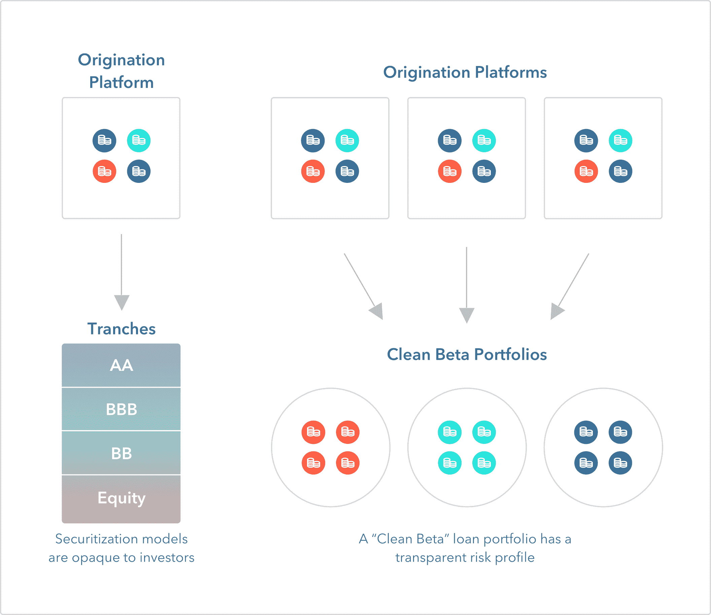

# 市场贷款将如何成为主流投资资产类别？

> 原文：<https://web.archive.org/web/https://techcrunch.com/2016/05/22/how-will-marketplace-lending-become-a-mainstream-investment-asset-class/>

张敏是首席执行官和联合创始人

[Totum Wealth](https://web.archive.org/web/20221206174005/http://www.totumwealth.com/)

，这是一个面向金融顾问及其客户的全方位互动财富分析平台。

一个朋友最近刚开始创业，却无法从三家银行获得抵押贷款。我建议他尝试像 SoFi 这样的市场借贷平台，以利用金融科技领域正在进行的创新。然而，SoFi 也拒绝了他，因为它遵守与传统银行相同的承销规则。像银行一样，SoFi 将他们的抵押贷款出售给房利美。

从表面上看，这与该公司的“不要银行，SoFi”口号相悖；但现实中，每个网贷平台背后都已经有一家银行了。为源自这些平台的抵押贷款获得广泛资金来源的能力是卓越的，事实上也是至关重要的。自从我们回到斯坦福商学院，我就非常尊敬迈克·卡格尼，看到苏菲在这个问题上继续走在前沿，我并不感到惊讶。

随着最近来自 [OnDeck](https://web.archive.org/web/20221206174005/https://www.crunchbase.com/organization/on-deck) 和 [Lending Club](https://web.archive.org/web/20221206174005/https://www.crunchbase.com/organization/lending-club) 的消息，媒体自然开始质疑市场借贷是否已经接近尾声。根据摩根士丹利[的数据，自 2010 年](https://web.archive.org/web/20221206174005/http://www.morganstanley.com/ideas/p2p-marketplace-lending)以来，这个领域每年都翻一番，据基金会资本(Foundation Capital)预测，到 2025 年预计将增长到 1 万亿美元。

能够跨越鸿沟吸引主流贷款人的在线发起者将能够参与到预期的增长中。所谓主流，我指的是贷款在 20 万亿美元财富管理市场的广泛分布，Totum 已经开始提供差异化的风险分析和数字参与。

例如，房利美是一个主流的分销渠道。如果你在 401(k)计划中持有一只总回报核心固定收益基金，你可能会持有一些房利美抵押贷款支持证券。是的，你可能投资了你自己和你邻居抵押贷款的一小部分！

## 平台的痛点:做生意的成本

发起平台今天面临的挑战不是平台发起贷款的能力。事实上，根据高盛(Goldman Sachs)的报告“金融的未来，第一部分:新影子银行的崛起”，对银行高风险贷款的更严格的资本要求和审查将继续把发起活动从银行转移到非银行

问题在于融资成本。

> 尽管证券比贷款更容易获得，但对于主流投资者来说，这种方式仍然显得复杂且不透明。

贷款业务的盈利能力指标很简单:净息差。它是贷款利率，扣除违约和回收，减去借款利率。

如今，银行能够以接近零的存款利率贷出借款。对于一个市场借贷平台，储户的等价物是对冲基金，以及将贷款证券化并转售的机构。我们知道对冲基金不会对接近零的回报率收取 2/20 的费用。

## 平台的机会:对收入产品的广泛需求

在世界各地，对收入产品的需求实际上是广泛的，并且是由老龄化人口推动的一个重要的长期趋势。作为参考，全球固定收益市场约为 100 万亿美元，其中美国占三分之一。

从普通退休人员、高净值个人和家族理财室到养老基金和捐赠基金，投资者都乐于接受高回报、稳定回报、低波动性、与股票相关性低、对利率变动敏感度有限(即期限较短)的投资产品。

网上贷款拥有这些非常可取的特点。为了获得这些收益，投资者承担了信用风险。

## 投资者的痛点:现有投资选项的弊端

投资这一资产类别主要有三种方式:

**个人贷款人直接在平台上投资。**这些投资者往往是拥有信贷投资经验的早期使用者。他们通常承担单一贷款的非多样化信用风险。

**机构购买非证券化贷款池。**对冲基金运用熟练的团队和复杂的分析工具，如 MonJa，从贷款池中挑选和交易贷款。我们从将资金池分配到其高净值账户的财富管理机构那里了解到，在某些情况下，由于违约率意外上升，利率低于承诺的水平。

如果说贷款池让即便是经验丰富的投资者都感到不舒服，那么普通散户投资者就远不会对接触这一资产类别感到舒服。

机构将一批贷款证券化，然后再出售这些证券。从理论上讲，这种方法应该通过破产远程工具消除发起人的违约风险，从而降低融资成本。它将把风险重新分配给风险较小、利率较低的部分，以及风险较高、回报较高的部分。

尽管证券比贷款更容易获得，但对于主流投资者来说，这种方式仍然显得复杂且不透明。结果取决于证券化价格如何风险。全球金融危机前的证券化创造了太多来自次级抵押贷款的 AAA 债券。

如今的平台正面临着相反的问题。在 [LendIt](https://web.archive.org/web/20221206174005/http://www.wsj.com/articles/fintech-fix-prosper-outlines-response-to-slowdown-concerns-1460417790) 上，Prosper 总裁 Ron Suber 表示，花旗集团高估了贷款的风险，因此要求更高的利差。

除了证券化模式可能出现分歧之外，证券化渠道也开始冻结。[花旗集团](https://web.archive.org/web/20221206174005/http://www.bloomberg.com/news/articles/2016-04-12/citigroup-said-to-stop-securitizing-prosper-s-peer-to-peer-loans)已经停止将 Prosper 的贷款证券化。高盛(Goldman Sachs)和杰富瑞(Jefferies)最近停止从 Lending Club 购买贷款池。我希望这些只是暂时的停顿。

前两个选项的可伸缩性不是特别好。如果证券化模式停止运作，发起平台需要扩大它们的贷款人基础，以便分配它们存放在借入资本中的贷款“库存”。

## 穿越银河:“干净的贝塔”贷款组合

为了获得新的投资者基础，需要有与更广泛的分销渠道(如独立财务顾问和其他零售渠道)配合良好的新产品。

成功的消费产品，比如苹果，必须极其简单。在这种情况下，需要清楚地解释回报和风险状况。

> 能够跨越鸿沟吸引主流贷款人的在线发起者将能够参与到预期的增长中。

对于分销这些投资产品的财务顾问来说，他们还需要对基于贷款的产品有足够的了解，并且能够在他们日常使用的投资组合管理平台上方便地访问投资数据。

对于主流投资者群体来说，具有充分理解的同质风险因素但分散了单一借款人和单一平台风险的贷款组合可能是一种合意的产品。这类似于“聪明贝塔”，介于贝塔(即贷款池的风险敞口)和阿尔法(在这种情况下是对冲基金正在进行的贷款选择和交易)之间。

我称之为“干净的贝塔”对于证券化，投资者几乎不知道基础池是否能够支持所有发行的 AA 债券。相比之下，每个“干净 beta”投资组合持有来自相同借款人类型和质量的贷款，可能来自不同的发起人。这种级别的透明度使得人们能够清楚地了解预期回报和违约风险。

## 双赢的未来

市场借贷平台和主流投资者都可以从这种适合零售市场及其分销渠道(金融顾问)的产品中受益。

对投资者来说，好处是能够获得一种新的资产类别，而不必为挑选单个贷款而烦恼。收益率可能低于对冲基金(通常包含杠杆风险)，但高于大多数资产支持证券——对大多数投资者来说仍然非常有吸引力，但它降低了平台的融资成本。

我也赞赏所有让这个空间变得更加流动、透明和可及的努力，例如:Orchard 的二级市场交易所、T2 的 NSR 投资公司和 T4 的 LendingRobot 公司的贷款选择指南，以及几只由市场贷款支持的 ETF，这些 ETF 正在接受 SEC 的审查。

很难想象你在金融科技平台上的投资——虚拟和数字货币与你的股票、交易所交易基金和共同基金在同一个地方——而且大多数金融顾问不会就这些较新的资产类别提供建议。尽管如此，总有一天你会很容易看到你的市场贷款敞口、创业公司的众筹交易、项目和房地产的影响，或许还有你在第二人生中修建的道路或酒店以及所有其他资产的影响。