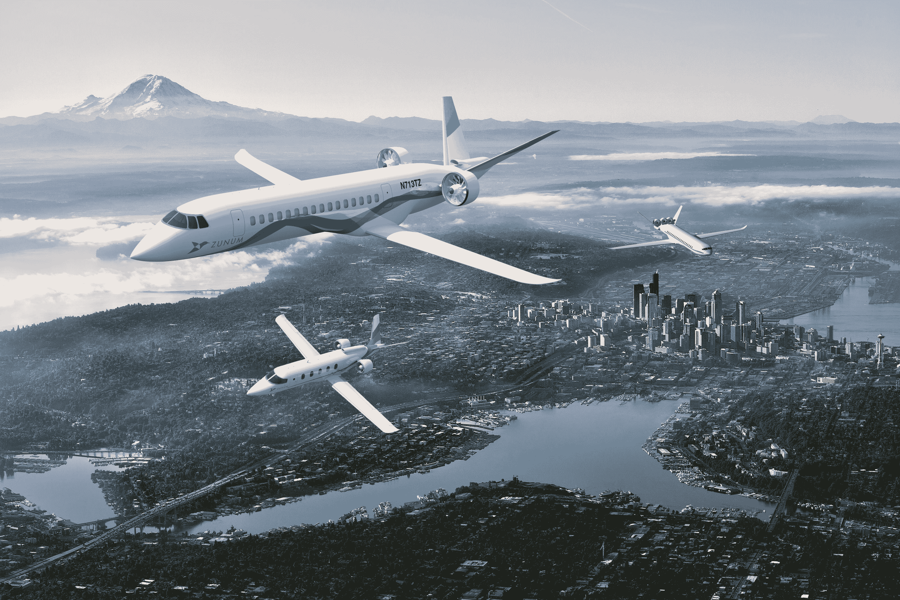

# Zunum Aero 计划如何从 2022 年开始转变商业飞行

> 原文：<https://web.archive.org/web/https://techcrunch.com/2017/10/05/how-zunum-aeros-hybrid-electric-planes-aim-to-transform-flight-starting-in-2022/>

消费者客运飞行可能是下一个由电力传动系统改变的行业，西雅图的 Zunum Aero 希望成为这一变化的前沿。

这家总部位于西雅图的公司得到了波音公司 HorizonX fund 和 Jet Blue's Technology Ventures 的支持，计划改变区域飞行的基本经济学，并将航空旅行的经济学转向最终完全电动飞行的道路。

Zunum Aero 实现这一目标的计划始于其第一架发射飞机，在今年早些时候[分享了一些信息](https://web.archive.org/web/20221025222613/https://beta.techcrunch.com/2017/04/05/zunum-aeros-electric-passenger-plane-hopes-to-offer-cheaper-flights-by-2020/)之后，该公司今天披露了该飞行器的全部细节。第一架 Zunum 飞机旨在提供区域服务，可容纳 12 名乘客，交付窗口从 2022 年开始。经济效益可能会改变游戏规则，飞机每小时的运营费用约为 260 美元。

Zunum 的最大巡航速度为每小时 340 英里，起飞距离为 2200 英尺，混合动力总航程为 700 英里(它希望及时扩展到 1000 英里以上)，噪音和排放比传统的支线飞机低 80%，Zun um 将其飞机定位为照亮美国未充分利用的支线机场的最佳方式，在经济现实使定期服务不切实际的地方提供经济实惠和高效的通勤航班。

“过去，我们有意对运营成本保持沉默，因为电动汽车的运营成本低得惊人。这样你就可以得到一架尺寸永远无法与低于商业票价的客机竞争的飞机，”Zunum Aero 首席执行官 Ashish Kumar 在一次采访中告诉我。他认为每座位运营费用大约为每英里 8 美分。“这大约是一架公务机每小时运营成本的十分之一，”他说。

Kumar 向我展示了一张美国 5000 多个机场的地图，这些机场目前的运营能力远远不足，他解释说 Zunum 的目标是通过最大限度地提高现有基础设施的效率来改变航空运输的面貌。

他解释说，Zunum 机身的设计可以与现有的跑道和机场配合使用，由于混合设计，它们甚至不需要大量的加油或充电大修。他们的机身也设计成易于现有的商业飞行员获得资格和使用。

随着时间的推移，Zunum Aero craft(应该与当前的商用飞机具有相同的可操作循环限制)也被设计为能够适应不断变化的电源选项:Zunum 官方称其为“混合动力-电动”飞机，其设计使得其机载燃料箱最终可以减小尺寸，并由额外的电池单元取代，因此随着电池技术的改进，它可以过渡到全电动飞机——即使不必投资新一代机身。

但是对消费者的利益呢？Kumar 说，旅行时间可以大大减少，例如，将目前从波斯顿到 DC 华盛顿州的 4 小时 50 分钟的门到门旅行变成 2 小时 30 分钟的旅行。此外，还可以节省成本，这趟旅程的票价可能会在 140 美元左右，比目前的商业定价低三分之一左右。

在加州，从圣何塞到洛杉矶的航班可能只需要 2 小时 15 分钟，而不是目前平均需要的 4 小时 40 分钟。根据估计，定价将在 120 美元左右，这也将低于目前的平均票价。

[gallery ids="1551518，1551519，1551520，1551521"]

减少这些时间不仅仅是停留在空中的时间，因为在许多情况下，商用飞机实际上以更高的速度飞行。相反，它是关于减少主要枢纽周围机场的拥堵，重新分配区域航班，使其远离拥挤的国际设施，提高安全性，延长值机时间，并提供靠近消费者居住地的航班，而不是要求先去最近的主要机场进行长途旅行。

“你有一种商务飞机类型的旅行体验，你走来走去，也许没有任何安全保障，你可以更快地到达某个地方，因为你是从一个小机场起飞的，而且你支付的费用不比商业经济舱高，”库马尔说。

Zunum Aero 的计划是在 2019 年进行飞行测试，为此它将在芝加哥附近开设一个新的开发中心，并开始地面测试，并继续雇佣更多的顶级人才，包括最近从航空业巨头波音公司和洛克希德马丁公司引进的工程师。最终，该公司希望还能推出第二种机身，旨在容纳更多乘客，取代行驶距离更远的车辆。