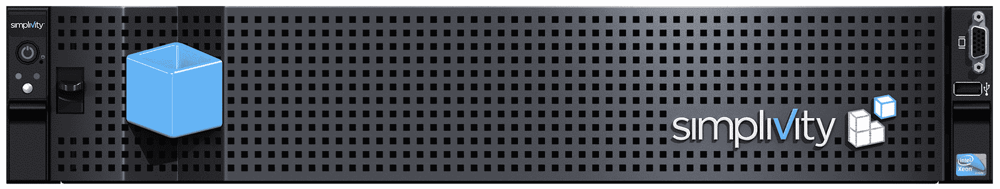

# HPE 以 6.5 亿美元现金收购 SimpliVity 

> 原文：<https://web.archive.org/web/https://techcrunch.com/2017/01/17/hpe-acquires-simplivity-for-650m-in-cash/>

[HPE](https://web.archive.org/web/20230130100805/https://www.hpe.com/us/en/home.html) 今天[宣布](https://web.archive.org/web/20230130100805/https://www.hpe.com/us/en/newsroom/news-archive/press-release/2017/01/HPE-to-Acquire-SimpliVity-and-Expand-Leadership-in-Growing-Hybrid-IT-Industry.html)以 6.5 亿美元现金收购数据管理平台 [SimpliVity](https://web.archive.org/web/20230130100805/https://www.simplivity.com/) 。

SimpliVity 是该领域众多专注于所谓“超融合基础设施”的公司之一这听起来像是某人的流行语——确实如此——但核心思想非常合理:超融合系统将计算、存储和网络结合到一个系统中。

SimpliVity 的旗舰产品是[omni cube](https://web.archive.org/web/20230130100805/http://www.businesswire.com/news/home/20150310005293/en/SimpliVity-Raises-175M-Series-Funding-Eclipses-1B)hyperconverged infra structure 设备，但该公司也与联想、戴尔、思科和华为[合作，将其解决方案的软件部分引入他们的服务器。](https://web.archive.org/web/20230130100805/https://www.simplivity.com/simplivity-products-overview/)

对于 HPE 来说，这里的想法显然是利用 SimpliVity 的平台来扩展其现有的基础设施、自动化和云服务。

惠普企业总裁兼首席执行官 Meg Whitman 在今天的声明中写道:“这笔交易扩展了 HPE 的软件定义能力，完全符合我们让客户的混合 IT 变得简单的战略。“越来越多的客户正在寻找能够为他们带来安全、高度灵活的云经济内部基础架构的解决方案。这正是我们关注的焦点。”

SimpliVity 成立于 2009 年；在过去几年中，它在四轮融资中筹集了近 2.76 亿美元，由凯鹏华盈、Accel Partners、DFJ 成长、CRV 和 Waypoint Capital 等公司牵头。对于这些投资者来说，6.5 亿美元并不是一个巨大的退出，特别是考虑到该公司在 2015 年筹集 D 轮融资时的估值超过 10 亿美元。

至于 HPE，该公司最近主要因出售部分业务而出现在新闻中。例如，去年九月，它出售了其大部分软件部门[，交易价值约 88 亿美元](https://web.archive.org/web/20230130100805/https://techcrunch.com/2016/09/07/hewlett-packard-enterprise-to-spin-off-software-assets-in-8-8b-transaction/)。然后，在 11 月，[也将其 OpenStack 和 Cloud Foundry 资产出售给 SUSE](https://web.archive.org/web/20230130100805/https://techcrunch.com/2016/11/30/suse-buys-hpes-openstack-and-cloud-foundry-assets/)(SUSE 本身也为微焦点所有)。该公司有可能看到了超融合市场的机会，并希望利用这些销售获得的一些现金来加强其在那里的地位。