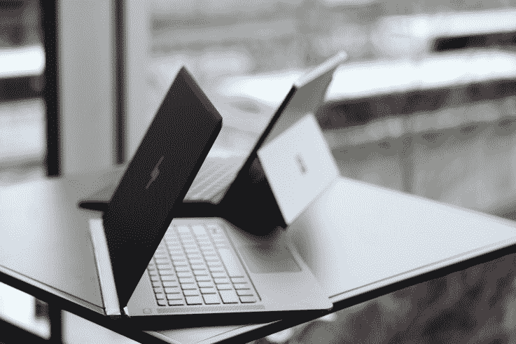
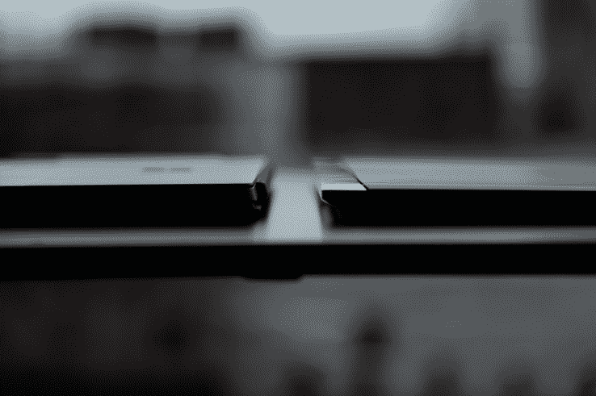

# HP Spectre 是超极本设计的一项成就，厚度仅为 10.4 毫米 

> 原文：<https://web.archive.org/web/https://techcrunch.com/2016/04/05/hps-spectre-is-the-purists-ultrabook-by-being-just-10-4-mm-thin/>

作为一名电子产品专家，通常我会关注上周未发布的产品。感兴趣的对象是 [**惠普**](https://web.archive.org/web/20221207061611/http://hp.com/) Spectre，一款 13.3 英寸的超极本，厚度 10.4 毫米，重量 2.45 磅——惠普称之为世界上最薄的笔记本电脑。

它的厚度(或缺少厚度)只有苹果的 Macbook 可以与之媲美，但它仍然更厚，最厚处为 13.2 毫米。

惠普客户体验和产品组合战略副总裁迈克·纳什注意到，尽管 Spectre 很薄，但它实际上是一款能够做事情的笔记本电脑，而不仅仅是电子邮件。

这得益于英特尔酷睿 i5 或酷睿 i7 的处理能力，因为它们是真正的双核处理器选项；有趣的是，由于惠普设计的高压冷却系统，这只能在如此小的空间内实现。

[gallery ids="1301177，1301164，1301163，1301173，1301159，1301160，1301158，1301464，1301460"]

通俗地说，风扇、散热器、通风孔和冷却管被战略性地放置，以便它们可以一起工作，在笔记本电脑内部创建一个加压空间，从而使处理器保持冷却— *实际上是*。

另一个工程创意是委托给电池，它是在单独的“薄片”中，平放在内部。惠普表示，尽管节省了电池，但一次充电应该可以持续 9 个小时。

n Ash 说，CNC 铝制顶盖和键盘面板由碳纤维底部补充，采用灰银或铜强调的饰面，所有这些都与惠普新的优质标识很好地互补，这将成为未来所有优质系统的一种方式。

看到它薄得惊人，重量轻，设计坚固，我很快就问做出了什么妥协。最大的？13.3 英寸 IPS 屏幕，分辨率上限为 1080p。

端口选择如下:三个 USB-C 端口，都可以充电和传输数据，也可以给 Spectre 充电——其中两个兼作 Thunderbolt 端口。虽然对一些人来说这可能是一见钟情，但屏幕分辨率和端口选择可能是交易的破坏者。

> 这里为了瘦做出的最大妥协是什么？主要是屏幕第一，电池第二。

为了弥补这一缺点，惠普在面板上覆盖了仅 0.4 毫米厚的保护性大猩猩玻璃，转换成更亮、更近的图像，看起来好像是 QHD 面板——当被问及 Spectre 第一眼显示的分辨率时，我上当了，很可能其他人一开始也会这样看。

然而，知道事实有点令人失望:即使 1080p 显示器在 Spectre 所在的人工(以及后来的)自然光设置下清晰、锐利和明亮，但它仍然“只是全高清”。

至于音频，Bang & Olufsen 提供了立体声扬声器，这也是惠普过去一年的趋势，这些扬声器经过调整，声音清晰，但在整个频谱中保持中立。

> 定价？惠普 Spectre 将成为美国百思买的独家产品，起价 1169 美元，标配 8GB LDDR3 RAM，酷睿 i5 或 i7 处理器，256 或 512GB PCIe 固态硬盘，银色或铜色可选。

然而，更重要的是，键盘是全尺寸的，机械的，背光 1.3 毫米的行程，使每个动作在我尝试的时候都相对愉快；长期测试(与它一起生活和工作)会证实或否定最初的印象。

在发布会期间，惠普的“另一件事”是一部分有趣，另一部分不可企及:两款限量版(没有关于如何“限量”)设计师 Spectre 超极本。

这两幅画都在巴黎展出，并将被拍卖；收益将捐给纳尔逊·曼德拉基金会——这两个基金会都不在现场，我无法享受它们的荣耀。

[gallery size = " full " ids = " 1302210，1302211，1302212，1302209"]

第一款由 Tord Boontje 设计，仅盖子上就有 600 颗施华洛世奇手工镶嵌水晶，从扬声器格栅到按键的*边，到处都是金色细节。*由杰斯·汉娜设计的第二款，Instagram fame 的 **[，将独特性提升了一个档次，不仅引入了黄金层，还引入了镶钻电源按钮，当系统开启时*会点亮*。](https://web.archive.org/web/20221207061611/https://www.instagram.com/jess_hannah/?hl=en)**

> 这很好，但谁会想要“设计师”幽灵呢？

设计师版本并不像他们听起来那么俗气，但仍然处于宣传噱头的领地。惠普表示，这完全是向 Spectre 的设计致敬，同时也允许该公司通过曼德拉基金会“回馈社会”，对此我不能完全不同意。

当然，当常规的 Spectre 在 5 月份上市时，我会尝试对其进行评估，以确定它是否真的能够成为您唯一的超极本。