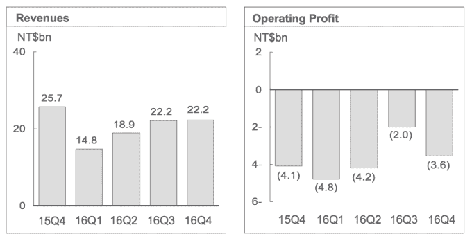

# HTC 又经历了一个艰难的季度，收入同比下降 13%，但损失较小

> 原文：<https://web.archive.org/web/https://techcrunch.com/2017/02/14/htc-has-another-tough-quarter-with-revenue-down-13-yoy-but-smaller-losses/>

对于这家移动设备和虚拟现实耳机制造商来说，HTC 最新的财务数据又是一个相当惨淡的数据，尽管令人欣慰的是，它的同比亏损略有减少。其 2016 年第四季度的运营亏损为 36 亿新台币(1.168 亿美元)，而 2015 年第四季度的亏损为 41 亿新台币(1.331 亿美元)。

2016 年第四季度的收入也下降到 222 亿新台币(合 7.207 亿美元)，同比下降约 13%。显然，这不是好消息，但收入同比下滑的幅度比[其他](https://web.archive.org/web/20230227150226/https://techcrunch.com/2016/05/09/htcs-revenue-plunges-64-as-the-struggling-firm-reports-another-quarter-in-the-red/)最近[季度](https://web.archive.org/web/20230227150226/https://techcrunch.com/2016/08/02/yet-another-red-quarter-for-htc-as-revenue-drops-44-year-on-year/)要小。

然而，毛利率也逐年下降，从 2015 年第四季度的 13.9%降至 2016 年第四季度的 10.5%。而 HTC 本季度的同比运营利润率几乎相同，为-16.0%。

在第四季度的报告中，HTC 声称“销售业绩强劲”，并指出连续收入“在 2016 年连续改善”，尽管第三季度和第四季度的收入实际上持平——在销售周期的某个点上，你可能会期待假期对收入的提振。

HTC 还强调了其所称的“积极管理”的运营支出，在过去的一年中，该支出为该公司降低了 34%的成本。

但是效率节约本身并不能带来业务的好转——这需要一连串的产品胜利。鉴于消费者对这种新生技术缺乏成熟的需求，虚拟现实对 HTC 来说是一个冒险的赌注。

近年来，亏损季度已成为这家台湾公司的常态，2013 年第三季度该公司首次公布亏损季度。自那以来，大量的管理层变动、投资组合调整以及与专注于虚拟现实的游戏发行商 Valve 的合作，尚未转化为 HTC 业务的任何持续上升势头。

在产品方面，除了继续努力宣传其 Vive VR play 之外，HTC 在第四季度推出了几款带有现有/过时品牌名称的中端手机，如 Desire 和 Evo。

值得注意的是，它自那以后推出了它所谓的手机业务“新方向”，[上个月](https://web.archive.org/web/20230227150226/https://techcrunch.com/2017/01/12/htc-outs-an-always-listening-dual-screen-smartphone-with-its-own-ai-assistant/)宣布了一个新的手机品牌 HTC U，用于一系列预装新人工智能助手的手机。在第四季度没有准备好急需的智能手机更新显然无助于该季度的销售业绩。

HTC 还是 Alphabet 新推出的谷歌品牌 [Pixel](https://web.archive.org/web/20230227150226/https://techcrunch.com/2016/10/18/google-pixel-xl-review/) 手机的设计和制造合作伙伴，该手机于本季度推出。但几乎没有迹象表明，这种关系已经转化为 HTC 可观的销售收入。

它的第四季度报告没有提供任何未来计划的细节，只是指出它将继续努力投资，试图建立一个持续的虚拟现实市场。

“HTC 继续围绕 HTC Vive 建立虚拟现实生态系统，几个事件突显了 VIVE 平台的不断扩大，包括在台北开设第一个基于 VIVE 的街机，在北京、台北和旧金山举行 VIVE X 加速器计划的第一次演示日，以及推出 VIVE studios，”它指出。