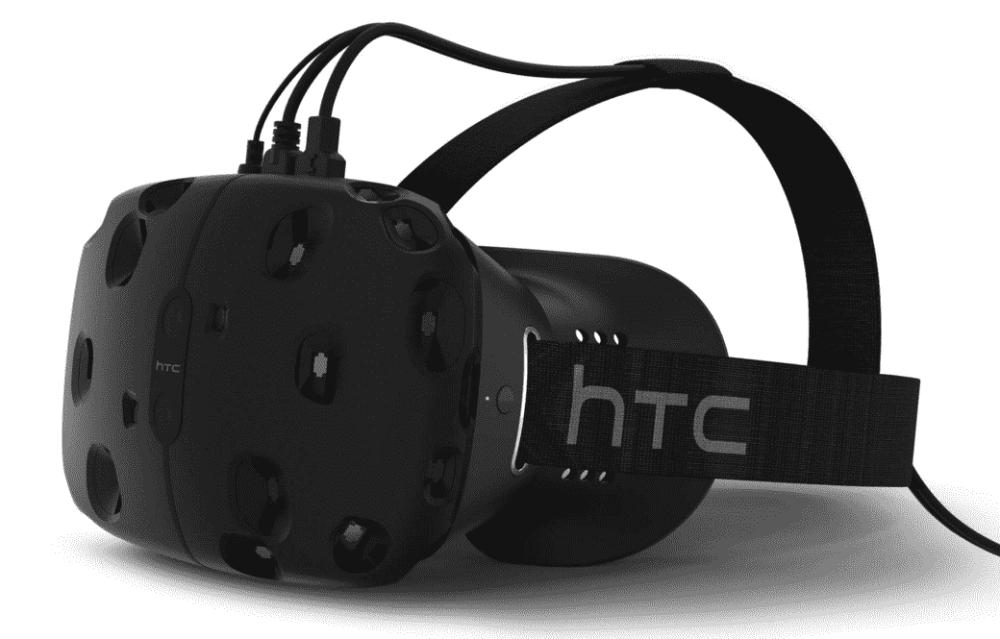

# HTC Vive 终于有了发布日期:2016 年 4 月 

> 原文：<https://web.archive.org/web/http://techcrunch.com/2015/12/08/htc-vive-finally-gets-a-release-date-april-2016/>

# HTC Vive 终于有了发布日期:2016 年 4 月

在给 Vive 开发者的一封电子邮件和一篇由于流量原因现在被关闭的博客文章中，HTC 最终澄清了他们何时会推出他们期待已久的虚拟现实耳机 Vive。

[他们的岗位](https://web.archive.org/web/20230130034650/http://blog.htc.com/2015/12/htc-vive-update)现在不工作了，但是**这里有重要的部分**:

> 新年伊始，我们将向开发商提供额外的 7，000 套公寓，随后将于 2016 年 4 月正式上市。我们对未来感到无比兴奋，并期待着在我们迈向发布时分享更多信息。

这个消息是在 8 月份的一份声明之后发布的，该公司的目标是 2016 年的 Q1，这是一个他们几乎不会错过的窗口。

在尝试了市场上或即将上市的所有主要虚拟现实耳机(Gear VR、所有 Oculus 原型、索尼的 Playstation VR)后，我可以诚实地说:Vive 是最令人印象深刻的。与 Valve 合作打造的跟踪功能简直是*荒谬*——与 Vive 看起来疯狂的控制器搭配起来，它给人一种即时沉浸感。我用控制器把物体“画”进 3d 空间；这让我觉得自己像个该死的巫师。

唉，Vive 也是最笨重的:你的头上悬着一根大电线，你必须在你的房间周围放置几个大的“灯塔”传感器来处理跟踪。与三星 Gear VR 的无线功能(使用三星手机作为大脑和显示器，以避免电线混合)或 Playstation VR 的即插即用简单性相比，这将是一个很难向所有人推销的产品，除非是最热衷于 VR 的人。