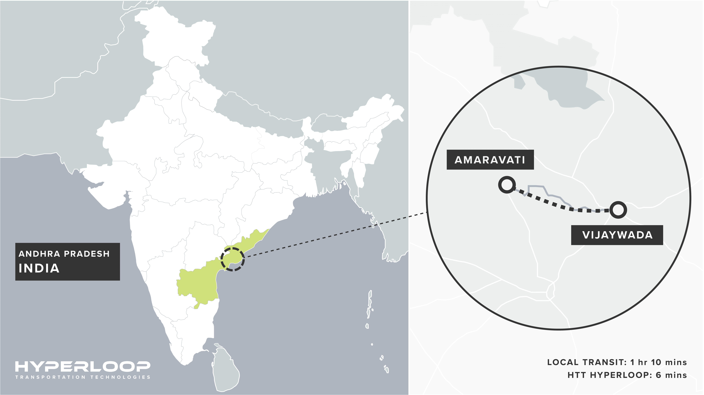

# HTT 签署协议在印度开发 Hyperloop

> 原文：<https://web.archive.org/web/https://techcrunch.com/2017/09/06/htt-signs-agreement-to-develop-a-hyperloop-in-india/>

# HTT 签署协议在印度开发超级高铁

Hyperloop Transportation Technologies(HTT)今天宣布，该公司已与印度安得拉邦政府签署了一份谅解备忘录，以开发 Amaravati 和 Vijaywada 两个城市之间的 Hyperloop 运输路线。如果成功的话，这条路线将把一个小时的行程缩短到六分钟，并将采用主要由私人来源资助的公私合作模式来资助其建设。

这是印度第一个此类的 Hyperloop 线路协议，HTT 表示，预计该项目将创造 2500 个就业机会。这个分两个阶段的计划包括首先从 10 月份开始进行可行性研究，预计将持续 6 个月左右，然后是第二阶段，这将是 Hyperloop 本身的实际建设。

在最初阶段，HTT 将与私人和公共利益攸关方合作，确定连接这两个城市的最佳路线，同时考虑到周边城市的位置和其他因素。安得拉邦经济发展委员会将帮助 HTT 通过监管要求，以确保该项目在推进过程中获得政府的正式批准。

根据一份新闻稿，该州引进 Hyperloop 的目标是帮助它建立自己和 Amaravati 作为技术和软件中心，并从总体上帮助提高该地区的生活水平。

HTT 在 6 月份宣布，它已经与一些韩国机构和研究所达成协议，在该国建立一个超级环路运输系统。竞争对手 Hyperloop One 最近也在努力取得进展，[包括在其内华达测试跑道](https://web.archive.org/web/20221206185026/https://beta.techcrunch.com/2017/08/02/hyperloop-ones-full-scale-pod-reaches-192-mph-in-new-nevada-track-test/)成功进行全尺寸吊舱的高速测试。