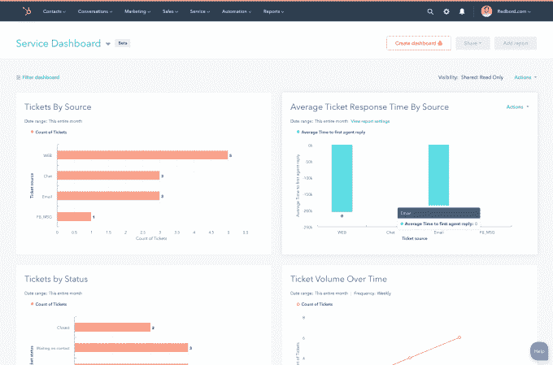

# HubSpot 在其营销平台 TechCrunch 中增加了客户服务工具

> 原文：<https://web.archive.org/web/https://techcrunch.com/2018/05/11/hubspot-service-hub/>

# HubSpot 在其营销平台上增加了客户服务工具

随着用于管理客户服务的[服务中心](https://web.archive.org/web/20221209033623/https://www.hubspot.com/products/service)的正式启动，HubSpot 正在向销售和营销以外的领域扩张。

该产品是去年秋天[首次发布的](https://web.archive.org/web/20221209033623/https://www.hubspot.com/company-news/hubspot-announces-customer-hub-expands-platform-to-support-the-entire-customer-experience)，但是现在它已经退出了 beta 测试。

HubSpot 总裁兼首席运营官·谢尔曼说，这是该公司合乎逻辑的下一步。他认为，互联网已经“民主化”了企业通过创造自己的内容(使用 HubSpot、natch 等工具)来吸引客户的能力，尽管“这个机会仍然存在，坦率地说，由于正在发生的事情数量庞大，它变得越来越难。”

“照顾你的顾客是有意义的，”谢尔曼说——既能保持他们的忠诚度，也能把他们变成可能帮助你吸引新顾客的拥护者。

服务中心总经理迈克尔·雷德博德和走向市场负责人大卫·巴隆带领我快速参观了服务中心。它包括一个用于所有客户通信的通用收件箱，一个用于自动化一些客户交互的机器人生成器，用于建立公司知识库的工具(然后可以输入到机器人生成器中，Redbord 将其描述为一种更“以客户为中心”的方式来呈现您的内容)，用于创建调查的工具和一个跟踪您的服务团队如何工作的仪表板。

Redbord 说，他以前在 HubSpot 自己的服务和支持团队工作，所以 ServiceHub 的每个功能都与 HubSpot 面临的问题或他个人面临的问题有“一对一的关系”，同时试图支持客户。

Barron 补充说，ServiceHub 受益于与 HubSpot 现有产品的集成，允许企业跟踪他们与客户在销售、营销和支持方面的互动。

“我们是一家平台公司，”他说。“当这些对话发生时，无论是与人类的聊天还是与机器人的聊天，都将记录在 HubSpot 的(单个记录)中，因此不同团队之间不会有数据泄露。”