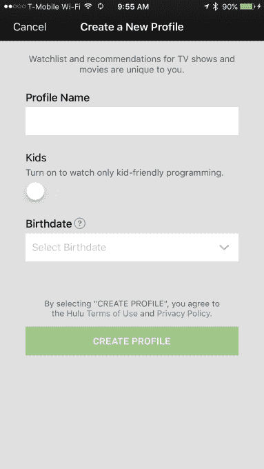

# Hulu 在手机 TechCrunch 上发布用户档案

> 原文：<https://web.archive.org/web/https://techcrunch.com/2017/01/18/hulu-launches-user-profiles-on-mobile/>

去年 12 月， [Hulu 宣布推出用户档案](https://web.archive.org/web/20221210025540/https://beta.techcrunch.com/2016/12/08/hulu-launches-user-profiles-each-with-their-own-recommendations-watchlist-and-history/)，以使其流媒体电视服务对最终用户更加个性化，为每个用户提供他们自己的观看列表、观看历史和基于他们活动和兴趣的推荐。然而，在发布的时候，这项功能还没有广泛应用。这种情况现在正在改变，因为 Hulu 刚刚向移动用户推出了用户资料。

根据 [Hulu 的 iOS 应用](https://web.archive.org/web/20221210025540/https://itunes.apple.com/us/app/hulu-stream-movies-watch-latest/id376510438?mt=8)的最新更新，用户资料现在对所有人开放。该公司表示，这还包括对儿童档案的支持。

这意味着父母可以为家里的每个孩子建立一个特殊的档案，锁定他们访问或观看成熟的电视节目或电影的能力，或者在推荐中看到成人内容。这将大大有助于 Hulu 与亚马逊和网飞等竞争对手的流媒体服务竞争，后者多年来一直提供用户资料。

虽然看起来是一个小的更新，但在今天的流媒体时代，用户体验和个性化是服务竞争的两个主要领域，个人资料实际上是一个竞争优势。毕竟，一个服务的目录可能很大，但如果它不能将正确的节目和电影放在想要观看它们的用户面前，那么客户可能会转向另一个服务来寻找观看的内容。

此外，个人资料使服务更适合家庭，父母不希望孩子看到其服务上的一些更暴力、可怕或不适当的内容。

虽然 Hulu 之前提供了一个“儿童”区，但你必须首先启动 Hulu 的主界面，然后导航到儿童区——在此期间，儿童可以接触到成熟的内容，甚至可以点击观看成人节目。与此同时，Hulu 的[家长控制](https://web.archive.org/web/20221210025540/https://help.hulu.com/articles/166617)并不十分强大。

对于 Hulu 来说，它正准备在未来几天推出自己的直播电视流媒体服务，用户资料也将有助于将其视频点播目录与其直播电视流联系起来。

公司[最近购买了一个视频元数据数据库](https://web.archive.org/web/20221210025540/https://beta.techcrunch.com/2016/11/15/hulu-acquires-the-video-genome-project-to-improve-recommendations-ahead-of-live-tv-services-launch/)，即视频基因组项目，以帮助其在扩展到电视直播之前改进其推荐。该公司解释说，它可以使用这项技术来摄取时事新闻，然后将它们的主题(例如“政治动荡”)与它的点播节目和电影库联系起来。

如果它真的推出这样的功能，这可能使 Hulu 的服务成为现有直播电视服务的一个令人信服的替代选择，包括 Sling TV，PlayStation Vue 和新推出的[但陷入困境的](https://web.archive.org/web/20221210025540/https://beta.techcrunch.com/2017/01/16/att-denies-refunds-for-directv-now-customers-despite-the-services-performance-issues/) DirecTV Now。

Hulu 用户档案最初在网上[可用，在手机首次亮相之前](https://web.archive.org/web/20221210025540/http://www.hulu.com/Account/Profiles)。Google Play 应用程序并没有表明它们已经在 Android 上出现，但我们知道，它们现在正在悄悄推出。简介应在本周末之前在 Android 上上线。

网络用户现在应该都可以访问个人资料，Xbox 360、Xbox One、PS3 和 PS4 上的观众也应该可以看到个人资料。其他设备将很快出现。