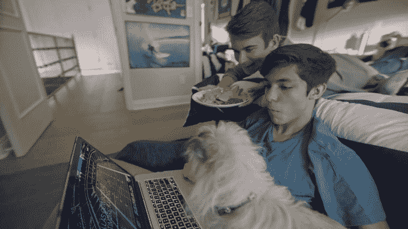
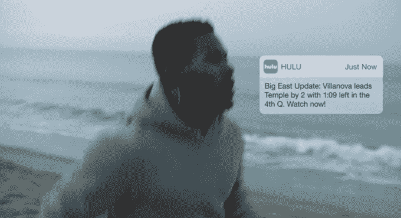

# 据消息人士称，Hulu 的直播电视服务每月收费 39.99 美元

> 原文：<https://web.archive.org/web/https://techcrunch.com/2017/04/13/hulus-live-tv-service-to-cost-39-99-per-month-with-ads-sources-say/>

据了解 Hulu 计划的消息人士称， [Hulu 的直播电视服务](https://web.archive.org/web/20221127014251/https://www.experiencehulu.com/)的定价可能为每月 39.99 美元，包括广告和访问 Hulu 的点播库，该服务是有线电视的竞争对手，以及 Sling TV、PlayStation Vue、DirecTV NOW 和 YouTube TV 等一系列其他流媒体电视服务。这与 Hulu 首席执行官迈克·霍普金斯[之前的声明](https://web.archive.org/web/20221127014251/http://www.businessinsider.com/hulu-streaming-tv-service-pricing-under-40-2017-1)一致，即其新服务每月费用将“低于 40 美元”。

直播电视服务将包括访问 Hulu 的点播内容、Hulu 原创、网络直播和广播网络的点播内容。39.99 美元的价格点尚未确定——它仍有可能下降，但鉴于 Hulu 早先的承诺和目前竞争激烈的流媒体电视市场，不太可能上涨。

当被问及定价时，Hulu 发言人表示，该公司仍在构建其直播内容包的过程中，尚未最终确定任何定价。

**云 DVR 捆绑包**

直播电视服务将在其基础包中允许一定量的录制和存储空间，这一功能正迅速成为这些类型企业的标准服务。但是这个记录空间将不是全功能的 DVR，因为它不支持快进。

然而，Hulu 正在考虑为其直播电视服务提供一个附加套餐，其中将包括一个最多可播放 200 小时节目的无限制 DVR，以及无限制的流媒体。(尽管家庭以外的并发流可能有上限——我们已经听到了三个。)

消息人士告诉我们，这个附加捆绑包将允许用户选择升级他们的云 DVR 和无限流直播电视服务，价格将低于每月 20 美元。

当然，Hulu 并不是唯一提供 DVR 的服务。

PlayStation Vue 最引人注目的功能之一是它的云 DVR，它让你可以录制电影和节目，而不用担心冲突或存储空间，因为你必须用传统有线电视盒中的 DVR。但 Vue 的 DVR 功能很快被竞争对手采用，包括 Sling，它一直在向[用户](https://web.archive.org/web/20221127014251/https://whatson.sling.com/announcements/cloud-dvr-first-look-roku-android-update/)稳步推出自己的云 DVR ，提供 50 小时的存储，每月 5 美元，记录的内容没有到期。

当时的 YouTube TV[宣布推出无限存储的云 DVR 时，似乎超越了所有竞争对手。](https://web.archive.org/web/20221127014251/https://beta.techcrunch.com/2017/04/05/youtubes-35-live-tv-streaming-app-is-now-available-in-five-us-cities/)

但是[《华尔街日报》指出【to YouTube TV 的 DVR 选项有一个附加的重要警告，其他人没有——它将迫使你观看你的许多 DVR 节目上的广告。《华尔街日报》发现，如果节目可以点播，观众就不能跳过广告，即使他们录下了节目。相反，YouTube TV 将播放点播版本，其中广告快进被禁用。](https://web.archive.org/web/20221127014251/https://www.wsj.com/articles/youtube-tv-will-force-you-to-watch-ads-on-many-dvrd-shows-1491842805)

《华尔街日报》的文章还暗示，这种 DVR 安排是电视高管将在未来服务中推动的事情，但 Hulu 的 DVR 不会是这种情况。

令人欣慰的是，Hulu 的云 DVR 将让用户能够快进他们录制内容中的商业广告——就像有线电视 DVR 一样。

然而，尽管 Vue 和 Sling 的 DVR 在技术上支持快进，但由于版权交易，该选项并不总是可用。看看 Hulu 的直播电视服务到来时是否会面临同样的问题，这将是一件有趣的事情。

**商业免费 Hulu 点播+电视直播**

除了每月 39.99 美元的直播电视服务，Hulu 将继续为其点播节目库提供广告支持(每月 7.99 美元)和无广告(每月 11.99 美元)订阅，其中包括 Hulu 原创节目、电视节目和电影。(也可以选择购买*没有 Hulu 点播库的*直播电视，价格待定。)

不过，在很大程度上，Hulu 的直播电视是作为直播和点播节目捆绑销售的。这意味着目前无商业广告的 Hulu 用户只需为他们的直播电视升级多付几美元。(Hulu 的点播图书馆从广告升级到无广告的成本是每月多 4 美元。应用于直播电视服务，4 美元的升级将使新的直播电视服务达到每月 43.99 美元。但在上市前，价格仍有可能发生变化。)

在较高的价格点，Hulu 开始听起来有点贵。如果你也在捆绑云 DVR 包，Hulu 的价格可能和你今天支付有线电视的价格一样高——假设你有比基本包更大的东西。

但值得注意的是，Hulu 的新服务更类似于将网飞订阅与 Sling TV 等流媒体服务相结合——因为它在一个屋檐下提供了规模可观的视频点播库和流媒体直播电视。事实上，这将是第一个这样做的服务。

https://youtu.be/UvmiRhdnrrk

根据你的家庭设置，有线电视公司对每个额外的有线电视盒收费约 10-12 美元，如果这些盒子有自己的 DVR，这个数字可能会更高，所以你可能仍然会节省或收支平衡。

此外，目前 Hulu 的用户已经每月支付 7.99 美元或 11.99 美元，因此电视直播升级的财务痛苦将不是整整多 39.99 美元或 43.99 美元——而是新旧计划之间的差异。

**付费频道**

新的直播电视服务还将提供付费频道附加服务，从 Showtime 开始，这是 Hulu 的订阅视频点播服务目前拥有的网络。Showtime 将继续每月多花费 8.99 美元。据我们所知，其他网络将紧随其后，包括 HBO，它将在服务上线后不久到来。

Hulu 的直播电视服务仍计划在春季推出。从技术上讲，春天的最后一天是 6 月 21 日，所以我们可能还要等一段时间。