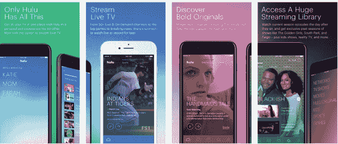

# Hulu 的新电视直播应用登陆应用商店 

> 原文：<https://web.archive.org/web/https://techcrunch.com/2017/05/03/hulus-new-live-tv-app-hits-the-app-stores/>

Hulu 刚刚宣布的直播电视服务的新应用现在已经登陆应用商店。该公司没有在 Hulu 现有的应用程序中提供升级到直播电视的功能，而是推出了一个新的应用程序，名为“Hulu with Live TV”。这款应用的特色是 Hulu 经过改进的用户界面，该界面将与直播电视服务同时推出，这可能是该公司决定将其作为一款独立产品发布的部分原因。然而，该公司表示，目前并非所有 Hulu 用户都能体验到新界面。

新的 Hulu 应用在 iOS 应用商店的[和 Google Play 的](https://web.archive.org/web/20221007223149/https://itunes.apple.com/us/app/hulu-with-live-tv/id1230815695?mt=8)[都有。](https://web.archive.org/web/20221007223149/https://play.google.com/store/apps/details?id=com.hulu.plus)在 iOS 上，它是第二个应用，在 Android 上，现有的应用已经更新到新的界面。

虽然直播电视的所有订户都将自动获得新界面，但还没有升级的用户还没有获得新界面。与此同时，新界面也将通过 Xbox One、Apple TV(第四代)和 Android 移动设备上现有的 Hulu 应用程序推出。(Hulu Live TV 也将与 Chromecast 合作。)

如果你下载了新的直播电视应用程序，你可以删除旧的 Hulu 应用程序，因为所有的点播节目都可以在 Hulu 和直播电视上观看。

升级后的用户界面旨在将 Hulu 现有的点播库和新的直播电视内容结合在一起，模糊了现在正在播放的内容和随时可以观看的内容之间的区别。

新的直播电视应用程序提供了许多个性化工具，包括建立自己的用户档案，然后选择你最喜欢的电视节目、电影甚至新闻频道。该公司称，你看得越多，Hulu 就越会根据你的兴趣定制推荐。

此外，体育迷将能够在 Hulu 的新应用程序中跟踪他们最喜欢的职业和大学球队，包括 NFL、NBA、NCAA、MLB、MLS 和 NHL，然后选择现场录制这些比赛，如果他们在游戏正在播放的市场上。这是对电视的一种不同的思考方式——不需要知道要调到哪个频道才能看，你只需要跟着你最喜欢的频道走。

儿童模式也将延续到新的应用程序中，家长们可以在这里找到 Hulu 的儿童友好节目精选。在这种模式下，搜索或浏览其他 Hulu 内容的能力被屏蔽。

[gallery ids="1484809，1484807，1484806，1484805，1484804，1484803，1484802，1484801，1484800，1484799"]

作为一名现有的 Hulu 点播订户，在启动 Live TV 应用程序后，您将经历一次新的入职体验，该应用程序提供了导入您的观察列表的选项，然后提示您告诉 Hulu 更多您的兴趣——如科幻、英国喜剧、犯罪与司法、深夜、纪录片、动作与冒险、怀旧浪漫、新闻与头条、名人真人秀等。

在完成设置过程之前，该应用程序会要求您将特定的电影和电视节目添加到“我的资料”部分。

新的带电视直播的 Hulu 应用程序现在可以在各自的应用程序商店中在 iOS[和安卓](https://web.archive.org/web/20221007223149/https://itunes.apple.com/us/app/hulu-with-live-tv/id1230815695?mt=8)[上获得。](https://web.archive.org/web/20221007223149/https://play.google.com/store/apps/details?id=com.hulu.plus)