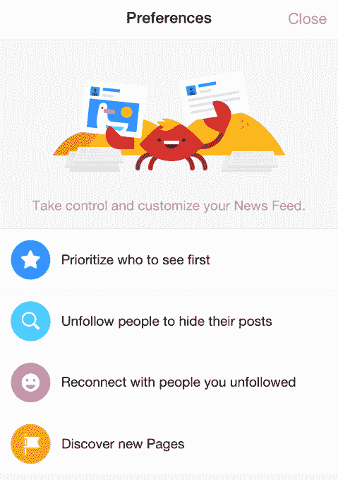
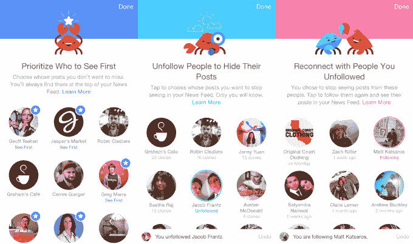

# 脸书让我们能够告诉新闻提要我们想先看到什么

> 原文：<https://web.archive.org/web/https://techcrunch.com/2015/07/09/humanizing-the-algorithm/>

“我们知道算法并不完美”新闻订阅产品经理 Greg Marra 告诉我。因此，为了确保脸书保持娱乐性和上瘾性，它通过修改新闻订阅偏好让用户更直接地控制他们看到的内容。

脸书在美国推出了一种选择朋友和页面的方式，他们想在 feed 上“首先看到”，在[我发现它上个月测试了这个功能](https://web.archive.org/web/20230404150527/https://techcrunch.com/2015/06/18/facebook-see-first-puts-your-favorite-people-atop-the-feed/)。升级后的设置部分现在将显示在你的订阅源中显示最多的人，并允许你取消关注他们，重新关注你隐藏的人，以及根据你的兴趣发现页面。今天，它将登陆美国的 iOS 平台，并很快登陆其他平台。

在多年建议我们应该添加谁为好友后，脸书终于帮助我们筛选和协调出现在我们的新闻源中的人。这可以确保我们最好的朋友不会被远方的熟人淹没。“发现新页面”部分可以让我们明确地自愿提供信息，从而更好地将兴趣与联系联系起来，提高脸书作为新闻读者的能力。

与此同时，See First 为那些希望在影响力下降的人群中提升其页面受众的营销人员创造了一个新的圣杯。期待品牌为你争取将他们添加到你的 See First 部分，这样你就不会错过他们的帖子。

[维梅奥·https://vimeo.com/132961281]

脸书在 11 月份首次推出了新闻订阅偏好设置，提供了取消关注的建议和重新关注人们的方法，但马拉承认单调的界面让配置它们看起来像是一件苦差事。新版本包括明亮的动画和简单的语言描述，以便每个人都能理解。

“我们想让这里看起来不像是一个工作的地方，”马拉告诉我。俏皮的蟹偏好吉祥物让选择你的设置变得很有趣，如果可能的话。对于保持脸书的趣味性和个性化这一严肃问题，这是一个轻松的解决方案。

如果你点击脸书移动标签栏上的“更多”按钮，你会在脸书的设置菜单底部找到新闻订阅偏好设置。不幸的是，它被埋得太深了，很多人永远不会注意到它。为了给它一些可见性，脸书会推荐用户在隐藏或取消关注他们的订阅时访问它。

这四个部分是如何工作的:

**确定谁最先看到的优先级**–选择你想在他们每次发布帖子时出现在你的提要顶部的朋友或页面。这比脸书现有的让你在你最喜欢的人发帖时收到通知的选项要好，因为 See First 集成到了你已经阅读过的提要中。

**取消关注以隐藏他们的帖子**–在这里，你可以看到谁在控制你的订阅源，以及他们最近向你显示了多少帖子。这有助于你决定，如果你不追随他们，谁会给你最大的空间，并抵消多年来关于添加谁的建议，这些建议可能会堵塞你的订阅。

**重新联系你没有关注的人**——脸书在这里列出了你没有关注的人，以防你改变主意，而不是把他们扔进社交网络的深渊。

**这个新的探索部分，是对我在 2010 年写的一篇文章的修改。它使用脸书关于你的行为和与你相似的人喜欢什么的所有数据来推荐相关页面。这里有一个有偿安置的机会，但是脸书说现在还没有这个计划。**

马拉声称这些环境不应该对营销人员产生太大的影响，但我不同意。多年来，品牌被告知在脸书上购买类似页面的广告来扩大影响力。脸书从未真正为向企业收取随着时间流逝变得越来越不值钱的费用而道歉。现在，这基本上证实了人们的担忧，即仅仅被喜欢并不意味着你可以再接触到人们，这可能会引发营销活动，让用户添加首先看到的品牌。

每天都有更多的朋友和页面注册脸书，人们积累了更多的联系，每个人都发布了更多的帖子。这超过了我们阅读提要的时间增长，[导致竞争加剧，每个人的内容有机可及性下降](https://web.archive.org/web/20230404150527/https://techcrunch.com/2014/04/03/the-filtered-feed-problem/)。这个社交网络很大程度上依赖于它的技术来推断应该用什么来填充 feed 中的有限空间。

但是现在脸书发现直接询问用户不仅能提高相关性。这也让用户觉得他们在掌控着他们大部分的上网时间。