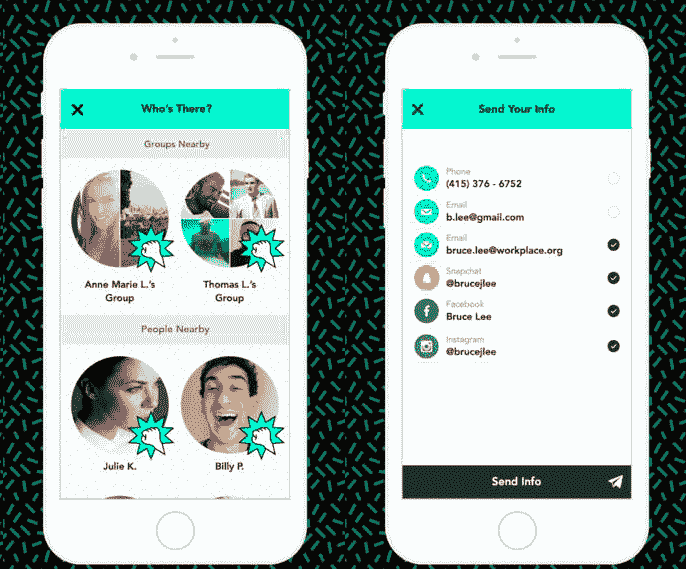

# 胡敏推出 Knock Knock，这是一款让大学生无需交换号码就能相互联系的应用程序 

> 原文：<https://web.archive.org/web/http://techcrunch.com/2015/08/19/humin-launches-knock-knock-an-app-that-wants-to-connect-with-college-kids/>

胡敏的创始人安库尔·贾恩(Ankur Jain)坐在我对面，敲着自己的智能手机。这款应用旨在比智能手机更好地管理你的联系人。

在玻璃屏幕上敲两下，一个名为 Knock Knock 的漫画风格的应用程序打开，开始搜索我们周围的其他用户。

Knock Knock 是贾恩一直在做的一个项目，是他的主要创业公司胡敏的副业。他的第一个应用程序旨在从本质上理解你使用手机联系人的方式，而 Knock Knock 则基于与你在各种活动中遇到的人联系并记住他们。

贾恩计划将这款新应用推广为大学生建立联系的一种方式，避免立即分享联系信息的尴尬。

“新的社交接触可能既尴尬又令人生畏，”贾恩说。“回想起我大学的第一周，我记得我希望有一种方法来记录和记住我遇到的所有新朋友。我们创造了 Knock Knock 作为一个有趣的解决方案，利用反映我们现实生活中社交习惯的技术，减轻在这些情况下的压力。”

很多应用程序以前都尝试过这样做。About.me 有一个名为 Intro 的 iOS 应用程序，用于快速交换联系信息，GroupMe 通过建立群聊来处理对话部分的事情。LinkedIn 有一个名为 Connected 的联系人应用程序。

许多这类应用程序也没能成功。 [Spincard](https://web.archive.org/web/20230209131139/http://spincards.com/?reqp=1&reqr=) 去年倒闭了。 [Bump](https://web.archive.org/web/20230209131139/http://bu.mp/) ，一个让用户互相碰撞手机以交换照片和获取联系信息的应用，是另一个已经不复存在的应用。但是贾恩对 Knock Knock 的大学未来持乐观态度。

他有理由乐观。贾恩是科技亿万富翁、信息空间创始人纳文·贾恩的儿子。他从小学起就看着父亲经营公司。他还为《敲门》争取到了一些名人的支持。理查德·布兰森爵士(Sir Richard Branson)、Will.i.am 和索菲亚·布什投资了 Knock Knock，并出现在一则广告中，展示这款应用的工作原理(点击本文末尾查看视频)。所有这些似乎足以至少给这个应用一个机会。

> 它消除了社交中的尴尬。你不用给假号码。安库尔·贾恩

此外，贾恩是

[Kairos Society](https://web.archive.org/web/20230209131139/http://kairossociety.com/)

–一个寻找和招募 25 岁以下最有才华和创业精神的人的组织–他们中的许多人来自常春藤盟校。这些学生在他们的大学和其他地方拥有有影响力的职位，贾恩有能力鼓励这些年轻和向上流动的人使用这款应用程序。

他还有一个在校园里推广这款应用的策略。贾恩和他的团队选择了某些倾向于对世界产生智力影响的大学。这些大学包括哈佛大学、康奈尔大学、宾夕法尼亚大学、斯坦福大学、伯克利大学和南加州大学。Knock Knock 使用在这些学校的某些兄弟会和姐妹会房屋内设置的 Beacon 技术，因此参加其中一个房屋的聚会或希望宣誓的学生可以轻松地与他们在活动中遇到的人联系，并在以后保持联系。

Jain 告诉 TechCrunch:“然后，兄弟会可以向该团体发送任何即将到来的聚会或活动的特别邀请，并很容易就像 Rush 这样的事情联系到人们。”

这可能看起来很突兀，但 Jain 肯定学生可以取消订阅这些消息，并指出通过应用程序发送邀请和信息可以帮助这些组织减少电子邮件的噪音。

学生通过敲两下打开应用程序，在 Knock Knock 网络上相互联系。该应用程序随后会在网状网络上搜索那些同样使用该应用程序的人。然后，用户可以使用该应用程序相互联系和聊天，或者他们可以选择与小组的其他成员分享他们的电子邮件、手机、Snapchat 和其他社交资料。如果你不想分享你的联系方式，但又不想显得粗鲁，你可以只和某些人分享部分信息。

“他们永远不会知道你与团队中的其他人分享了更多，”贾恩说。“它消除了社交中的尴尬。不用给假号。”

该应用程序还能帮助用户记住他们遇到的人的名字以及他们在哪里遇到的。这是 Jain 在胡敏开发的一个功能，但它在基于事件的会议中有一个真正的应用，这是为了像 Knock Knock 这样的应用程序。

该应用还包括群敲门功能。只需要一个人打开应用程序。房间中的其他每个人都可以通过物理地敲击他们关闭并锁定的智能手机屏幕来连接该人/团体，以添加到该群组。

这样做的一个缺点是，该应用程序使用蓝牙功能，这可能会耗尽你的电池。然而，Jain 认为该应用程序的电池使用量非常低，尤其是在使用 Beacon 技术的时候。你不必保持蓝牙打开才能使用该应用程序，但当另一个用户在附近打开该应用程序并开始敲门时，它会激活你手机上的蓝牙。这可能会耗尽手机电池，如果你不想回应他们的敲门，也会很烦人。

它会在其他人失败的地方建立联系吗？只有时间能证明一切。总的来说，这似乎是一个设计简洁的有趣应用程序，Jain 添加了所有的铃铛、口哨和敲门，让它有一个好的尝试。

Knock Knock 免费下载，从今天开始在 iOS 和 Android 上都可以使用。