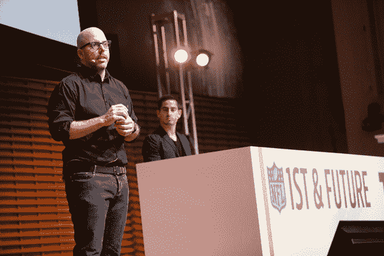

# HYP3R 的基于位置的参与 CRM 在第一届和未来 上赢得“未来体育场”类别

> 原文：<https://web.archive.org/web/https://techcrunch.com/2016/02/06/hyp3rs-location-based-engagement-crm-wins-the-future-stadium-category-at-1st-and-future/>

# HYP3R 的基于位置的参与 CRM 在第一和未来赢得了“未来体育场”类别

我们已经到了第一和未来的尾声，这是一场以体育为中心的创业竞赛，由 NFL、斯坦福大学商学院和 TechCrunch 联合举办。

今天比赛的三个类别的决赛是“未来体育场”，侧重于推动未来体育场体验的技术。

获胜者是… [HYP3R](https://web.archive.org/web/20230307051644/http://www.hyp3r.com/) ！HYP3R 是一个基于位置的参与平台。

体育比赛和事件是社交媒体更新的巨大来源——但更多时候，这些更新没有标签或其他识别标志。HYP3R 的仪表板帮助场馆和赞助商识别这些帖子，允许他们以独特的方式参与(例如发送“欢迎来到竞技场！”第一次识别访问者时的消息)

或许更有趣的是，HYP3R 为那些被它识别为从某个地点发帖的人提供了 CRM 帮助他们识别回头客和显著的社交媒体影响者。

这一类别的评委是通用电气副主席贝斯·康斯托克、基准资本普通合伙人比尔·格利、威瑞森首席执行官洛厄尔·麦克亚当(*标准披露:威瑞森拥有美国在线，而美国在线拥有 TechCrunch* )和三藩市 49 人首席执行官杰德·约克。

至于比赛，**这里是这个类别的其他决赛选手的快速纲要:**

通过短信即时购买。卖家(如体育场)可以向潜在客户发送类似“我们找到了两张今晚比赛的门票！想要吗？回复买票和你要的数量”，客户回复即可完成购买。

**偏执粉丝:**事件上的社交映射。粉丝可以将不同的兴趣点(尾门派对、排队时间较短的食物点或他们的当前位置)钉在竞技场和周围地区的地图上，供其他粉丝和朋友使用。

**Sidestep:** 让活动参与者在活动前或活动期间通过他们的手机查看/购买商品，让他们跳过长队，做好购买准备。