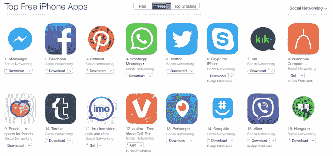
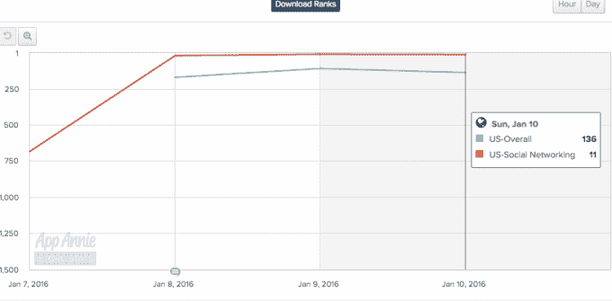

# 不管是不是炒作，Peach 很快就登上了社交网络应用排行榜的前十名

> 原文：<https://web.archive.org/web/https://techcrunch.com/2016/01/11/hype-or-not-peach-hit-the-top-10-social-networking-app-list-fast/>

# 不管是不是炒作，Peach 很快就进入了 10 大社交网络应用排行榜

你可能听说过很多关于社交网络/消息应用桃子的事情。有人说它很蠢，有人说它很棒，还有很多人说介于两者之间。我对它有什么感觉？感觉很新鲜。以 Twitter、Path、WhatsApp 和 Messenger 感受不到的方式新鲜。

请注意，这是一个巨大的炒作列车现在，所以采取一切与谷物的盐。但是无论如何，请试一试。没有必要让愤世嫉俗阻止你尝试。说到这里，似乎很多人都在这么做:

Peach 目前在美国苹果应用商店的免费应用中排名第 120 位，在社交网络中排名第 9 位(还有一些不错的公司。)不要把这种上涨视为“炒作”或“崩盘”时刻，它向我发出信号，表明有一群人愿意尝试新事物。我们还没有达到消费应用的峰值。因此，尽管 Snapchat 继续火起来，Messenger 变得越来越智能，但还是有必要——或者说想要——一些“别的东西”

我整个周末都在使用 Peach，我能告诉你的是，关键是不要在你的图表中添加太多的人，因为交流越亲密越好。一旦你掌握了它的“神奇词汇”，它的命令行界面可以在应用程序中分享不同的内容，你也会有一种成就感。看到添加了什么其他命令会很有趣。

我也很喜欢用一种感觉像动画、视频或脸书回旋镖的方式拍照:

开创性？不。新的？新鲜？是的。一旦一个应用程序进入某个类别的前十名，就会有一件有机的事情发生，那些不看科技 Twitter 或科技媒体的人就会得到它。

