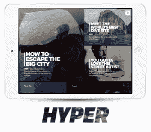

# Hyper 每天为您带来最好的互联网视频 

> 原文：<https://web.archive.org/web/https://techcrunch.com/2015/08/26/hyper-brings-you-the-best-of-internet-video-every-day/>

今天，策划视频发现平台 Hyper 发布，为您提供互联网每日最佳短片内容。

在 Advancit Capital、Lowercase Capital、Broadway Video Ventures、Freelands Ventures 和 Mesa Ventures 提供的 110 万美元种子资金的推动下，电影制片人马库斯·吉勒斯(Markus Gilles)和电影摄影师乔纳斯·布兰道(Jonas Brandau)今年早些时候离开了柏林的独立电影界，建立了 Hyper。

“我们生活在一个互联网世界里，我们拥有比以往任何时候都多的令人敬畏的短片内容，但同时也越来越难在流行的点击诱饵中找到它，”Gilles 说。“这种东西在我们的社交媒体流和基于算法的推荐中大量涌现，因为我们的朋友已经成为它的受害者。”

当然，YouTube 对于[观看灰熊滚下山丘](https://web.archive.org/web/20221209183952/https://www.youtube.com/playlist?list=PLrEnWoR732-DN561GnxXKMlocLMc4v4jL)可能是有用的，但是对于我们这些寻找更有智力实质的东西的人来说，寻找短视频可能比实际观看它们花费更多的时间。

为了给我们筛选成堆的垃圾视频内容，Hyper 雇佣了一个记者和电影制作人团队，他们每天手工挑选六到十几个视频，并将其打包成一个视觉上吸引人的数字杂志。

这些视频时长从 1 分钟到 20 分钟不等，涵盖各种各样的主题，从艺术美食视频到令人动情的战区纪录片。

Gilles 说，目标是选择大多数人可以学习和欣赏的视频，即使主题是他们通常不会被吸引的东西。

由于该团队不会发布任何超过几天的内容，因此选择过程在很大程度上依赖于个人品味，而不是浏览量或社交分享指标。

Gilles 说:“有时候，保护比你想象的要明显得多。“我们经常回头看，发现这些视频表现得非常好，远在算法能够检测到这一点之前。”

视频内容聚合和监管是一个拥挤的空间，但 Gilles 认为，他的团队的电影背景和对用户体验的痴迷使 Hyper 比 Vimeo 和 YouTube 等网站中现有的发现工具更具优势。然而，考虑到 Hyper 的小编辑团队驱动了产品的大部分价值，该公司将面临随着规模扩大保持其声音和地下艺术吸引力的挑战。

Hyper 目前仅适用于 iPad，但该公司计划在未来几个月推出 iPhone 版本。