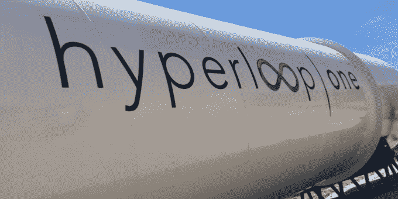

# Hyperloop One 联合创始人、传奇投资人谢文·皮什瓦尔(Shervin Pishevar)即将来到 TechCrunch Disrupt SF 

> 原文：<https://web.archive.org/web/https://techcrunch.com/2016/06/09/hyperloop-one-co-founder-and-legendary-investor-shervin-pishevar-is-coming-to-techcrunch-disrupt-sf/>

# Hyperloop One 的联合创始人和传奇投资人谢文·皮什瓦尔将来到 TechCrunch Disrupt SF

《星星》的投资者、夏尔巴资本和 Hyperloop One 的创始人谢文·皮舍瓦(Shervin Pishevar)即将颠覆 2016 年科幻小说。Hyperloop One 是埃隆·马斯克的大胆想法，他想在不到 30 分钟的时间里，在真空管中拍摄从旧金山到洛杉矶的人们。

这位传奇的风险投资家将在舞台上加入我们，谈论如何以高速将我们和其他一切从一个目的地炸到另一个目的地，以及为什么它将改变我们所知的交通运输的未来(就像前往纽约的汉密尔顿，因为你的晚餐消化了来自 SF 最新热门餐厅的食物)。

皮谢瓦尔投资了我们这个时代一些最成功的科技公司，包括优步、Airbnb、Shyp、Tumblr 和 Warby Parker，迄今为止，他还参与了超过 121 笔其他金融交易。

这位伊朗出生的风险投资人在加州大学伯克利分校学习分子生物学时，很早就接触了技术。皮什瓦尔迷上了搜索的想法，并创建了一个基于网络的操作系统，或 WebOS，后来成为 [HyperOffice](https://web.archive.org/web/20221210045547/https://en.wikipedia.org/wiki/Hyperoffice) 。在加入 Menlo Ventures 之前，他继续创立或成为许多成功创业公司的创始团队成员，后来在 2013 年创办了 Sherpa Ventures。

皮舍瓦也被称为好莱坞和硅谷的连接器，是希拉里·克林顿总统竞选的坚定支持者。这位优步投资者 4 月份在他旧金山的家中为克林顿举办了一场[晚宴，客人们花了 35.34 万美元与克林顿、乔治·克鲁尼和他的妻子阿迈勒·克鲁尼坐在一起。](https://web.archive.org/web/20221210045547/http://www.politico.com/story/2016/03/hillary-clinton-george-clooney-fundraiser-221207)

我们期待着他上台谈论当前的投资市场，他对名人投资的想法，未来的交通运输，并让我们从幕后看一些来自 [Hyperloop One](https://web.archive.org/web/20221210045547/https://hyperloop-one.com/) 的技术。

Pishevar 加入了 Disrupt SF 越来越多令人兴奋的演讲者的行列。为了利用额外的早鸟价格，请尽快购买您的机票。

*赞助商让 TechCrunch 活动成为可能。如果你想通过 TechCrunch 了解更多关于赞助的信息，给 sponsors@beta.techcrunch.com 发一封电子邮件吧。*