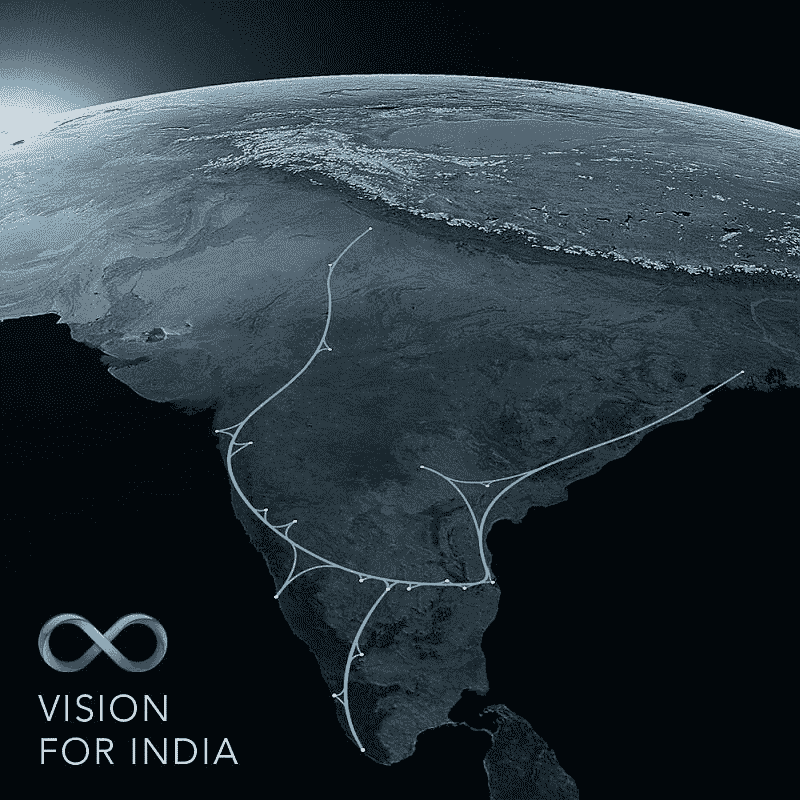

# Hyperloop One 正与印度政府进行早期谈判 

> 原文：<https://web.archive.org/web/https://techcrunch.com/2017/02/28/hyperloop-one-is-in-early-talks-with-the-indian-government/>

# Hyperloop One 正与印度政府进行早期谈判

Hyperloop One 可以将它的高速管道运输系统带到印度，并将在今年年底之前根据它已经开始与印度政府进行的对话，打电话询问在该国运营是否可行，根据[彭博](https://web.archive.org/web/20221208230632/https://www.bloomberg.com/news/articles/2017-02-28/hyperloop-one-pitches-elon-musk-s-dream-carrier-to-crowded-india)。该公司在印度参加“印度愿景”活动，讨论其运输创新如何改变市场的客运和货运。

印度是今年 1 月 CES 期间公布的 Hyperloop One 入围名单之一，该名单揭示了提出最强大、最具财政和实际吸引力的 Hyperloop 项目的国家和实体。这包括 35 名半决赛选手，其中 5 名来自印度。

印度拟建超级环线的概念图。

Hyperloop One 首席执行官 Rob Lloyd 告诉彭博，他和他的公司正在与政府进行早期谈判，讨论如何最好地形成公私合作伙伴关系，以实现竞赛参与者提出的一些愿景。会谈内容包括讨论在当地采购系统部件，包括钢铁等基础材料，以帮助政府推动印度交通基础设施的现代化，并支持一些本土举措，如[“印度制造”](https://web.archive.org/web/20221208230632/http://www.makeinindia.com/home)

我们仍然有可能看到该公司在阿联酋运营的第一个主动 Hyperloop 系统，但这些讨论清楚地表明，许多市场对 Hyperloop One 提供的东西感兴趣，因为其核心技术的展示正在证明 Hyperloop 整体的可行性。