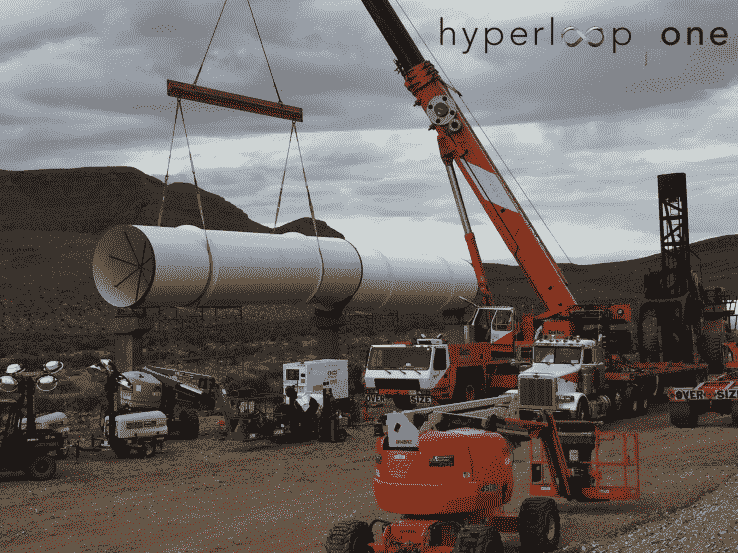

# Hyperloop Technologies 成为 Hyperloop One，获得 8000 万美元并宣布全球合作伙伴 

> 原文：<https://web.archive.org/web/https://techcrunch.com/2016/05/10/hyperloop-technologies-becomes-hyperloop-one-pulls-in-80-million-and-announces-global-partners/>

# Hyperloop Technologies 成为 Hyperloop One，获得 8000 万美元并宣布全球合作伙伴

总部位于洛杉矶的 Hyperloop 科技公司今天完成了 B 轮融资，现在已经是 Hyperloop One，并拥有 8000 万美元的财富。

就在几天前，竞争对手 hyperloop 建筑商 Hyperloop 运输技术公司(HTT)宣布了一项[许可协议](https://web.archive.org/web/20221218055021/http://www.usatoday.com/story/tech/news/2016/05/09/la-sf-30-min-hyperloop-wars/84137224/)，为其自己的磁悬浮技术原型提供动力。

Hyperloop One(前身为 Hyperloop Technologies)和 HTT 都位于洛杉矶，都在研究埃隆马斯克的 Hyperloop 模型，这是一种基于真空管的交通技术，承诺在 30 分钟或更短的时间内将乘客从旧金山送到天使之城。

这个名字太像它的竞争对手 hyperloop builder 了，这一变化正好赶上了明天将在北拉斯维加斯进行的推进露天测试(POAT) Hyperloop One。

新的资金来自现有的投资者 Sherpa Ventures，8VC，ZhenFund 和 Caspian Venture Partners，以及一些新的投资者，包括 137 Ventures，Khosla Ventures，Fast Digital，Western Technology Investment(WTI)，SNCF，法国国家铁路公司(有趣的是)和 GE Ventures，GE Ventures 已经在欧洲和中国等世界各地投入巨资建设高速铁路。现在筹集的资金总额为 1 亿美元。

Hyperloop One 的联合创始人、风险投资家谢文·皮舍瓦(Shervin Pishevar)在一份公司声明中表示:“我们得到的压倒性回应已经证实了我们一直以来所知道的事情，即 Hyperloop One 处于解决地球上最紧迫问题之一的运动的前沿。”“最聪明的头脑在正确的时间聚集在一起，以消除分隔经济和文化的距离和边界。”

在马斯克于 2013 年公开提出建造这样一个交通系统的计划后不久，皮舍瓦尔和布罗根·班布根(Brogan BamBrogan)就创建了这家公司。

Hyperloop One 去年 9 月引入了新的首席执行官 Rob Lloyd，将 BamBrogan 调任为 CTO。

除了更名和新融资，该公司还增加了一些重要的全球合作伙伴关系。AECOM、安伯格集团、ARCTURAN SUSTAINABLE CARGO、ARUP、Bjarke Ingels 集团、Cargo Sous Terrain、Deutsche Bahn Engineering & Consulting、FS LINKS、GRID、毕马威和 SYSTRA 将加入 Hyperloop One，共同打造未来的交通运输。

洛杉矶有许多交通问题，能想到以闪电般的速度行驶数百英里是件好事，但在最近一次去 Hyperloop One 总部的旅行中，我被告知，该公司将在不远的将来专注于在全美和全球范围内运输货物——此举可能会大大减少卡车排放和货物运输时间。

Hyperloop One 还宣布，正在参与私人资助的可行性研究，以考察 Hyperloop 路线在芬兰和瑞典的经济和社会效益。