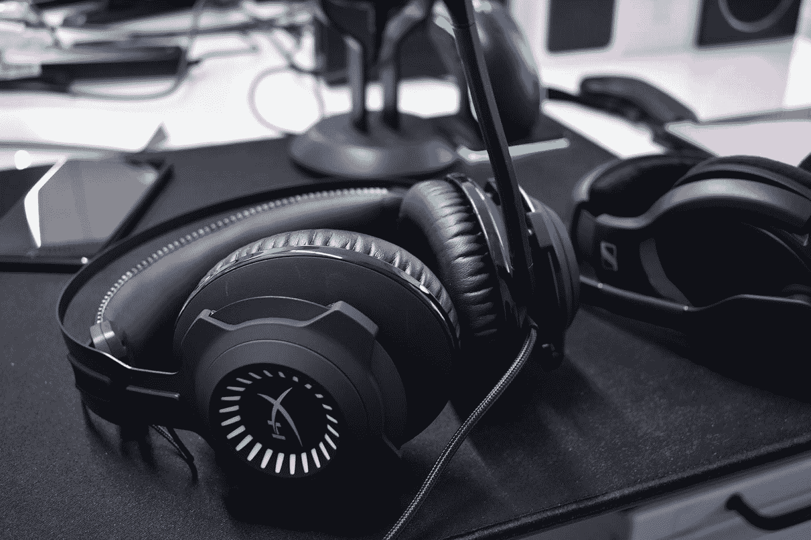

# HyperX 的左轮手枪 S 是杜比 7.1 游戏耳机的最佳范例 

> 原文：<https://web.archive.org/web/https://techcrunch.com/2017/06/09/hyperxs-revolver-s-is-the-right-example-for-dolby-7-1-gaming-headsets/>

如果你对蓬勃发展的电子竞技感兴趣，你一定听说过 HyperX。它们在职业游戏锦标赛中作为职业玩家事实上的游戏耳机的流行是难以否认的，尤其是如果你真的观看电子竞技的话。

我的兴趣越来越大，但我仍然很惊讶左轮手枪 S，一款杜比 7.1 环绕声游戏耳机，给我留下了如此积极的印象。当我开始玩在线游戏时，沉浸感产生的声音很容易识别，但在较高或较低的音量下并不明显。

## 杜比(和游戏耳机)做得好

[gallery ids="1501064，1501061，1501060，1501063，1501062"]

对我来说，这款 HyperX 耳机最有趣的方面是它的海报儿童外观，一副游戏耳机应该是什么样的。

这意味着有一个可接受的价格，一个详细的声音轮廓(即听到对手在游戏中的脚步声)，并使用复合材料赋予它重量和质量。我希望所有这些都来自一个好的游戏耳机，特别是如果耳机是由一个游戏公司设计的，而不是说，一个有游戏分公司的音频公司。

森海塞尔的 PC 373D 耳机——我认为它不值得你浪费时间，关闭杜比功能后听起来更好——与我在左轮手枪 s 上看到的(和听到的)完全相反。

但两种聆听模式下的美感和卓越音质都取决于执行力；你如何使用它。左轮手枪 S 是真正的即插即用通过 USB，不需要升级声卡或甚至软件驱动程序来使用。一旦你把它插上，你就有了直接音量、杜比模式和静音控制。

你还想要什么？

## 结果

这是我推荐的一副电脑游戏耳机。它在立体声和杜比声音模式下都能很好地工作，为用户提供大量的控制，运动坚实的构建质量，成本低于其他杜比游戏耳机。

事实上，如果你不是游戏玩家，只是想要杜比耳机，这里没有什么可以阻止你。这种设计并不明显前卫(大多数游戏配件往往如此)，而且麦克风可以从设备的其余部分拆下来，使其有点模块化。

左轮手枪 S 让我很乐意使用它，从一届*战地 1* 到每周 Beats 1 榜单。对于我每天测试和撰写的大多数设备，这是我不能说的。

*价格已审核:[【亚马逊】149 美元](https://web.archive.org/web/20221025223129/https://www.amazon.com/HyperX-Revolver-Surround-HX-HSCRS-GM-NA/dp/B01N9RM9N3)*