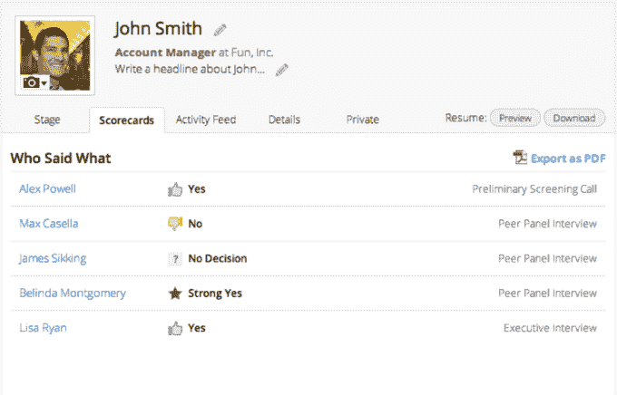

# 温室效应从基准测试中获利 1360 万美元，让你免于招聘地狱

> 原文：<https://web.archive.org/web/https://techcrunch.com/2015/03/11/i-have-people-skills/>

招聘是创始人浪费时间的第一件事。不是因为不重要。糟糕的雇佣可能是有害的。而是因为效率低。寻找、面试和选择候选人已经够难的了，大多数招聘工具都不能告诉你你在哪里浪费了时间和金钱。

然而温室却可以。在包括 Evernote、Zenefits 和 Venmo 在内的 450 名客户告诉他们的投资者它帮助他们雇佣了多少人之后，风投们在[筹集了 750 万美元的 A 轮](https://web.archive.org/web/20230404085925/https://techcrunch.com/2014/08/13/greenhouse-recruiting-app-platform/)后仅仅七个月就来敲 Greenhouse 的门。

现在，Greenhouse 已经筹集了 1360 万美元的 B 轮融资，由 Benchmark 牵头，由 Social+Capital Partnership、Felicis Ventures 和 Resolute Ventures 加入。Greenhouse 首席执行官兼联合创始人丹尼尔·柴特(Daniel Chait)告诉我，他的公司“还不是独角兽”，所以不值 10 亿美元，但现在价值是上一轮的 2.5 倍。

“招聘是竞争的重中之重，”Chait 说。“我们之前的每个人都认为这是一个管理和跟踪的问题。Chait 告诉我:“大量的数据和大量的简历需要处理。但这不是什么杂务。好的招聘是创业公司成败的关键，也是大企业保持低成本的关键。

温室以三种方式增加公司的招聘力度。它将公司的求职者来源，如推荐、活动、求职板、外部机构和社交媒体，整合到一个招聘仪表板中。从那里，公司可以 A/B 测试他们的工作列表，并让他们现有的员工发送空缺。

对于面试，Greenhouse 帮助企业组织他们的问题以及如何提问，以便每个候选人都有一个公平的竞争环境，并且通过其决策工具很容易获得答案。Greenhouse 可以快速地将候选人与其他候选人以及他们想要的职位进行比较，并根据行业招聘基准评估公司的表现。

不过，Chait 说，有了额外的资金，目标是“让平台更智能、更主动。”

Greenhouse 之前筹集的 750 万美元还没有花完。“远非如此，”Chait 告诉我。相反，他表示，“看上去，超高速增长的 SaaS 公司的增长轨迹最终会非常成功，它们会继续融资。”让 Benchmark 的马特·科勒(Matt Cohler)加入董事会也应该有助于温室效应。

Chait 告诉我，对于新的 1360 万美元，他有三个大计划:

*   平台基础设施—“我们正在超越启动模式。我们在这个平台上有很多高级业务，还会有更多。我们需要安全审计、国际化和基础设施。这听起来并不令人兴奋，但对我们的客户来说却是如此。这些数据非常敏感，所以我们要想在拥有 5，000 到 10，000 名员工或更大规模的国际公司中竞争并获胜，他们需要看到我们进行了投资。”
*   增长——“我们正在雇佣一个更大、更有能力的销售和营销团队。该公司开始看到加大油门的机会。”Greenhouse 的软件即服务需要一个团队来销售其订阅。这家初创公司现在有 70 名员工，但预计年底前会翻倍。
*   一个前瞻性的产品——“我们希望进行智能预测，让软件自动控制我应该在哪里花更多的时间或金钱来获得更好的候选人。”

这是最后一部分，可以给温室一个旧工具的优势。Chait 说“有些人试图把它变得简单、漂亮和现代。有些人试图让它变得便宜。”但是温室希望实现“招聘优化”

温室联合创始人兼首席执行官丹尼尔·柴特

“例如，你可能会发现应聘者通常会通过第一轮电话技术筛选，但却通不过面对面的面试。嗯，面对面的要贵得多。我们可以识别出在随后几轮中失败的候选人的模式，并提出在早期阶段淘汰他们的方法。”温室还希望能够告诉公司，“什么问题更能预示招聘的成功？”或者“哪些面试官在挑选优秀候选人方面做得最好？”

虽然它已经超越了 Jobvite 等陈旧的招聘软件，但还有一类新的数据驱动工具，如 [Lever](https://web.archive.org/web/20230404085925/https://lever.co/) 专注于为招聘经理提供做出每个决定所需的最大信息。 [Lever 在 10 月份的 A 轮融资中筹集了 1000 万美元](https://web.archive.org/web/20230404085925/https://techcrunch.com/2014/10/02/lever/)投资温室。

这完全验证了 Chait 为[温室](https://web.archive.org/web/20230404085925/http://www.greenhouse.io/)筹款的论点。SaaS 奖获得者一旦发现产品市场合适，就会保持超高速增长，而不是让竞争对手悄悄跟上。