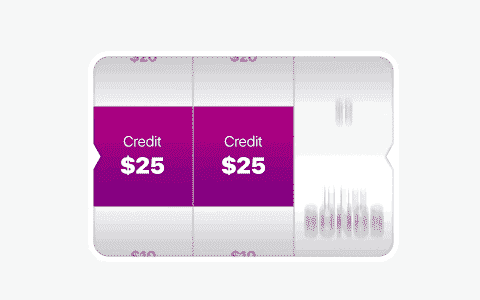
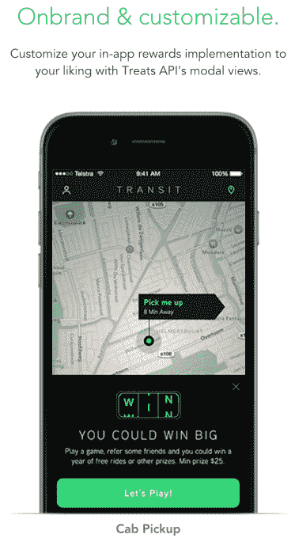
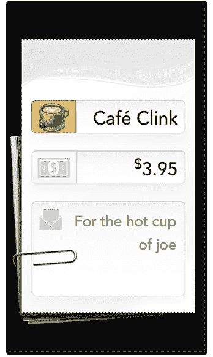
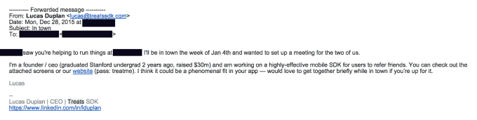

# Clinkle 的燃烧残骸重建作为参考服务

> 原文：<https://web.archive.org/web/https://techcrunch.com/2015/12/29/i-know-you-thought-it-was-dead-but/>

5 月份，Clinkle 员工集体辞职，抗议其年轻的首席执行官卢卡斯·杜普兰对这家获得 3000 万美元融资的支付初创公司管理不善，随后 clink le 倒闭。但是杜普兰不会放弃。TechCrunch 获得的电子邮件显示，杜普兰正在将 [Clinkle](https://web.archive.org/web/20230328135941/https://www.clinkle.com/) 从其之前的超声波支付和忠诚度借记卡产品中剥离出来。现在 Clinkle 是一个名为 Treats 的 SDK，其他应用程序可以集成它，为用户提供一个因邀请朋友而赢得奖励的机会。

TechCrunch 收到的电子邮件显示，杜普兰提议其他移动创业公司的创始人整合 Treats，并让他们联系 TreatsSDK.com 的(密码有“treatme”保护)。当我今天和杜普兰通话时，他拒绝发表评论，甚至不承认发送了邮件。以下是整个 Treats SDK 网站的截图:

【图库 ids="1255784、1255785、1255783、1255782、1255781、1255780、1255779、1255778、1255776、1255775、1255774、1255773、12555772、12555771、1255771

Treats SDK 让其他应用程序为推荐朋友提供类似的奖励激励，就像 Clinkle 的旧应用程序 Treats 一样。用户不是获得可预测的奖励，如第五次免费购物或推荐的每五个朋友的折扣，而是获得彩票的入场券，以赢得更大的折扣或现金。

就像老虎机一样，这个想法是可变奖励比可预测的奖励更容易上瘾。Treats SDK 可以让应用程序设定较低的推荐奖励，但有机会赢得巨额头奖。赢得大奖的梦想应该会让人们沉迷于推荐朋友或进行应用内购买。为个人利益向你的朋友发送垃圾邮件。

作为可变奖励的诱惑释放到大脑中的多巴胺的证据，Treats 引用了罗伯特·萨波斯基的演讲“这不是关于幸福，而是关于追求幸福。”

Treats SDK 如何在其他应用程序中工作的示例

例如，按需用车服务可以为推荐提供 5 美元的折扣，但也让用户参加竞赛，赢得一年的免费乘车。或者，一个购物应用程序可以通过购物赢得 250 美元的商店信用。作为管理推荐系统的交换，Clinkle/Treats 可以获得相当于其客户所支付报酬 30%的费用。

如果 Treats 能够摆脱其母公司的阴影，它仍将不得不与类似的推荐奖励提供商竞争，如 [ReferralCandy](https://web.archive.org/web/20230328135941/http://www.referralcandy.com/api.) 、 [ReferralSaasquatch](https://web.archive.org/web/20230328135941/http://www.referralsaasquatch.com/) 、 [VouchFor](https://web.archive.org/web/20230328135941/https://vouchfor.com/vf/) 等。

不过，杜普兰可能很难签下客户，因为众所周知，他在过去四年里筹集了 3000 万美元，却未能打造出一款成功的产品。即使在一个理应拥抱失败的场景中，Clinkle 的品牌也成为了自 Color 以来最多的笑话。杜普兰将需要一种异常高性能的产品才能生存。

Clinkle 在 2013 年筹集了前所未有的 2500 万美元种子资金，但其基于超声波的 Apple Pay 竞争对手从未实现。Clinkle [经历了裁员](https://web.archive.org/web/20230328135941/https://techcrunch.com/2013/12/09/payments-startup-clinkle-lays-off-a-quarter-of-its-staff/)，其[数据库被黑](https://web.archive.org/web/20230328135941/https://techcrunch.com/2014/01/30/clinkle-gets-hacked-before-it-even-launches/)，并目睹了高调的[雇佣辞职](https://web.archive.org/web/20230328135941/https://techcrunch.com/2014/03/13/more-dramz-at-clinkle/)。

Clinkle 的早期版本

这家初创公司[重新聚焦于借记卡](https://web.archive.org/web/20230328135941/https://techcrunch.com/2015/01/13/social-slot-machine/)，用户可以通过购买获得不同的奖励。但在据称笨拙地提出收购 Clinkle 之后，杜普兰突然解雇了他的首席财务官和工程副总裁。七名员工，大部分剩余员工，在后不久同时辞职。

当被问及七名员工主动辞职的问题时，杜普兰试图向我解释说这是一次“有计划的员工重组”接近该公司的消息人士认为，这位首席执行官不诚实，容易爆发，并且很快与他不同意的人断绝关系。首席执行官关于支付革命的大胆主张没有实现，Clinkle 成了硅谷的笑柄。

根据 LinkedIn 的数据，自 5 月份内爆以来，Clinkle 已经带来了几家新的工程承包商。一名前员工表示，Clinkle 可能试图四处展示这种可推广的 SDK 产品，希望软着陆收购。

杜普兰本人似乎急于与 Clinkle 品牌保持距离，该品牌除了其服务条款外，在 Treats 网站上没有出现过。在向 Treats SDK 的其他几位创始人推销的复制粘贴式电子邮件中，杜普兰写道:“我是另一位创始人兼首席执行官(2 年前从斯坦福大学毕业，筹集了 3000 万美元)”。但是他从来不叫 Clinkle。

