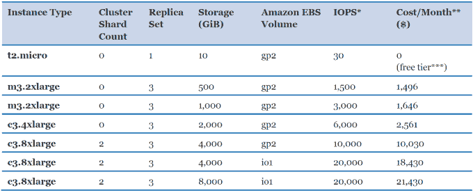

# 我也想运行有状态容器

> 原文：<https://web.archive.org/web/http://techcrunch.com/2015/11/21/i-want-to-run-stateful-containers-too/>

迪安·皮特森撰稿人

迪安·彼得森是

[abecorn](https://web.archive.org/web/20230317155757/http://abecorn.com/)

以及明尼苏达州就业和经济发展部的解决方案架构师。

在我看来，使用亚马逊做任何事情都是错误的——有点像《星球大战》中的叛军从达斯·维德那里租用了一艘歼星舰，而不是招募千年隼来对抗帝国。

"不要在容器中运行有状态的应用程序，Raaaw . "这就是目前在开发/运营领域的合理建议。我听到它一遍又一遍地重复。我明白了。在容器中运行有状态的应用程序很困难。然而，没有人应该付钱给你，让你旋转 1000 个无状态容器来打印“hello world ”,然后在 Amazon 上点击一个按钮来打印硬的有状态部分。

你说你在遵循“12 因素应用”的指导方针，这是给自己一个机会这告诉你，在云中编写应用程序应该单独附加有状态服务。你真正需要的是动态扩展你用 React 和 Node.js 编写的惊人的无状态“hello world”应用程序。

亚马逊、MongoLabs、Rackspace、微软；他们都在你耳边说着情话。“跟着孩子跑，去玩 Angular 2，Node.js，React 给 Spring Boot，鼠包和聚合物一个尝试。把硬的有状态部分留给我们。”你同意并开始把所有东西放在亚马逊的云中。他们让你对他们的药物上瘾。然后，当一切都为时已晚的时候，你才知道[的真正代价，“你所有的数据都是属于我们的。”](https://web.archive.org/web/20230317155757/https://en.wikipedia.org/wiki/All_your_base_are_belong_to_us)

让我倒回去一分钟，告诉你我为什么写这篇文章，我想要什么(简而言之:我希望谷歌的 Kubernetes、Docker 和 OpenShift 加强他们的游戏)。我正在我工作的地方重写一个大型应用程序。我们受够了在一个整体中增长的复杂性，并决定追求一个微服务架构。更小、更易维护的应用程序的承诺让我夜以继日地工作。

事情就是这样发展的。我学习 Angular 1、Bootstrap、Grunt、JBoss stack:在 Wildfly 的 JEE7 应用服务器上运行的 REST 服务，并且我使用一个中央 OAuth/OpenID 连接提供者来保护一切，以便在许多独立的应用程序中共享用户凭证。

是的，我知道 JEE7 很烂，Angular 2 打破了与 Angular 1 的向后兼容性(不是本文的重点)。是的，我曾经是一个本地 JavaScript 爱好者，所以我知道像 Angular 这样的框架也很糟糕。我真的不认为它们很糟糕，但我确实认为移动设备的速度太慢了。然而，那是另一个时代的阴谋(我认为它源于移动设备上不必要的内存和存储空间的缺乏，以便谷歌和苹果可以为你的 200 亿张婴儿图片出售云存储)。

回到我的观点(我想我有一个)。

不可避免的是，我们意识到降低应用程序开发的复杂性是以增加运营的复杂性为代价的；所有这些服务和独立的客户端和数据库都需要以相同的方式构建、部署和管理。

> 我认为容器的价值是让你的整个应用程序易于扩展。

我一头扎进了“DevOps”世界。我直接学习 Docker，并使用 Docker Compose 来编排应用服务、客户端和单个 MongoDB 节点的运行容器。此外，etcd(IP/端口的名称值存储)、registrator(用于保持 etcd 同步)、nginx(负载平衡服务)和 confd 的容器可在容器启动和停止时动态重新配置 nginx。“是的，我很厉害！”至少，我是这么认为的，直到我意识到 Docker Compose 在简化这些容器的管理方面做得很不够。

我不想尝试用 Docker Swarm 来扩展设置。临时搭建的 PAAS 有太多可移动的部件，不值得卖给管理层。如果复杂性是在一个节点上运行太多的容器，那么将 Docker Swarm 加入进来将是一场噩梦。

在这一点上，我的观点是有状态应用程序，比如 MongoDB，应该与无状态客户端和服务一起运行在容器中。我不知道那使我变得愚蠢。像一个天真的梦想家一样，我认为容器的价值是让你的整个应用程序易于扩展。我不知道社区已经给他们的投降起了一个正式的名字(后勤服务)。

有了一些码头工人的经验，我重新审视了码头工人 PAAS 的风景。我需要比 Docker Compose 和 Docker Swarm 更强大的东西。我该如何选择？有 Kubernetes，Fleet 和 Mesos。但是等等。我不直接用那些？它们是给平台开发者用的？

最终我明白了；它们是供我(开发者)使用的许多其他平台背后的技术。我需要在从底层技术中选择之后选择我的平台。来自谷歌的 Kubernetes 拥有大量的追随者，它是开源的，并且很好地利用了我已经掌握的 Docker 知识。我选择 Kubernetes。

现在我需要选择一个 Kubernetes 平台。我已经使用 Red Hat Enterprise Linux 运行 Docker 容器和一些 JBoss 堆栈，所以我选择 OpenShift Origin。我花了几周时间学习 OpenShift。我花了几个小时与 OpenShift 开发人员交流，最终让我用 Docker 和 Docker Compose 运行的所有东西都在 OpenShift Origin 上运行。

除了现在我有一个构建和部署部分，映像会自动被推送到注册表，我可以轻松地动态扩展和缩小 pod，只需一行命令，负载平衡就融入到我创建的每个服务中。生活是美好的。除了我仍然停留在扩展我的有状态 MongoDB 服务。每个 PAAS 都有运行 MongoDB 数据库的模板。他们都止步于容易的部分，把难的部分留给我们。

> 我想要一个工具，它有一个模板库，可以让非常困难的事情变得简单。

如果有人使用过 MongoDB，他们知道最难的部分是获得一个“生产就绪”的 MongoDB 实例。这意味着至少运行一个 MongoDB [副本集](https://web.archive.org/web/20230317155757/https://docs.mongodb.org/manual/core/replication-introduction/)。对于真正的生产级配置，需要一个[分片集群](https://web.archive.org/web/20230317155757/https://docs.mongodb.org/manual/core/sharded-cluster-architectures-production/)。很快就变得复杂了。在某人的平台中应该有这样做的模板。没有。现在，OpenShift 被[封锁了](https://web.archive.org/web/20230317155757/https://trello.com/c/jPGXhxlJ)，因为 Kubernetes 需要弄清楚如何将[单独的持久卷](https://web.archive.org/web/20230317155757/https://github.com/openshift/origin/issues/4211#issuecomment-147859015)附加到同一服务中的 pod 上。他们已将此列为首要任务。这应该是第一要务。

这让我认真考虑转行。Tutum 是 Docker 买的。好吧，也许我该回码头工人营地用 Tutum。不，他们还停留在简单的部分，只有一个开发 MongoDB 节点的例子。他们仍在试图与弗洛克集成，这意味着他们离解决问题还很远。

好吧，我考虑完全离开 Docker 容器世界，转而使用有状态服务，因为我找到了一个 Ansible 模板来做我想做的事情。但是，它已经过时了，只适用于红帽 6。这就是 Ansible 的问题；可行的行动手册取决于他们的环境。Docker 图像是可移植的，我知道它们会运行。

我想要一个工具，它有一个模板库，可以让非常困难的事情变得简单。如果存在的话，我就不需要亚马逊为我做所有困难的事情了。我几乎可以在亚马逊上买到我想要的东西。但是看看价格:

使用 CloudFormations 在 Amazon 上托管 MongoDB 的估计价格。

他们让你免费上瘾，下一个级别是每月 1496 美元… wtf！MongoLabs 也好不到哪里去。我不明白为什么所有的东西都变成了定价过高的服务。请记住，平台即服务提供商应该为难以设置的有状态服务(如 MongoDB)提供模板。

与其使用 IAAS 提供商的模板，我应该能够使用运行在我选择的云/IAAS 提供商(随你怎么称呼)上的其他人的平台，比如亚马逊，向他们施压以降低价格。如果他们知道离开很容易，他们的价格就会下降。让我们收回一些能力，在我们选择的任何地方做困难的事情，这样运行一个数据库就不会花费…等等，什么，每月 21，430 美元？

拜托，告诉我我疯了。告诉我为什么我错了。我真心想知道。如此多的产品离能够与亚马逊竞争只有几英寸之遥，并把选择权还给开发者，无论他们是想在亚马逊上运行还是保留更多的自由(甚至可能在另一个云或本地云环境中运行)。很快，Kubernetes 将允许复杂的有状态服务在容器中运行。

与此同时，亚马逊每天都发布竞争产品。亚马逊有 API 网关，CloudFormations 来支持几乎任何堆栈或服务，CodePipeline 用于持续交付，负载平衡；你说吧，他们有。

> 在我看来，使用亚马逊做任何事情都是错误的。

现在，你可能会问，问题出在哪里？跟亚马逊走就行了，大家都在做。“除非你在用亚马逊，否则你就不酷。”我确实为一家大型机构工作，这家机构有能力在亚马逊上运行一切(也许；有些人可能不同意。不过，我也在多方交易平台【Abecorn.com】T2 紧张工作。没有风险投资的公司。我学会了“少花钱多办事”

在我看来，使用亚马逊做任何事情都是错误的——有点像《星球大战》中的叛军从达斯·维德那里租用了一艘歼星舰，而不是招募千年隼来对抗帝国。亚马逊为许多服务建立了虚拟机(亚马逊机器映像)。他们应该使用集装箱来增加密度和降低成本。除此之外，亚马逊容器平台还缺少一些特性。

原生 Amazon 容器支持有两种风格:Amazon EC2 容器服务和 AWS Elastic Beanstalk 上的 Docker。AWS Elastic Beanstalk 上的 Docker 更像是一个 PAAS，在幕后使用亚马逊 EC2 容器服务。这提供了一种运行和自动缩放容器的方法；Amazon 没有提供无缝构建和存储容器映像的方法。您必须从第三方注册中心获取预构建的 Docker 容器，因为 Amazon 容器注册中心尚不可用。

另外，没有专门为构建容器而设计的 Amazon 工具。组合 Docker 文件层来创建一个完整的容器映像并不是一项简单的任务。许多平台，包括 OpenShift，已经有了容器构建配置来简化这个过程。另一个至关重要的组件是 Docker 容器的共享文件系统。

目前，亚马逊的弹性文件系统处于预览模式。你必须得到许可才能使用它(我还在等待)。OpenShift 已经允许我使用许多不同的共享文件系统，包括 NFS(网络文件系统)，这是亚马逊的弹性文件系统。使用 NFS 挂载在容器(可能在集群中的不同节点上运行)之间共享持久数据是非常有用的。网络文件系统允许存储在文件系统上的 Lucene 索引在跨越多个节点的容器之间共享。

我在裸机和亚马逊上运行过容器。在类似规格的机器上，Amazon 的性能会明显变慢。布莱恩·坎特里尔的这段视频详细解释了原因。这是一个关于在虚拟机上分层容器是如何导致低性能和资源利用浪费的演讲。他把这等同于开发商“着火了，然后着手灭火。”

所有亚马逊机器映像都是虚拟机。当你在 Amazon 上运行容器时，你是在虚拟机上运行它们。新的提供者可以让你在裸机上运行容器来最大化它们的性能。由于在容器中运行的应用程序的密度大大提高，他们可以经济地提供这种服务。

我完全支持“云”，但云并不一定意味着所有的亚马逊，所有的时间。亚马逊正在积极模糊 IAAS(基础设施即服务)和 PAAS(平台即服务)之间的界限。直到最近，他们才推出了更新的以开发人员为中心的 DevOps 工具，如 EC2 Container services 和 AWS Elastic Beanstalk 上的 Docker。仅仅因为他们被接受为 IAAS 的主要提供者，不应该给他们在以开发者为中心的平台上无可争议的优势。使用亚马逊的基础设施是可以的，但要给自己足够的灵活性，使用像 Kubernetes 这样的便携式 PAAS。

否则，很快，我们都可能会等待亚马逊推出我们需要的缺失服务。让我给你一瞥未来。

**建筑师鲍勃和管理层的对话示例。**

管理人员:鲍勃，你认为这份申请应该怎么写？

鲍勃:亚马逊

****管理** :** 但是……

鲍勃:亚马逊

**管理:**是啊但是……

鲍勃:亚马逊

天才鲍勃，你又成功了。我已经得到我需要的了，让我把它拿到旗杆上。