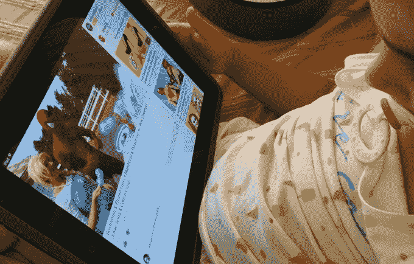

# 我看了 1000 个小时的 YouTube 儿童内容，这就是发生的事情...

> 原文：<https://web.archive.org/web/https://techcrunch.com/2017/11/12/i-watched-1000-hours-of-youtube-kids-content-and-this-is-what-happened/>

多年来，用户生成的五颜六色的内容在 YouTube 上成功地吸引了数百万孩子的眼球，这些内容通过重新混合流行的卡通人物来粗略地表演关键字搜索场景，本周进入了更广泛的公众视野，此前作家詹姆斯·布赖德(James Bridle)写了一篇措辞严厉的 [Medium post](https://web.archive.org/web/20221204000743/https://medium.com/@jamesbridle/something-is-wrong-on-the-internet-c39c471271d2) 文章，辩称这些内容代表了“数字系统和资本主义激励机制相结合所固有的一种暴力”。

如果你没完没了地将《蜘蛛侠》和《小丑》与《T2》《冰雪奇缘》《T3》中的艾尔莎重组，并为麦当劳等垃圾食品品牌植入大量广告，你会得到什么？

很明显，YouTube 上有很多观点。因此，一种非常现代的儿童“娱乐”形式显然只能存在于一个巨大的、质量不受控制的、本质上不受监管的、算法激励的广告平台上，对内容创作者来说，这个平台的准入门槛非常低，它纯粹根据它是否能通过获得浏览量将自己从无限的视觉汤供应中提升出来来判断最终的 UGC，并通过擅长迎合民粹主义的幼稚渴望、最能表达这些渴望的关键词搜索标准以及自动对内容进行排名的算法来做到这一点。

这是有效的——如果不是字面上的话——由 SEO 优化的机器人进行的媒体编程。

正如马歇尔·麦克卢汉在 1964 年写道的那样，[媒介*就是*信息](https://web.archive.org/web/20221204000743/http://web.mit.edu/allanmc/www/mcluhan.mediummessage.pdf)。

> …因为它是塑造和控制人类交往和行动的规模和形式的媒介。这种媒体的内容或用途是多种多样的，因为它们在塑造人类交往的形式方面是无效的。事实上，任何媒体的“内容”都会让我们对媒体的特性视而不见，这是非常典型的。直到今天，各行各业才意识到他们所从事的各种业务。当 IBM 发现它从事的不是制造办公设备或商业机器的业务，而是处理信息的业务时，它就开始用清晰的视野导航。

就孩子们而言，通过 YouTube 媒介产生的信息经常是无意义的；一个无意识的和可怕的泥浆，无休止地改变被盗品牌内容的排列，播放着幼稚的曲调，令人眼花缭乱的重复童谣和粗糙的卡通音效的怪异混合。

这是孩子们可能会想到去寻找的东西的一个字面上的哑剧。这充分说明了这种媒体的不良激励机制。

在最近关于 YouTube 上令人不安的 UGC 故意针对儿童的抗议之后，谷歌表示，它将实施新政策，对这类内容进行年龄限制，以防止它们出现在 YouTube Kids 应用程序中，尽管之前禁止“不当使用家庭角色”的政策显然没有阻止流行文化汤的低俗流。

狂笑似乎是这种“类型”的标志性比喻，至少看起来是恰当的。

麦克卢汉的观点是，内容本质上是由我们获取内容的媒介决定的。而且是灵媒本身有能力通过重新配置人类的行为和集体交往来进行结构性的改变。

YouTube 上迷惑孩子们的无脑卡通噪音可能是这种争论的最佳视觉例子。即使麦克卢汉认为分析内容本身只会分散对媒介的适当批判性分析。

你所要做的就是想象这些交易中看不见的另一半:也就是那些一动不动、盯着屏幕看的孩子，他们一小时又一小时地喝着垃圾汤。

这种可怕的东西的繁荣存在，其唯一的目的是通过结构化来产生大量的广告收入，以便有可能通过搜索和推荐算法浮出水面，这也是一个完美的例子，说明人类最容易被说服消费的内容(又名 clickbait)和对他们来说最有智力利润的消费可能是两种截然不同的东西。

像 YouTube 这样经过算法组织的大型平台可能会托管优质内容，但在激励点击诱饵的创建和消费方面是专家——这要归功于广告定位业务模型，这些模型由推荐系统提供，这些系统监控用户的输入和行为，以识别最容易点击、因此最容易上瘾的内容，从而继续向他们提供信息。

(当然，这不仅仅是针对儿童的内容的问题。在同一功能失调的主题上，也可以看到[虚假信息在脸书](https://web.archive.org/web/20221204000743/https://twitter.com/sunny_hundal/status/929378119001264128)的成年人之间传播得有多快，这是另一个由广告资助、按算法组织的大型平台，其内容的优先顺序是尽可能经常地传播。)

就孩子们而言，YouTube 媒体的结构显然是在迎合最高热量的视觉渴望。(例如，另一种非常受欢迎的儿童内容格式是玩具拆箱视频，它在 YouTube 上经常获得数百万的浏览量。)从而挤掉了其他更有思想的内容——因为观看时间是有限的。

当然，并不是所有在 YouTube 上吸引儿童眼球的内容都是如此愤世嫉俗，以至于仅仅由关键词搜索汤组成。或者纯粹涉及他们可能渴望并纠缠父母购买的玩具的视觉效果。

其中一些东西，虽然谈不上原创或复杂，但至少可以包含情节和叙事元素(尽管经常涉及恶心/厕所幽默——所以这也是你可能不希望你的孩子花几个小时看的那种东西)。

当然，过去也有过关于孩子长时间看电视的道德恐慌。事实上，新技术常常会引发道德恐慌。

这是预料之中的，因为媒介/媒体能够大规模地重构社会。但也经常在没有充分关注导致结构变化的底层技术的情况下这样做。

在这里，至少内容的问题已经与分发平台的激励结构联系在一起——即使更广泛的问题越来越少被关注；就像社会被免费和无限供应的视觉大众媒体集体迷住意味着什么，这些媒体的内容是由只打算实现经济回报最大化的算法塑造的？

也许在政治领域，至少在 T1，便士已经开始下降。

虽然儿童电视内容可能(也可能)非常平庸，但你很难找到这么多像 YouTube 上为儿童消费而大规模制作的节目那样毫无创意的例子——因为 YouTube 媒体鼓励内容工厂制作点击素材，通过成功吸引该平台推荐算法的注意力，从而有机会在第一时间获得浏览量，从而推动广告收入并挤走其他内容。

这种令人沮丧的内容也很好地说明了数字公理:如果它是免费的，你就是产品。(或者更确切地说，在这种情况下，你孩子的眼球是——引发了孩子们花大量时间观看 clickbait 是否会损害他们的智力和社交发展的问题；即使你不同意 Bridle 的更尖锐的断言，即一些内容是如此糟糕，以至于被故意设计来伤害儿童，因此，再次在媒体中循环，它代表了一种系统的虐待儿童的形式。)

YouTube 上回流的流行文化泥浆的最糟糕的例子甚至不能声称有一个基本连贯的叙述。许多视频只是一系列重复的图形场景，旨在将精选的角色组合在一组无意识的关键字搜索动作和反应中。打斗场面。驾驶场景。垃圾食品交易场景。就这样无意识地继续下去。

一些人甚至自我标榜为“教育”内容——因为在 30 分钟的视频中间，比如说，他们可能会在红色的麦当劳巨无霸或 Chupa Chups 棒棒糖旁边显示“红色”一词；然后是蓝色巨无霸或 Chupa Chups 棒棒糖旁边的“蓝”字；然后是“黄色”这个词……如此等等，令人作呕。

如果真的有哪怕一丁点教育价值的话，也必须与重复的产品植入同时进行的明显的负面影响进行权衡，并且直接向孩子们推销垃圾食品。

当然，这种东西无法与原创儿童漫画和卡通系列相提并论——比如说，像汉娜-巴贝拉的《古怪竞赛》这样的经典作品——过去几代儿童都在 YouTube 上消费免费内容，因为当时没有广告资助、自我分类、免费访问的数字技术平台。

当时，父母可能也不喜欢这些内容——批评卡通是无聊和浪费时间的。但至少这样的系列娱乐了孩子们，在连贯的、创造性的总体叙事中，发展良好的、原创的角色参与到喜剧的次要情节中。至少，孩子们正在学习适当的故事结构。

我们无法预测，一种鼓励工厂流水线生产无脑视觉浆料供儿童消费的媒体会对儿童的发展和整个社会产生什么样的广泛影响。但是，很难想象如此有意识地将基础和底层喂养的东西系统地放在孩子们的眼前会有什么积极的效果。

鉴于内容确实传递了如此空洞的信息，把它解读为对潜在媒体激励结构的警告似乎是合乎逻辑的，就像 Bridle 所做的那样。

事实上，我没有看 1000 小时的 YouTube 儿童节目。十分钟这种可怕的事情足以让我做噩梦。

