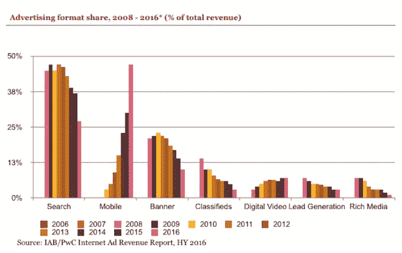

# 根据 IAB 报告 TechCrunch，2016 年上半年数字广告收入增长 19%

> 原文：<https://web.archive.org/web/https://techcrunch.com/2016/11/01/iab-2016-report/>

# 根据 IAB 的报告，2016 年上半年数字广告收入增长了 19%

根据互动广告局(数字出版商和广告商的贸易组织)最新的互联网广告收入报告，2016 年上半年数字广告支出增加到 327 亿美元。

这比去年同期增长了 19 %,创下了历史新高。IAB 的执行副总裁兼首席营销官大卫·多蒂(David Doty)表示，该行业的持续增长“令人惊讶”，但他表示，最令人印象深刻的数字是在移动端，广告收入增长了 89%，达到 155 亿美元——移动广告占所有数字广告支出的 47%，超过了桌面搜索。

“这是一个转折点，”多蒂说。“移动已经成为大事件。”

【T2

这份由普华永道为 IAB 准备的报告显示，移动消费在各个领域都有所增长。例如，移动视频增长了 178%，达到 16 亿美元，而移动搜索增长了 105%，达到 74 亿美元。

与此同时，桌面方面的情况正在下滑，桌面搜索下降了 12%，至 89 亿美元，桌面显示下降了 7%，至 63 亿美元。

虽然该报告没有具体列出移动社交媒体，但它表示，社交媒体广告支出整体增长了 57%，达到 70 亿美元。