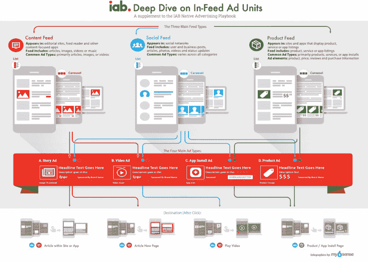

# IAB 发布植入式广告新概览 

> 原文：<https://web.archive.org/web/https://techcrunch.com/2015/07/21/iab-releases-a-new-overview-of-in-feed-ads/>

# IAB 发布植入式广告的新概述

互动广告局[刚刚发布了它的“深度潜水”](https://web.archive.org/web/20221207082008/http://www.iab.net/iablog/2015/07/iab-deep-dive-on-in-feed-ad-units.html)进入植入式广告的世界——也就是说，当你浏览你最喜欢的新闻网站或社交网络时，这些广告会出现在广告流的中间。

该报告旨在补充[IAB 的本土广告剧本](https://web.archive.org/web/20221207082008/http://www.iab.net/nativeadvertising)，该贸易集团于 2013 年底在[发布了该剧本。由包括 InMobi、Sharethrough、雅虎和其他数字媒体公司代表在内的任务组准备的这份新报告没有说任何特别有争议的事情(除非你讨厌植入式广告的存在，我猜)。](https://web.archive.org/web/20221207082008/http://www.adweek.com/news/technology/iab-sorts-out-native-ahead-ftc-workshop-154231)

相反，它提供了目前存在的植入式广告类型以及一些不那么令人讨厌的实现方式的概述。

IAB 以两种方式细分馈入广告——基于广告本身(无论是指向书面内容的故事广告、视频广告、应用安装广告还是产品广告)，以及广告出现的馈入类型(内容、社交或产品)。在每一种情况下，报告都提供了一些样本，以显示广告的外观以及用户点击或轻触广告时会发生什么 IAB 表示，这些例子“不是为了说明，而是为了代表当今普遍使用的范围。”

那么，该组织实际上在推荐什么呢？嗯，它强调披露的重要性，用“大而可见”的语言，清楚地表明广告已经付费了。它的结论是:

> 仅仅因为广告客户可以在任何类型的提要站点上放置任何类型的提要广告，并不一定意味着他们应该这样做。为了在原生(形式、功能、整合)的期望范围内满足广告商的目标，广告商应尊重消费者对单个发布者网站的期望，发布者应考虑拒绝不符合消费者对周围编辑内容的期望的广告类型。

是的，我们在 TechCrunch 上投放了一些植入式广告。我不认为编辑团队对这一举措感到兴奋，但如果这真的发生了，最好能有关于这些广告应该如何表现的明确指导方针。

你可以[在这里](https://web.archive.org/web/20221207082008/http://www.iab.net/media/file/IAB_Deep_Dive_on_InFeed_Ad_Units.pdf)阅读完整的“深潜”。

