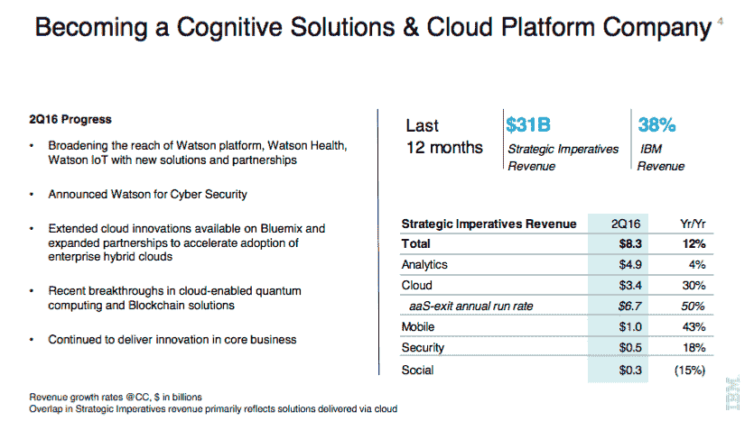
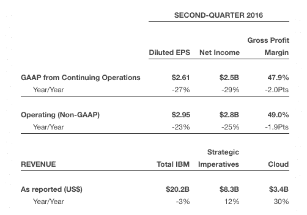
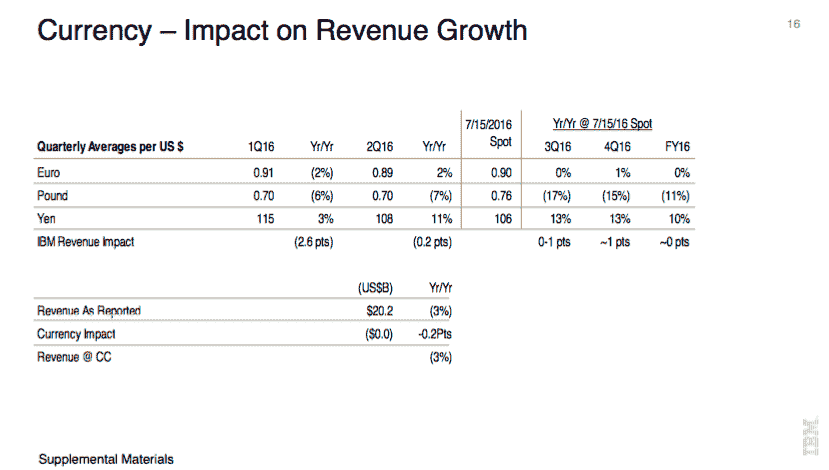

# IBM 以 202.4 亿美元的销售额击败 Q2 普通大众，每股收益 2.95 美元，云收入增长 30%

> 原文：<https://web.archive.org/web/https://techcrunch.com/2016/07/18/ibm-beats-the-street-in-q2-with-sales-of-20-24b-eps-of-2-95-cloud-revenues-up-30/>

IT 巨头 IBM 刚刚公布了其第二季度收益，收入为 202.4 亿美元，非 GAAP 每股收益为 2.95 美元。这些数字超过了[分析师预计的](https://web.archive.org/web/20221001181251/http://finance.yahoo.com/quote/IBM/analysts)200.3 亿美元的收入和每股 2.89 美元的非 GAAP EPS。

然而，非 GAAP 净收入为 28 亿美元，比一年前下降了 25%(GAAP 净收入为 25 亿美元，现在为 29%)。尽管结果显示盈利并超出分析师的预期，但它们仍在继续下滑。一年前，IBM 报告营收为 208.1 亿美元，每股收益为 3.84 美元。

投资者似乎对今天的收益报告很满意[。在盘后交易中，IBM 的股票上涨了近 3.3%，即每股 3.65 美元，至 163.51 美元。](https://web.archive.org/web/20221001181251/http://www.businesswire.com/news/home/20160718006295/en/IBM-Reports-2016-Second-Quarter-Earnings)

[graphiq id="9snpGgcdB9b" title= "国际商业机器公司(IBM)股价" width = " 600 " height = " 649 " URL = " https://w . graphiq . com/w/9 snpggcdb 9 b " link = " http://listings . findcompany . com/l/14803/International-Business-Machines-Corporation-in-Armonk-NY " link _ text = "国际商业机器公司(IBM)股价| findcompany "]

虽然该公司是科技行业中最大和最具标志性的公司之一，但 IBM 的遗留业务——即其服务器硬件和 z Systems 业务等领域——继续萎缩，本季度 Systems 下降了 23%以上。这就是为什么该公司、其他大型 IT 公司和小型初创公司都在新的业务浪潮中投入了如此多的精力和投资。

就蓝色巨人而言，它几乎涵盖了世界上所有的 IT 领域，包括新兴领域，如区块链、T2、人工智能和沃森部门的机器学习，以及各种各样的云服务，既有独立的云服务(如 T4 的视频产品 T5 或 T6 的安全产品 T7)，也有与思科等公司合作的云服务，思科最近几周扩展了与 IBM 的关系 T9。

正如您在下面的两个表格中看到的，第一个来自投资者演示，第二个来自财务发布，虽然这些新领域继续增长，但仍不足以抵消其他领域的下降:

就 Q2 的亮点而言，云服务继续增长，本季度增长了 30%，在过去的 12 个月里达到了 116 亿美元，占 IBM 上一季度收入的 17%。沃森和分析、安全、社交和移动技术的总收入增长了 12%，上个季度的销售额为 83 亿美元。

在其他部门中，IBM 注意到其中几个部门的整体下滑:

*   认知解决方案公布的收入为 47 亿美元，增长 3.5%。该部门的云收入增长了 54%。
*   全球商业服务收入为 43 亿美元，下降 2%。
*   技术服务和云平台(包括基础设施服务、技术支持服务、集成软件)的销售额为 89 亿美元，下降了 0.5%。
*   系统(包括系统硬件和操作系统软件)的销售额为 20 亿美元，下降了 23.2%。
*   全球融资(包括融资和二手设备销售)的销售额为 4.24 亿美元，下降了 11.3%。

2016 年到目前为止，IBM 在 M&A 非常活跃。IBM 首席财务官马丁·施罗特尔(Martin Schroeter)表示，该公司在过去 12 个月的收购支出超过了公司历史上的任何时候。本季度的大部分投资支持了 IBM 不断增长的认知解决方案业务。来自 Truven Health 的数据将支持 Watson Health，而 [Bluewolf](https://web.archive.org/web/20221001181251/http://siliconangle.com/blog/2016/03/30/ibm-acquires-salesforce-consulting-firm-bluewolf-for-200m/) 和 [EZ Source](https://web.archive.org/web/20221001181251/https://beta.techcrunch.com/2016/06/01/a-big-over-4-6-billion-week-in-enterprise-ma-highlights-the-business-markets-critical-needs/) 将帮助在认知解决方案和云服务与 API 管理产品和咨询服务之间架起桥梁。

在一次收益电话会议上，IBM 报告说，它将在未来几个月内让 Watson 用于更多的安全应用。这与该公司进行的其他战略收购是一致的。IBM [收购了 Resilient Systems](https://web.archive.org/web/20221001181251/https://beta.techcrunch.com/2016/02/29/ibm-adds-post-cyber-attack-planning-with-resilient-systems-acquisition/) ，这是一家为日益增长的网络安全服务提供安全事件响应的公司。

未来几个季度需要考虑的一个有趣问题是，欧洲的形势，尤其是英国的形势，可能会对公司产生什么影响。今天，IBM 报告了不同部门的货币影响，但该公司将英国视为其重要的国际市场之一，并预测货币贬值，例如英镑贬值，将在未来几个季度影响他们。其他 IT 公司如惠普和戴尔已经提高了他们的价格以弥补货币的下跌，所以值得观察 IBM 是否会这样做。

