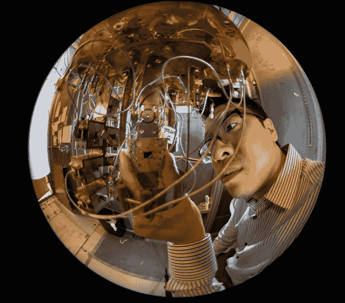

# IBM 研究人员现在可以发现量子计算中的错误 

> 原文：<https://web.archive.org/web/https://techcrunch.com/2015/04/29/ibm-researchers-can-now-spot-errors-in-quantum-calculations/>

# IBM 研究人员现在可以发现量子计算中的错误

IBM 的研究人员说，他们已经用一种新系统解决了量子计算难题中的一大块，这种新系统可以防止量子位中突然出现的错误。

该团队正在解决的问题类似于传统计算中存储数据的位中可能突然出现的错误。有时，应该是 0 的位变成了 1(反之亦然)，导致不准确或损坏的数据。为了解决这个问题，增加了一个额外的位，它的状态指示其他位是否都是正确的。

IBM Research 的实验量子计算经理 Jerry Chow 告诉 TechCrunch，他的团队正在寻找同样的比特翻转错误，但也在寻找量子比特特有的更奇怪的错误。鉴于它们的量子性质，量子位可以是 0 或 1，但 0 和 1 之间关系的“相位”可以在正负之间变化。

在 IBM Research 设计的系统中，有两个量子位保存数据，另外两个“检查”错误——它们的状态分别取决于一个量子位是否翻转到错误的值或相位。

Chow 说，这种方法可以随着系统中量子位的数量线性扩展，因此更大的晶格将需要更多的测量位。但是这个数字不会随着系统的能力成指数增长。

那么，为什么处理错误对量子计算如此重要呢？这些误差是由于热量、电磁辐射和材料缺陷等因素的干扰而产生的，不幸的是，这些因素都很常见。如果分子相互作用的模拟结果是可信的，那些使用数据的人需要知道没有随机误差。

下一个来自 IBM 的实验量子计算团队的是一个具有 8 个量子位的类似晶格。“13 或 17 个量子位是下一个重要的里程碑，”Chow 说，因为在这一点上，他们将有能力开始将逻辑编码到量子位中——这是事情开始变得真正有趣的时候。