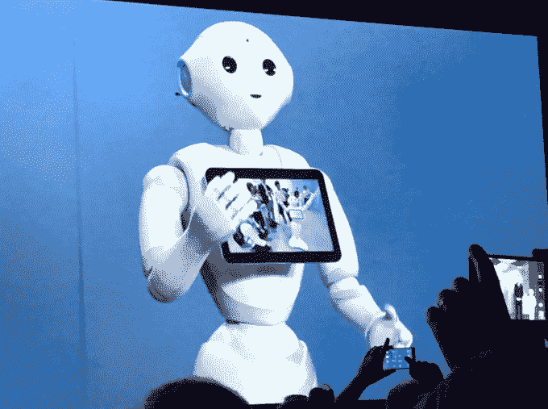

# IBM 的沃森现在为安德玛、软银的 Pepper 机器人和更多 TechCrunch 提供人工智能

> 原文：<https://web.archive.org/web/https://techcrunch.com/2016/01/06/ibms-watson-now-powers-ai-for-under-armour-softbanks-pepper-robot-and-more/>

从 2011 年作为 Jeopardy 冠军首次亮相到世界各地， [IBM 的沃森](https://web.archive.org/web/20230124192809/http://www.ibm.com/Watson)已经成为大型企业应用的强大人工智能平台，从[医学研究](https://web.archive.org/web/20230124192809/https://techcrunch.com/2015/08/06/ibm-buying-merge-healthcare-for-1b-to-bring-medical-image-analysis-to-watson-health/)到[金融](https://web.archive.org/web/20230124192809/http://www.techmeme.com/150524/p4#a150524p4)。现在，IBM 的目标是将沃森带到消费者面前。

在今天的 CES 上，IBM 首席执行官金妮·罗梅蒂(Ginny Rometty)公布了与运动服装制造商安德玛、软银机器人公司 Pepper 等的战略合作伙伴关系，这些公司正在使用沃森的机器学习算法和人工智能来运行智能和更个性化的应用程序和其他服务。这是 IBM 沃森扩张的最新举措:今年早些时候，该公司在德国成立了一个认知商业解决方案部门和一个独立的物联网中心。在今天的讲台上，Rometty 还指出，IBM 已经进行了大约 30 次收购，以扩大其专业知识和数据。

安德玛表示，它将在其健身和健康应用程序中使用沃森。其新版本的 [Record](https://web.archive.org/web/20230124192809/https://itunes.apple.com/us/app/record-by-under-armour-fitness/id895425891?mt=8) 应用程序——一年前首次推出，作为一个活动聚合器和监控器(整合来自 Jawbone、Withings 和 Garmin 的可穿戴设备的数据)——现在将开始包括不同的人工智能功能。

其中第一个将是一个“就像我一样”的功能，将用户与匿名的其他个人进行比较，以提供关于那个人的表现的一些见解，并提出建议。后来，该计划将包括一个类似 Siri 的私人教练，称为认知教练系统。基本上，Record 现在要做的是根据你的活动、睡眠和营养数据了解更多关于你的信息，并就如何提高你的表现提供建议。

IBM 和安德玛表示，Record 是他们的第一步，他们还计划为运动员开发应用程序，以利用 IBM 积累的更广泛的大数据池(有时通过其自己的 Watson 应用程序吸收这些数据):这将包括一些有趣的数据扭曲，如天气对成绩和训练的影响(想想 IBM 对天气公司的收购)。

安德玛创始人兼首席执行官凯文·普兰克在一份声明中说:“谈到数字健康和健身跟踪，过去十年一直是关于数据收集的。”“我们现在正处在一个转变的时刻，消费者对这些信息的要求越来越高。”

在这种情况下,“战略”到底是什么意思？IBM 表示，两家公司都在贡献员工、技术和资源来开发认知教练系统。

## 软银的胡椒

IBM 还与日本软银(Softbank)合作开发 Pepper，这是该公司的新机器人，现在首次开始向日本以外的地区发货。

沃森驱动的 Pepper 将利用广泛的数据源，从图像和文本到社交媒体和视频。IBM 表示，这一想法是为了让机器人能够“像人类一样理解世界——通过感官、学习和经验。”

“这已经不再是科幻小说的世界了，”软银机器人总监吉田健一(Kenichi Yoshida)今天在台上说道。

IBM 表示，第一批沃森驱动的机器人将在酒店和消费者零售环境中进行试点，给更广泛的受众提供第一时间、第一手的平台体验。这里的想法不是像 Pepper 这样的机器人正在取代销售助理，而是它们正在取代一些已经取代它们的更干燥的售货亭。

“今天零售环境中的自助服务选项通常是平板电脑或自助服务亭，这限制了客户体验的真正交互性和直观性，”IBM 指出。“有了机器人助手，用户可以进行自然的对话，他们的话语、手势和表情都能被理解。”

在日本，一些措施已经开始实施。Rometty 指出，已经有数百台 Pepper 机器人在雀巢零售店和日本的银行推出，它们正在帮助顾客在简短的问答会议后购买咖啡机。自 2015 年年中上市以来，Pepper 机器人一直在限量发售中售罄。

事实上，Pepper 不仅仅是一个简单的 B2B 产品:其想法是 Watson 将通过 SDK 的方式加载到 Pepper 机器人上，使开发人员能够修改和定制它的工作方式。

沃森今年早些时候首次与软银合作，部分是为了帮助沃森学习日语。

Rometty 今天报道的其他合作伙伴包括 Metronic 的一项新的糖尿病测试，该测试将能够在潜在的低血糖事件实际发生前几小时检测到它们，以帮助预防它们。然而，与安德玛和软银的合作不同，这项测试还不可用，因为它仍在通过监管障碍。

