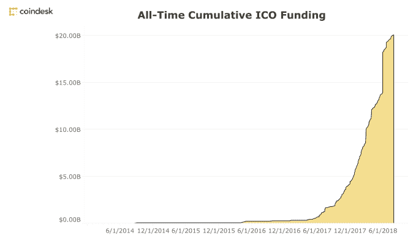
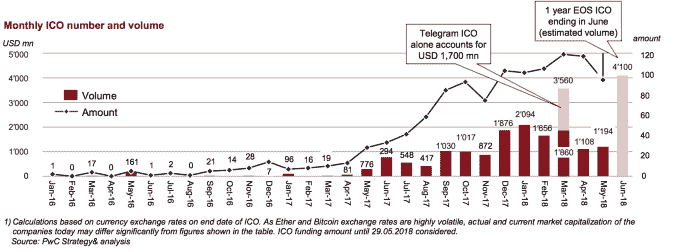
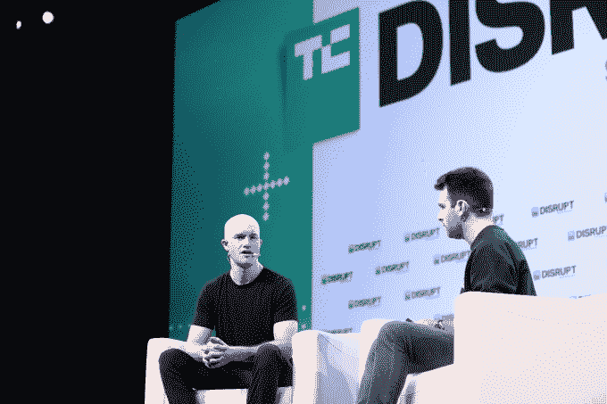

# ico 越来越只属于风险投资家

> 原文：<https://web.archive.org/web/https://techcrunch.com/2018/09/12/icos-are-increasingly-just-for-venture-capitalists/>

2017 年过山车般的暴富 ICOs 已经结束——加密公司开始意识到，专业投资者并不那么糟糕。

去年，公司通过首次发行硬币(ico)筹集了约 55 亿美元的加密货币资金。作为一个没有监管的新兴投资体系，几乎任何人都可以进入。连锁效应是，许多乘风破浪的人获得了巨额利润，往往高达数百万美元，因为 10 倍的回报似乎成为了那些变得密码丰富的人的最低标准。

这一趋势在 2018 年加速发展，当时比特币的价格达到近 2 万美元的峰值，以太坊的价格为 1200 美元。据 Coindesk 报道，[仅在今年前三个月，ICO 融资就达到了 63 亿美元，但是，快进六个月，一个新的趋势已经出现。允许任何人投资的公开 ico 正越来越多地被一种新的有限私人销售方式所取代，这种销售方式只包括合格的投资者和关系密切的人。如今，许多 ico 都不包括公开销售部分，散户投资者不得不等到代币在交易所上市。](https://web.archive.org/web/20230304111827/https://www.coindesk.com/6-3-billion-2018-ico-funding-already-outpaced-2017/)

## 仅限私人销售

Telegram 17 亿美元的巨额 ICO 最能体现这种变化。

2017 年，ICOs 开始在“公开”公开销售阶段之前包括私人预售，其想法是吸引大笔资金，并在某些情况下提供折扣等激励措施。但是 Telegram 选择公开其全部销售。它还坚持接受美国合格投资者的资金，而不是向任何想从其象征性销售中分一杯羹的人敞开大门。

这种趋势已经在其他 ico 中重复出现，包括最近为 Terra 提供的 3200 万美元“种子”轮投资及其稳定硬币项目。Terra 的联合创始人丹尼尔·申(Daniel Shin)向 TechCrunch 解释说，它将举行第二轮私人销售投资，但这将保留给投资专业人士和网络中的其他人。

当然，从法律上讲，这绝对有道理。

SEC 正在稳步加大对 ico 的打击力度，长期以来，计划购买 ico 的公司通常会忽略美国、中国以及通常其他法律不明确的国家的公民参与销售。但是，实际上，私下销售的基本原理超越了合法性。

## 专业投资者利益

加密行业已经意识到这样一个现实:从少数专业投资者那里获得资本——无论是风投、家族理财室、对冲基金还是战略公司——可能比从一群普通人那里获得资本更有优势。

首先，与十几个投资者打交道远比与一个数万人的电报集团打交道容易。专业投资者更习惯于给公司钱，让它独立使用，但加密领域的散户投资者往往要求更高，也更不现实，因为他们寻求快速回报。虽然流动性是 ICO 中所有人的主要吸引力，但与寻求转向下一个赚钱机会的散户投资者相比，风投往往持有更长期的方法。或者，在像现在这样的低迷时期，投资者有更雄厚的资金来度过衰退。

有一种流行的说法是，ico 意味着不必与“邪恶的风险资本家”打交道，但散户投资者群体正以自己的方式提出要求。许多 ICO 项目浪费时间和宝贵资源，发布缺乏新闻的乏味新闻稿，只是为了制造一些东西，希望能够安抚饥渴的散户投资者，并奇迹般地让他们的股票价格飙升。例如，[与韩国美国商会](https://web.archive.org/web/20230304111827/https://www.prnewswire.com/news-releases/pundi-x-and-american-chamber-of-commerce-korea-introduce-cryptocurrency-payment-solutions-for-mainstream-adoption-300655622.html)签署“战略合作伙伴关系”并不是新闻，真正的销售才是。

当你着手建立一家公司或一个产品时，这种资源的分散和分配是没有意义的，而这些项目的创始人最终都在这么做。任何有经验的创始人或投资者都会说，在早期，保持专注是关键。

除此之外，专业投资者实际上可以通过利用他们的网络来帮助建设。无论是在竞争激烈的区块链行业协助招聘，介绍潜在客户——美国商会韩国分会痛不欲生——引进其他投资者，等等。

这就是为什么在前面提到的案例中，Terra 选择将四个加密交易所纳入其私人出售中——毫无疑问，它们的影响将是建设这个仍然是一个巨大的雄心勃勃的项目的关键。其他筹集了大量 ico 的公司，包括 TenX 和 MCO，都公开表示有兴趣进行新一轮投资，以引入专业风投。这是因为光靠钱是打开不了大门的，但通常关系可以。

概括一下:专业风投可以更信任、更少分心、更有用，但在某些情况下，更开放的公开方式应该是 ICO 的一部分。这就是建立社区的时候。

## 例外:社区

“社区”这个术语已经被 ICOs 彻底地贬低了，但是有一些项目——至少在理论上——可以通过允许特定类型的人(将使用该产品的人)尽早参与进来而受益。

今年早些时候，交易所火币网为其用户[开发了一个令牌](https://web.archive.org/web/20230304111827/https://www.prnewswire.com/news-releases/huobi-global-launches-huobi-token-ht-300585764.html)，而[的聊天应用 Line 也在打造一个令牌](https://web.archive.org/web/20230304111827/https://techcrunch.com/2018/08/31/line-link-crypto-token/)，希望它能被用作其消息平台的一部分。在这两个案例中，两家公司都没有 ICO，但是他们确实使用了加密令牌来构建社区。

希望利用区块链“修复”媒体的初创公司 Civil 正在举办一场向公众开放的 ICO 活动。这也是一个社区剧，因为 CVL 令牌将被要求在其平台上创建新闻编辑室，并与他们互动，如挑战记者撰写的故事。

其他技术项目也在做同样的事情——直接关注他们正在建设的社区，并为他们的 ICO 筹款采用较低的目标数字。

技术空间如此之大，以至于有例外，但肯定值得注意的是，相对而言，很少有可信的项目规划包含散户投资者参与的 ico。[普华永道](https://web.archive.org/web/20230304111827/https://cryptovalley.swiss/wp-content/uploads/20180628_PwC-S-CVA-ICO-Report_EN.pdf)联合撰写的一份报告显示，ICO 投资的总体步伐落户 Q2 2018。如果你忽略像火币、Telegram 和 EOS 这样的异常者——这个融资一年的 60 亿美元项目——那么在经历了 12 个月的爆炸性增长后，活动肯定已经稳定下来。

稳定性的提高可能意味着私下销售的趋势将会继续。传统的风险投资公司正在[推出专门的加密基金](https://web.archive.org/web/20230304111827/https://techcrunch.com/2018/06/25/andreessen-horowitz-has-a-new-crypto-fund-and-its-first-female-general-partner-is-running-it-with-chris-dixon/)，加密领域的风险投资公司正在正式建立自己的投资工具，与此同时，美国证券交易委员会和世界各地的其他监管机构正在加强对 ico 的关注。风险资本在投资 ico 时可能会比以往扮演更重要的角色。

这并不是说散户投资阶段已经结束。上周在 TechCrunch Disrupt 上发表演讲时，比特币基地首席执行官 Brian Armstrong 描绘了他对未来的愿景，即所有公司的资本表都被“令牌化”

他预计，全世界的散户投资者都可以自由投资于证券代币，这些代币是纽约证券交易所(New York Stock Exchange)、纳斯达克(NASDAQ)等传统投资系统的一个更容易获得的分支。这是否会延伸到参与 ico 本身还有待观察。

比特币基地首席执行官 Brian Armstrong 认为，散户投资者在加密市场有很大的前途

*披露:作者拥有少量加密货币。足以获得一种理解，不足以改变一种生活。*