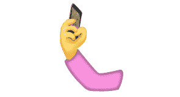
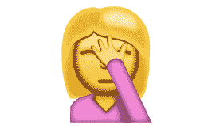
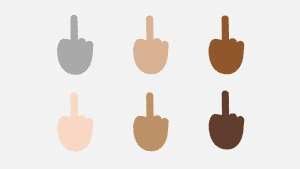

# 如果这个自拍表情符号成为官方表情符号，我就要回去用翻盖手机了 

> 原文：<https://web.archive.org/web/https://techcrunch.com/2015/08/20/if-this-selfie-emoji-becomes-official-i-am-going-back-to-using-a-flip-phone/>

# 如果这个自拍表情符号成为官方的，我就要回去用翻盖手机了

我最喜欢做的一件事是观看和了解哪些表情符号成为 Unicode 更新的候选(不要评判)。有时候他们真的很棒，有时候他们，嗯，很讨厌。

两年前[“自拍”这个词被加进了字典](https://web.archive.org/web/20221202110933/https://beta.techcrunch.com/2013/08/27/twerk-selfie-bitcoin/)，这让我的一天真的很糟糕，直到我看到“twerk”也被加了进去。然后就变成了有史以来最糟糕的一天。好吧，又一个无限的 facepalm 日即将到来，因为我们可能真的要忍受一个描绘他妈的*自拍的表情符号。*

是的。你没看错。

自拍行为仍然是几天来的笑柄，所以添加表情符号肯定不会让事情变得更糟。会吗？当然会。

自拍表情符号是 Unicode 9 的[候选，将于 2016 年年中推出。这意味着还有时间把它扔掉。其余的候选人都很正常(这里有几个):](https://web.archive.org/web/20221202110933/http://blog.emojipedia.org/unicode-9-emoji-updates)

*   戴牛仔帽的脸
*   小丑脸
*   恶心的脸
*   笑得在地上打滚
*   流口水的脸
*   说谎的脸
*   叫我手
*   抬起手背
*   朝左拳
*   向右的拳头
*   培根
*   握手
*   食指和食指交叉的手
*   孕妇
*   脸掌
*   耸肩

看到了吗？甚至还有 facepalm 表情符号。那是我能得到的东西。

拜托，拜托哦表情符号领主。不要采用自拍表情符号。如果你有，那就意味着自拍这个词，自拍的行为，看到[自拍杆](https://web.archive.org/web/20221202110933/https://beta.techcrunch.com/2015/07/09/solocam-is-a-selfie-stick-that-isnt-completely-insufferable/)等等。永远不会消失。

当微软[采用这个坏小子](https://web.archive.org/web/20221202110933/https://beta.techcrunch.com/2015/07/29/microsoft-has-a-brand-new-middle-finger-with-your-name-on-it/)时，它是对的:

我应该买什么翻盖手机？