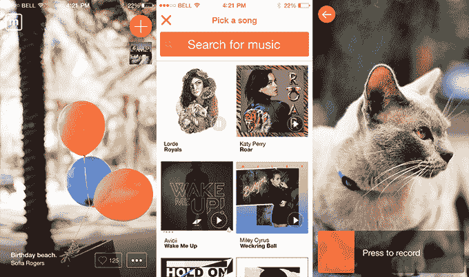
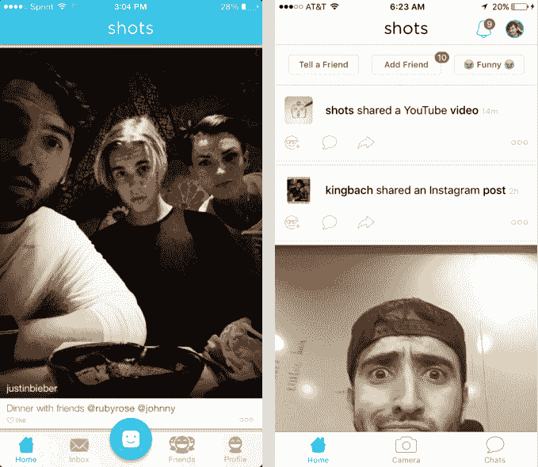
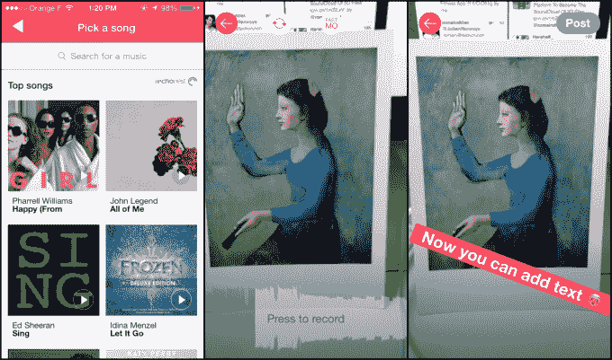

# Shots 收购 Mindie，打造青少年视频应用帝国 

> 原文：<https://web.archive.org/web/https://techcrunch.com/2016/04/20/if-you-build-it-they-will-squeal/>

Mindie 用原声做了 Instagram 用滤镜做的事情:它让枯燥的图像变得有趣。由于青少年分享的视频数量惊人，这个音乐视频制作应用程序似乎太有用了，以至于当它的创造者在 12 月份关闭 Mindie 时，它就不会消亡。因此，由于被贾斯汀比伯支持的自拍应用程序 [Shots](https://web.archive.org/web/20230129230056/https://www.crunchbase.com/organization/shots#/entity) 收购，Mindie 的技术正从坟墓中被挖掘出来。

Shots 的联合创始人约翰·沙希迪告诉我，Shots 刚刚收购了 Mindie 的应用程序、代码、社区和品牌，具体金额未透露。然而，他说这个价格“并不是一个疯狂的数字”虽然团队已经解散，Mindie 的一位创始人现在在 Vine 工作，但 Shots 很快会在 iOS 上重新发布它，并将其带到 Android 上。

“如果我在金门大桥上把手机放在窗外，而你听到这些噪音，那就不太好了，”沙希迪解释道。“但如果你把《再次上路》作为配乐，那就更有趣了。”类似于摄像机也作为镜头内的视频过滤器存在，Mindie 的配乐也可以进入其父应用程序。

Mindie 团队最初发布了一个名为 Ever 的讲故事应用程序，然后在 2013 年推出了专注于[音乐发现](https://web.archive.org/web/20230129230056/https://techcrunch.com/2013/10/17/mindie-is-an-immersive-music-and-video-jukebox-app-done-right/)的同名应用程序。它后来增加了[直接视频消息](https://web.archive.org/web/20230129230056/https://techcrunch.com/2014/04/09/mindie-adds-direct-video-messaging/)，并因要求用户通过 Mindie 登录并分享音乐视频到他们的故事而被 Snapchat 屏蔽了[。](https://web.archive.org/web/20230129230056/https://techcrunch.com/2015/02/10/no-more-snapchacks/)

Mindie 已经从一批强大的投资者那里筹集了 120 万美元的种子资金，包括 Lowercase、SV Angel、Betaworks、CrunchFund (TechCrunch 的创始人公司)、Slow Ventures 及其合伙人戴夫·莫林(Dave Morin)和凯文·科勒兰(Kevin Colleran)、特洛伊·卡特(Troy Carter)和皮特·凯什摩尔。但最终，Mindie 被同为音乐视频制作人的 [Musical.ly](https://web.archive.org/web/20230129230056/http://musical.ly/) 击败，退出了 iOS 应用商店。很快它将获得第二次机会。

Shots 已经从一个自拍应用程序(左)演变成了一个喜剧应用程序(右)

## 新的音乐电视

曾经是硅谷[笑话的笑柄](https://web.archive.org/web/20230129230056/http://www.techmeme.com/131112/p40#a131112p40)已经发展成为一束帮助孩子们欢笑和表达自己的应用:

*   **Shots** 拥有 1100 万注册用户，700 万活跃用户。它最近从[自拍](https://web.archive.org/web/20230129230056/https://techcrunch.com/2013/11/12/justin-bieber-shots-of-me/)扩展到让人们分享链接和视频，并有一个以[最有趣的](https://web.archive.org/web/20230129230056/https://techcrunch.com/2016/03/03/shotscomedyapp/)为特色的提要。它从前期风险投资、DCM、Shervin Pishevar、Bieber 等公司筹集了 1520 万美元。
*   **摄录机**是一个有目的的低保真度但快如闪电的[视频分享应用](https://web.archive.org/web/20230129230056/https://itunes.apple.com/us/app/camcorder-record-vhs-home/id1036066107?mt=8)团队开发的，自 9 月份推出以来已有 500 万次下载。
*   **笨拙的木偶**是 Shots 的[原创视频内容倡议](https://web.archive.org/web/20230129230056/https://techcrunch.com/2015/10/29/awkward-puppets/)，由 Vine 明星鲁迪·曼库索主演的幽默，移动优先的短剧，它的每次观看观看率高达 90%。
*   Mindie 允许用户选择一首歌曲，拍摄一些视频剪辑，并立即创建一个引人注目的音乐视频，比标准的上传到脸书或 Instagram 更具观赏性。

除了这些产品和他们的青少年用户大军，Shots 还培养了一批社交媒体创作者，他们使用其应用程序并向粉丝推广这些应用程序。这些明星大多是在 Vine 上锻造的，像乐乐·庞斯、巴赫、毁灭力量、洛根和杰克·保罗和阿曼达·塞尔尼现在可能会开始拍摄明迪视频。

比伯作为投资者也可以帮助 Mindie，因为它试图正式与主要唱片公司的关系。顶级音乐内容所有者在阻止 Mindie 和 Musical.ly 等应用程序使用他们的歌曲方面出人意料地放松，大概是将这些视频视为对他们艺术家的免费推广。如果 Mindie 开始以某种方式收费，这种情况可能会发生变化，因为唱片公司可能会想要分成或阻止应用程序伪造他们的内容。

贾斯汀比伯主演了一部尴尬的木偶视频

移动视频分享和观看现在正呈爆炸式增长，Mindie 可以让人们的视频片段值得观看。脸书和 Instagram 缺乏任何原生的声音跟踪功能，尽管我的直觉告诉我，这些应用注定会很快获得更多功能齐全的视频上传者，而且脸书去年确实与唱片公司谈过许可事宜。

但是，即使大型社交应用程序加入了音乐，对于轻浮的青少年手指来说，它们可能会感到过于臃肿和复杂。“我们喜欢独立的产品，因为人们，尤其是我们的观众，不希望我们做的是将所有这些想法塞进一个应用程序中，”沙希迪说。“最好把它们都分开，这样不同的产品就不会太杂乱。”