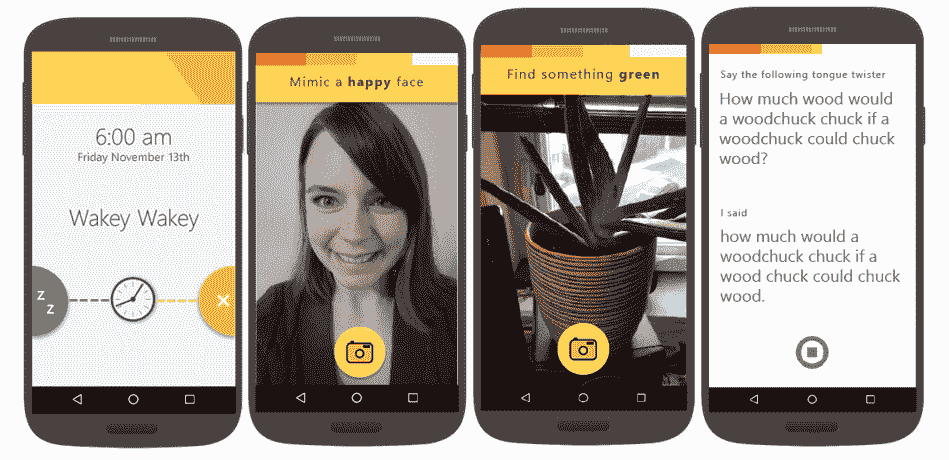

# 如果你讨厌早上，你会非常讨厌微软的新安卓闹钟应用 

> 原文：<https://web.archive.org/web/https://techcrunch.com/2016/01/21/if-you-hate-mornings-youll-really-hate-microsofts-new-android-alarm-clock-app/>

# 如果你讨厌早上，你真的会讨厌微软新的安卓闹钟应用

https://youtu.be/VWJyCYkMc3Y

[微软车库](https://web.archive.org/web/20230210171819/https://garage.microsoft.com/)今天[发布了](https://web.archive.org/web/20230210171819/https://www.microsoft.com/en-us/garage/profiles/profile-mimicker-alarm.aspx)这一定是迄今为止安卓系统最烦人的闹钟——尤其是如果你像我一样讨厌早晨的话。

[模仿闹铃](https://web.archive.org/web/20230210171819/https://play.google.com/store/apps/details?id=com.microsoft.mimickeralarm)应用程序只能让你通过——你猜对了——模仿特定的面部表情，给一个与应用程序决定的当天颜色相匹配的物体拍照，或者通过重复绕口令(“我想要的只是一杯真正的咖啡，用真正的铜咖啡壶做的”)。

如果你按下暂停键，你会有五分钟的休息时间。

如果你没有在 30 秒内完成游戏，应用程序将假设你再次睡着了，闹钟将再次开始响起。

微软开发了这款应用，作为开发人员利用其牛津项目机器学习服务所能创造的一个例子。这些产品出奇的好，公司喜欢用奇怪的小实验来炫耀它们。例如，第一个——How-Old.net——是微软上一次构建会议的意外收获。

**在今天的发布会上，牛津项目应用开发团队的项目经理艾莉森·莱特(Allison Light)表示，通过模仿器，我们展示了几种不同的牛津项目应用编程接口。“我们希望开发一个简单的应用程序，利用牛津项目让它变得独特而有趣。由于我们[开源了所有代码](https://web.archive.org/web/20230210171819/https://github.com/Microsoft/ProjectOxford-Apps-MimickerAlarm)，我们认为其他开发人员可以很容易地阅读代码并了解我们是如何使用 API 的。”**

 **微软表示，“该应用的内部测试给团队带来了积极的反馈。”那显然是一群早起的人。

公平地说，你也可以随时关掉游戏，把这个应用程序当作一个普通的闹钟来用，但这有什么意思呢？**