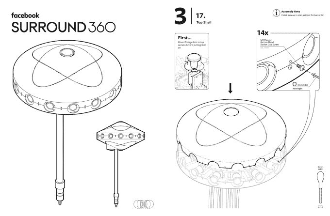
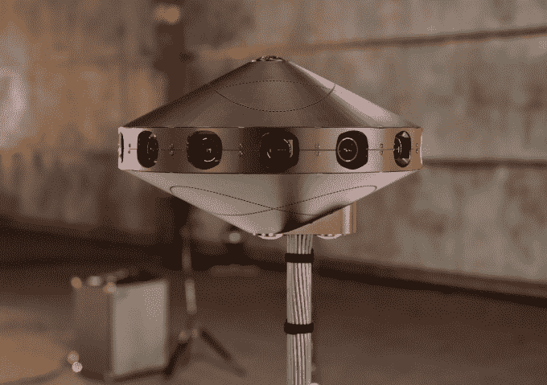
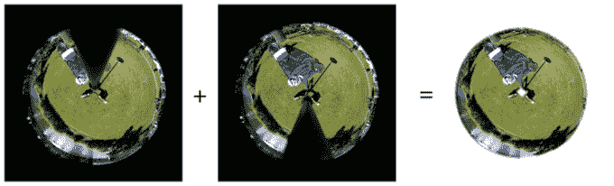
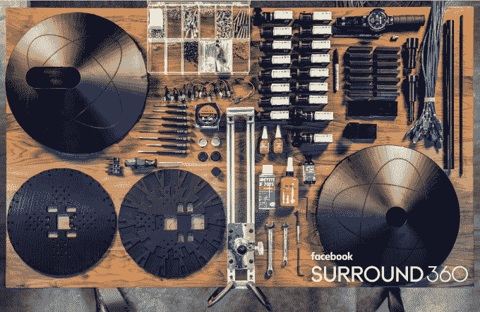

# 脸书开源环绕 360°摄像机，带有宜家风格的说明

> 原文：<https://web.archive.org/web/https://techcrunch.com/2016/07/26/if-you-source-it-they-will-build/>

脸书需要你用 360 的内容填充它的新闻 Feed、Oculus Rift 和 Gear VR。所以[今天](https://web.archive.org/web/20230404065135/https://code.facebook.com/posts/265413023819735/surround-360-is-now-open-source/)它在四月份宣布计划后，把它的[环绕 360°摄像机](https://web.archive.org/web/20230404065135/https://techcrunch.com/2016/04/12/facebook-surround-360/)的所有硬件和软件设计放到了 [Github](https://web.archive.org/web/20230404065135/https://github.com/facebook/Surround360) 上。由于受到宜家手册启发的厚脸皮指导手册，你可以学习如何购买零件，组装相机，加载图像拼接软件，并开始拍摄 360°内容。

实际上，在一个看起来像 UFO 的棍子上有 17 个摄像机，Surround 360 摄像机可以以大约 30，000 美元的价格组装。400 万像素的镜头可以拍摄 4K、6K 或 8K 360 视频，顶部和底部的鱼眼镜头可以消除盲点。脸书强迫一名随机工程师尝试根据开源指令构建 Surround 360，发现这需要大约四个小时。

“我们开始对此进行开源，并加速这个生态系统的发展，并捕捉 360°视频。我们相信这是第一款完全端到端开源的相机，”脸书负责该项目的工程总监 Brian Cabral 说。“自己构建，修改，制作不同的版本——这就是目标。我们希望用丰富的新媒体连接世界。这是我们能够更快到达那里的方法。”

这是一个构建视频，展示了环绕声 360 的融合:

对于普通消费者来说，与你可以买到的大约 400 美元的现成型号(如 [360Fly](https://web.archive.org/web/20230404065135/https://360fly.com/) 或[理光 Theta](https://web.archive.org/web/20230404065135/https://theta360.com/en/) )相比，Surround 360 肯定太贵太费力了。

需要一台适应性强、便携、耐用的相机进行商业拍摄的专业人士不得不花费[60，000 美元购买一台诺基亚 Ozo](https://web.archive.org/web/20230404065135/https://ozo.nokia.com/ozo_en/ozo-vr-capture-device/) ，花费 15，000 美元购买谷歌 Jump-powered[go pro Odyssey](https://web.archive.org/web/20230404065135/https://gopro.com/odyssey)，这款相机只限量生产，或者等待 [Lytro Immerge](https://web.archive.org/web/20230404065135/https://techcrunch.com/2015/11/05/lytro-introduces-immerge-for-cinematic-virtual-reality/) 。环绕声 360 可立即用一般可用的部件进行构建，并可根据创作者的需求进行调整。

正如[脸书的其他大型开源项目](https://web.archive.org/web/20230404065135/https://code.facebook.com/projects/)一样，如用于构建界面的 Open Compute servers、React JavaScript library，它希望开发者根据他们的需求定制设计，但也提供可以与社区分享的修改建议。“他们可以帮助我们改进蓝图，”卡布拉尔告诉我。

由于脸书的图像拼接软件，360 视频几乎不需要后期处理就可以从相机中出来，操作员甚至可以观看低分辨率的实时预览。这大大加快了获得完美镜头的速度，而不需要等待一天或更长时间来检查处理后的数据。多亏了一根特殊的超长电缆，视频导演可以远程操作摄像机，这样他们就不在镜头里了。

观看环绕声 360 拍摄的内容令人印象深刻。非常清晰，尤其是在 8K 拍摄时。然而，由于 Gear VR 等一些耳机无法足够快地处理或传输那么高的分辨率，所以 Surround 360 提供了动态流媒体。

来自环绕声 360 摄像机底部的两个鱼眼镜头的图像可以被组合以移除它所站立的杆

这将你在耳机中看到的东西放在高清 8K 中，但如果你摆动你的头，你会看到一秒钟的低分辨率图像，直到这个角度变成高清。滞后是显而易见的，但这是一个聪明的权衡，提供了一个额外的尖锐，虽然有限的窗口到另一个地方。

360 和 VR 内容的一个大问题是制作起来有多艰难。这个瓶颈意味着狂热的耳机用户可能会看不到顶级的体验，让他们的虚拟现实设备积灰。通过促进内容创作，脸书正在拓宽其虚拟现实分销渠道。Surround 360 尤其擅长制作出色的新闻照片和视频，这些照片和视频可以将用户吸引到脸书，因为它们无法在 Snapchat 和 twitter 等其他社交网络上运行。

但要实现这一切，环绕声 360 不可能是一个令人生畏的 DIY 项目。因此，当被问及组装手册是否直接受到宜家黑白指南的启发时，Cabral 笑着说:“我们让它变得容易理解。我们希望它有点熟悉和干净。我们并没有真的打算这么做，但事情就是这样发展的。”

