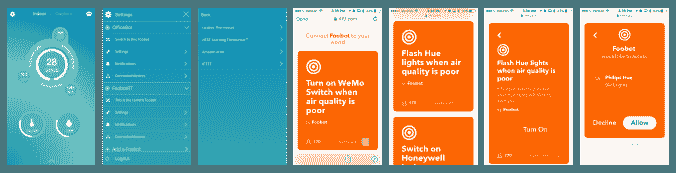

# IFTTT 食谱现在直接嵌入第三方应用程序，如 Ring、Roger 和 Lifx 

> 原文：<https://web.archive.org/web/https://techcrunch.com/2016/08/10/ifttt-recipes-now-embed-directly-on-3rd-party-apps-like-ring-roger-and-lifx/>

IFTTT 作为一个平台而闻名，人们可以轻松地构建(或获取预构建的)脚本来自动化各种应用程序中或之间的任务——例如，当你的汽车告诉它你离这里 20 分钟车程时，使用你家的智能恒温器打开空调。现在，作为该公司发展无处不在的努力的一部分，它正在采取下一个自然的步骤:不再期望用户自己在 IFTTT 上找到或编写这些食谱，它现在将允许[开发合作伙伴](https://web.archive.org/web/20230201180829/https://ifttt.com/developers)将这些 IFTTT 食谱直接嵌入他们自己的第三方应用程序中。

第三方嵌入现在将对所有开发者开放，但今天，第一批主持 IFTTT 食谱的合作公司是视频门铃环、资金管理器 Qapital、污染监测器 Foobot、车库管理器 Garageio、汽车监测器 Automatic、空气质量跟踪器 Awair、视频门铃 Skybell、智能灯泡公司 LIFX、天气信息提供商 Bloomsky、消息应用程序 Roger、家庭安全初创公司 and 和 Stack Lighting。

IFTTT 的联合创始人兼首席执行官林登·蒂贝茨(Linden Tibbets)表示，初始合作伙伴已经开始付费使用该平台，未来将公布更多定价细节。

虽然 IFTTT 可以与任何应用程序配合使用，但最近该公司看到了与联网硬件初创公司合作的机会，创造了自动化这些服务的方法，并帮助分散的市场更加和谐地工作。这一初始群体中的许多公司都是这一努力的一部分。

IFTTT 表示，今天发布的几家公司在过去一年中一直在致力于私人测试版的集成(大多数公司已经与 IFTTT 合作:例如参见[罗杰](https://web.archive.org/web/20230201180829/http://techaeris.com/2016/05/12/roger-app-gets-major-update-alexa-slack-ifttt-integration/)、 [Qapital](https://web.archive.org/web/20230201180829/https://blog.qapital.com/space-qapital-out-of-this-world-ifttt-recipes) 、 [Ring](https://web.archive.org/web/20230201180829/http://blog.ring.com/index.php/2015/12/15/1374/) 、 [Foobot](https://web.archive.org/web/20230201180829/https://techcrunch.com/2016/06/21/hardware-battlefield-competitor-foobot-wants-to-reduce-pollution-in-your-home/) 、[自动](https://web.archive.org/web/20230201180829/https://techcrunch.com/2014/02/26/connected-car-app-automatic-gets-even-smarter-with-ifttt-integration/)、 [Garageio](https://web.archive.org/web/20230201180829/http://www.cnet.com/videos/garageio-opens-the-door-to-ifttt-and-echo-integration/) )。与此同时，我们已经看到来自其他公司的竞争产品，如微软和 Hive。

自 2010 年以来，IFTTT 已经从安德森·霍洛维茨、贝塔沃克斯、NEA 和诺韦斯特风险投资公司等投资者那里筹集了大约 3900 万美元的资金，如今它为大约 330 个应用程序提供菜谱，但它没有透露它有多少用户或这些菜谱被利用的频率。

但是为什么 IFTTT 会把这些服务翻出来让应用程序自己发现的逻辑是很清楚的。

IFTTT 的口号是简化许多新的、通常是孤立的应用和服务背后的一些机制和自动化，但对于绝大多数用户来说，实际上去另一个网站获取这些配方代表着一个太远的飞跃。

将食谱直接放入应用程序本身，会使它们更有可能被使用，而将它们提供给联网设备的用户，会使这些设备更具功能性，因此更有可能让早期用户以外的用户购买它们。

Garageio 的联合创始人兼首席执行官 Zachary Dziczkowski 在一份声明中表示:“我们认为，将 IFTTT 引入我们的应用程序将是用户采用的关键，我们很高兴看到这些新用户对突然从 Garageio 获得如此多的东西作何反应。”

蒂贝茨自己也承认，让 IFTTT 食谱被理解(更不用说被使用)存在障碍。

“我们在 T2 面临的最大挑战是，我们走了一条与众不同的道路，”他在一次采访中告诉我。“向人们解释我们所做的事情需要做很多工作。我们不是人工智能，或智能恒温器，或智能虚拟助理，但我们相信，如果它们使用锁定在这些筒仓中的信息，它们中的任何一个都可以受益。这就是我们关注的焦点。这就是挑战。那是福也是祸。”

*更新了定价说明。*