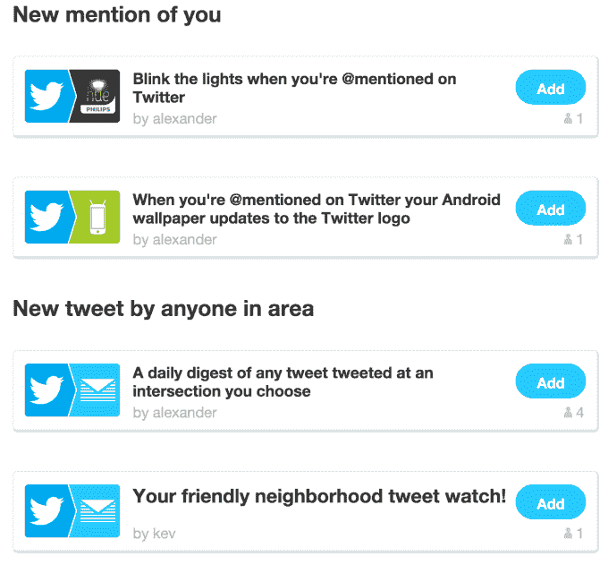

# IFTTT 推出强大的新 Twitter 触发器，用于搜索、提及、位置跟踪等

> 原文：<https://web.archive.org/web/https://techcrunch.com/2014/10/16/ifttt-rolls-out-powerful-new-twitter-triggers-for-searches-mentions-location-tracking-and-more/>

# IFTTT 推出强大的新 Twitter 触发器，用于搜索、提及、位置跟踪等

就在一年多前，“互联网胶水”服务 [IFTTT](https://web.archive.org/web/20230218160621/https://ifttt.com/) ，它让你定义触发器来自动化与你的在线账户和服务相关的动作，[推出了一套新的 Twitter 触发器](https://web.archive.org/web/20230218160621/https://techcrunch.com/2013/08/21/nearly-a-year-later-twitter-triggers-return-to-ifttt-with-official-support/)，它符合 Twitter 对开发者的新规则。今天，该公司正在扩大早期的阵容，推出其他几个新的触发器，包括当有人提到你时，当特定用户发推文时，当用户在特定区域发推文时，以及其他基于搜索的标准时，让你开始行动。

你可能还记得，IFTTT 在 2012 年[不得不关闭其 Twitter 触发器](https://web.archive.org/web/20230218160621/http://thenextweb.com/apps/2012/09/20/ifttt-removes-twitter-triggers-comply-new-api-policies/)，以遵守针对第三方开发者的 Twitter API 政策变化，其中涉及如何访问 Twitter 的数据以及如何显示推文。当时，这些变化让许多 IFTTT power 用户感到非常不安，他们曾经能够[做一些很酷的事情](https://web.archive.org/web/20230218160621/http://thenextweb.com/apps/2012/07/27/use-ifttts-custom-espn-trigger-channel-to-keep-up-with-the-olympics/)，比如将推文存档到 Dropbox，甚至通过 Twitter 推文关注奥运会，这些推文后来变成了短信、电子邮件或 Instapaper 文章。

IFTTT 自愿关闭其 Twitter API 访问，直到它能够构建符合新政策的 Twitter 触发器。[这些是去年推出的](https://web.archive.org/web/20230218160621/https://techcrunch.com/2013/08/21/nearly-a-year-later-twitter-triggers-return-to-ifttt-with-official-support/)，包括“你的新推文”触发器，加上“你的带标签的新推文”、“你的新链接”和“你的新宠”另一方面，你也可以基于来自其他服务的触发来提示 Twitter 的行为，以发布 tweet 或 tweet 图像，将用户添加到列表中等等。

但是今天的推出带来了额外的配方，让你可以更深入地查询 Twitter 的信息流，而不是只关注你自己的行为。这些新的触发器也更加有用。它们可以作为一种有价值的研究工具，允许你做一些事情，比如跟踪标签或关键词，并将其转化为推文的电子表格，或将这些信息输入 Slack。IFTTT 建议，你也可以配置 Twitter(通过 IFTTT)来提醒你附近正在发生的事情，或者建立一个 tweets 摘要。

虽然多年来，Twitter 慢慢地切断了与第三方开发者的联系，这些开发者正在开发与 Twitter 平台相竞争的功能或客户端，但 Twitter 最近一直在改变策略——或许终于意识到，一个健康、积极参与的开发者生态系统可能对其业务有益，而不是有害。

该公司就在上个月[宣布了](https://web.archive.org/web/20230218160621/https://techcrunch.com/2014/09/10/twitter-announces-flight-an-annual-mobile-developer-conference/) [Flight](https://web.archive.org/web/20230218160621/https://blog.twitter.com/2014/introducing-twitter-flight-our-first-mobile-developer-conference) ，这是一个专注于移动设备的年度开发者大会，将于 10 月 22 日在三藩市举行——这可能有助于重新定位该公司，从一个过去被认为对其开发者社区有点 [敌意](https://web.archive.org/web/20230218160621/https://techcrunch.com/2011/03/11/twitter-ecosystem-guidelines/)的[，到一个现在试图与外人合作以造福所有人的公司。](https://web.archive.org/web/20230218160621/https://techcrunch.com/2012/08/27/twitter-api-changes-are-already-posing-challenges-to-tweetbot-developers/)

IFTTT 也可能是这种情况，[说](https://web.archive.org/web/20230218160621/http://ift.tt/b_twittertriggers)它与 Twitter 的团队合作开发新的触发器和配方。(我们联系了 IFTTT 以获取更多相关信息，如果该公司做出回应，我们将更新信息。更新:IFTTT 表示，这笔交易没有涉及任何财务条款，而且它已经与 Twitter 合作了一段时间。)