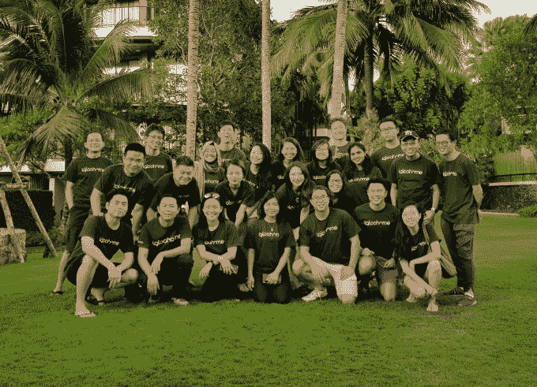

# 新加坡智能锁制造商 Igloohome 融资 400 万美元

> 原文：<https://web.archive.org/web/https://techcrunch.com/2018/04/05/igloohome-raises-4m/>

# 新加坡智能锁制造商 Igloohome 融资 400 万美元

总部位于新加坡的智能锁制造商[iglooohome](https://web.archive.org/web/20230302224114/https://www.igloohome.co/)已经[完成了 400 万美元的首轮融资](https://web.archive.org/web/20230302224114/https://www.igloohome.co/where-to-buy/)。

这笔投资由 Insignia Ventures([)牵头，这家新公司是由前红杉资本(Sequoia venture)合伙人谭英兰(Yinglan Tan)](https://web.archive.org/web/20230302224114/https://techcrunch.com/2017/09/13/insignia-venture-partners-fund-25-million-yinglan-tan/)创办的。Phillip Private Equity，X Capital Ventures，K3 Venture 的 Kuok Meng Xiong，天使投资人 Koh Boon Hwee 以及现有的靠山 Wavemaker Partners 也参加了该项目。

这家公司是一个罕见的例子，它是一家来自东南亚、业务遍及全球的硬件初创公司。

受 Airbnb 和该平台上主机的兴起的启发，Igloohome 销售一系列无钥匙产品，包括数字锁、数字插销和数字保险箱。这些产品引人注目，因为它们离线工作，需要手动输入 pin 码或手机上的“蓝牙钥匙”才能解锁。尽管如此，所有者仍然可以远程控制访问，同时有一个物理钥匙以防万一。

> 冰屋团队

该公司表示，新的资金将用于 R&D 的新产品，以及开发商业项目的解决方案，其中可能包括酒店、学生住宿和仓库项目。该公司已经是 Airbnb、竞争对手 HomeAway 和中国朱晓的合作卖家，这有助于它接触到非常有针对性的受众。除了这些关系，它通过亚马逊、沃尔玛和家得宝等直接向十几个国家的消费者销售，同时也有其他全球市场的在线选择。

“投资者的支持让我们深受鼓舞。冰屋首席执行官兼联合创始人安东尼·周(Anthony Chow)在一份声明中说:“我们相信，通过合作，我们将能够带来更多创新的产品和服务，并将冰屋的名字发展成为一个生活方式品牌。”。