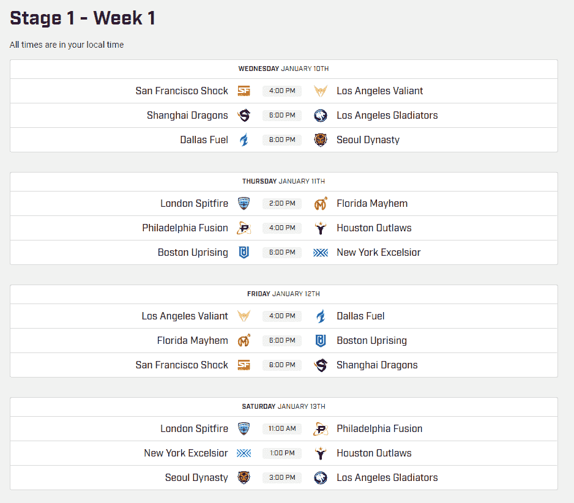

# 在接下来的两年里，每一场守望联盟的比赛都将在 Twitch 上直播

> 原文：<https://web.archive.org/web/https://techcrunch.com/2018/01/09/im-getting-too-old-for-this/>

《守望先锋》第一季的第一场比赛定在太平洋标准时间下午 4 点，西海岸的孩子们放学了，东海岸的孩子们吃完晚饭了，亚洲的孩子们早上起床了。

这项为期两年的协议将包括。单身。游戏。包括除中国之外的所有地区(没有消息说谁会是流媒体合作伙伴)。

Twitch 将是第三方提供商，提供从常规赛到季后赛和冠军赛的所有内容，并将以英语、韩语和法语播出。

该公司表示，这两家合作伙伴还在努力寻找方法，通过不同的功能和奖励让粉丝分走他们的钱，这些功能和奖励将为粉丝提供额外津贴，如游戏中的物品和独家配件。粉丝们还可以花钱购买 T2 啦啦队 T3，这是一种虚拟货币，有独家的 T4 啦啦队活动。

暴雪娱乐公司首席运营官阿明·泽尔扎在一份声明中说:“我们的粉丝喜欢参与 Twitch 上的内容，我们希望在《守望联盟》的第一季及以后的时间里增加它的收视率。”。

《守望先锋联盟》是暴雪/动视的一个大赌注，他们全力以赴推广和支持该联盟的最新和增长最快的冠军头衔(这个“增长最快”的奖牌可能是游戏新颖性的一个功能，或者是自 2014 年推出《守望先锋》和该公司上一次全新游戏推出以来游戏惊人传播的一个功能……在 20 世纪 90 年代)。

联盟的第一个赛季将从 1 月持续到 6 月，季后赛和决赛定于 7 月举行。以下是据报道支付了 2000 万美元来获得新联盟参赛权的球队(及其所有者)名单:

***太平洋分部***

*   旧金山冲击——球队老板:安迪·米勒，萨克拉门托国王队的共同老板，NRG 电子竞技的首席执行官
*   洛杉矶角斗士——球队老板:斯坦和乔希·克伦克，洛杉矶公羊队、丹佛掘金队、科罗拉多雪崩队、科罗拉多急流队和阿森纳队的老板
*   洛杉矶勇士队——球队老板:诺亚·温斯顿，不朽公司的首席执行官(该公司最近获得了狮门影业娱乐公司高管彼得·莱文的投资)
*   达拉斯燃料公司——车队老板:迈克·鲁菲尔，EnVyUs 车队的首席执行官
*   上海龙队——队主:网易，一家中国互联网技术公司
*   首尔王朝——球队老板:周凯文，KSV 电子竞技的首席执行官

***大西洋分部***

*   波士顿起义——球队老板:罗伯特·克拉夫特，新英格兰爱国者和新英格兰革命的老板
*   纽约精益求精——球队老板:杰夫·威尔彭，纽约大都会队的首席运营官
*   费城融合–团队所有者:Dave Scott，Comcast Spectacor 总裁兼首席执行官(费城飞人队和费城富国银行中心的所有者)
*   休斯顿亡命徒队——球队老板:Hector Rodriguez，OpTic Gaming 的首席执行官(该公司最近获得了德州游骑兵队(Texas Rangers)合伙人尼尔·利伯曼(Neil Liebman)的投资)
*   佛罗里达大混乱——球队老板:本·斯普恩特，Misfits Gaming(最近获得了迈阿密热火队的投资)的首席执行官
*   伦敦喷火——团队负责人:杰克·艾蒂安，Cloud9 的首席执行官

Twitch 的首席运营官林义杰说:“守望联盟通过城市团队重塑了电子竞技行业，对电子竞技产生了重大影响。”。“鉴于《守望先锋》一直是我们社区最受欢迎的游戏，我们期待为广大热情的粉丝提供他们开拓性的联赛风格，这不仅能够凝聚他们最喜爱的比赛，还能凝聚他们的家乡自豪感。”

《故乡的骄傲》将不会是第一季游戏的一部分，所有游戏都将在加州伯班克的[暴雪竞技场](https://web.archive.org/web/20230307142252/https://blizzard.gamespress.com/BLIZZARD-ENTERTAINMENT-ESTABLISHES-STATE-OF-THE-ART-LIVE-EVENT-DESTINA)举行。该场馆是为暴雪娱乐电子竞技活动定制翻新的，并且容纳了所有比赛，而当地特许经营商则为电子竞技准备了自己的场馆。

球迷可以通过购买周三、周四、周五和周六比赛的门票来现场观看比赛。关于门票销售的完整[时间表](https://web.archive.org/web/20230307142252/https://overwatchleague.com/en-us/schedule)和[信息](https://web.archive.org/web/20230307142252/https://overwatchleague.com/en-us/news/21338592/stage-1-tickets-on-sale-now)可以在[https://overwatchleague.com/](https://web.archive.org/web/20230307142252/https://overwatchleague.com/)找到，或者你可以看看下面的列表。

鉴于 Twitch 的巨大影响力，动视决定与 Twitch 合作是有道理的，但它确实提出了一个问题:为什么不使用 mlg.tv(它收购了 mlg . TV)？那是使命召唤的专属平台。

或许随着《守望》成为新的标题，发行胜过了收购。

不管原因是什么，Twitch 的 Overwatch 协议是确保 Activision 的新联盟顺利运营的又一步。现在我们来看看它能走多远。