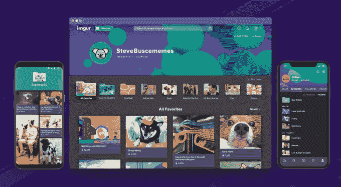

# Imgur 最喜爱的文件夹将 2.5 亿 meme 领主变成策展人 

> 原文：<https://web.archive.org/web/https://techcrunch.com/2017/11/16/imgur-favorite-folders/>

要么你是每月 2.5 亿 Imgurians 中的一员，要么你可能不知道 Imgur 是什么。这个张贴和上传笑话、灵感、琐事和伤感故事的网站长期以来一直不受关注，尽管它规模庞大，并获得了安德森·霍洛维茨基金的 4000 万美元资助。但是那些沉迷于图片分享社区的人都知道，有一个功能永远排在请求列表的首位:收藏夹。

今天，经过长时间的延迟和测试后，Imgur 满足了大众的愿望，在 T2 正式发布了桌面网页上最受欢迎的文件夹和它的本地应用程序。现在，你可以把你想保存的文章整理到自定义文件夹中，而不是“收藏并忘记”。用户甚至可以与他人分享文件夹——有点像 Pinterest 的公告板。

这是一件大事，因为它将 Imgur 从仅仅是一个图片发布和排名网站变成了一个策展人可以将帖子汇编成有用的简编，可能会吸引更多尚未了解 Imgur 的观众。这些聚合可能是最有趣的反应 gif，最漂亮的无人机镜头，最鼓舞人心的减肥前后或最好的瑞克和莫蒂迷因。

Imgur 创始人兼首席执行官艾伦·沙夫(Alan Schaaf)说:“它让你收集互联网的魔力。“我认为它触及了人类的基本需求和现实问题。当你找到你喜欢的东西，你想保存它，你想抓住它。Imgurians 人不仅有机会找到他们喜欢的内容，还可以向访问他们个人资料的其他人提供他们喜欢的内容。”

为什么花了几年时间才推出一个看起来很简单的东西？“我没有很好的答案给你。事实是，它确实比我们希望的时间要长。”用户可以在手机上长按喜爱的“心脏”,或者点击网页上的“更多”按钮来选择将收藏添加到哪个文件夹。用户配置文件中提供了隐私和编辑控件。

Imgur 充满了令人瞠目结舌、信息丰富、歇斯底里的图像，但它分散在一个巨大的档案中。通常，一旦一篇文章被投票推上首页，或者在用户提交的文章堆中死去，它就会永远默默无闻。收藏夹赋予旧内容新的内容。这就是为什么我们看到脸书和 Instagram 等其他应用程序也实现了自己的书签文件夹。

通过收集、审查和突出所有用户的最佳帖子，Imgur 的新一波策展人可以让那些还没有体验过的人更容易使用这款应用程序。沙夫说，“你可以是一个食谱收集者，一个 GIF 创作者，一个星球大战迷，一个角色扮演爱好者，”你的努力工作可以向那些不会一篇接一篇挖掘 Imgur 的人展示它的价值。

增长总是好的，尤其是 Imgur 通过不断增长的销售人员来扩大业务。更多的用户，更多的观众为其赞助的职位和显示广告。“我们正走在盈利的道路上，现在不需要筹集资金，”沙夫自豪地指出。“我们是自举的。我经营了一家盈利的 boostrapped 公司五年，然后从 Andreessen Horowitz 那里筹集了 4000 万美元。成为一家运营良好、优化的企业是该公司的天性。”

如今，Imgur 已经成立了八年多，这意味着它可能会上市。喜爱的文件夹可能会给它留下深刻印象的素材。很容易想象“最佳”收藏跟随问答网站 Quora 的脚步，为其他网站甚至印刷杂志制作优秀的联合内容。

品牌可能会付费创建他们自己的赞助收藏文件夹，减轻他们试图自己看起来很酷。网飞可以围绕一个主题制作一个新节目或经典电影的文件夹，吸引 Imgur 内部的客户，同时在他们将收藏发布到其他地方时推广该应用。

这两个网站曾经仅仅被称为 Reddit 的非官方图像主机，去年当 Reddit 开始托管自己的媒体时，这两个网站就分开了。两人都经历了令人讨厌的社区成员、厌女症和种族主义的挑战。但随着用户群的不断增长，仅比 Twitter 少 8000 万，加上独特的新功能，Imgur 正在证明自己是社交媒体的竞争者。

