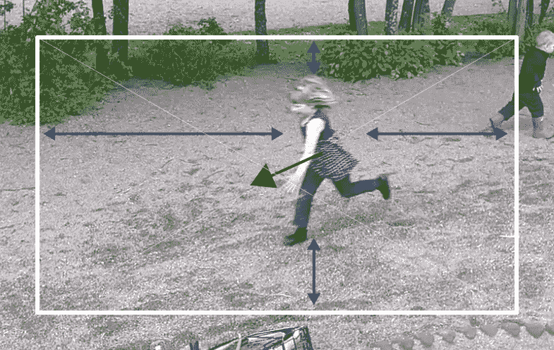

# Imint 的 Vidhance 算法可能很快会取代现场视频制作人 

> 原文：<https://web.archive.org/web/https://techcrunch.com/2015/06/22/imints-vidhance-algorithms-could-soon-replace-live-video-producers/>

https://www.youtube.com/watch?v=8WocPfvrp2I

几个月前，我们看了一下 [Iminit](https://web.archive.org/web/20221208035124/http://www.imint.se/) 的[视频稳定技术](https://web.archive.org/web/20221208035124/https://beta.techcrunch.com/2015/01/09/imint-wants-to-bring-real-time-video-stabilization-to-android/)；现在，瑞典视频技术奇才队又回来了，展示了他们的最终产品将能够处理基本的智能手机视频。Imint 的国防开发的自动变焦算法现在不仅可以稳定视频，还可以自动跟踪和放大视频中最有趣的部分。

就像 Imint 的所有技术一样，自动变焦是该公司在防御技术上的工作成果。毕竟，当你使用无人机时，你希望能够轻松跟踪那辆叛乱分子卡车(甚至可能向他们发射导弹——此时你[为他们祈祷](https://web.archive.org/web/20221208035124/http://www.nytimes.com/2015/06/17/us/as-stress-drives-off-drone-operators-air-force-must-cut-flights.html),希望他们是叛乱分子，而不只是一个周末旅行的吵闹家庭)。不过，这项技术也用于搜索和救援行动，以及基本的监视任务。

https://www.youtube.com/watch?v=BA3UTWaXWds&feature=youtu.be

正如 Imint 首席执行官 Andreas Lifvendahl 告诉我的，这是一件非常难做的事情。“这个问题比听起来更难解决，尤其是在实时情况下，”他说。“对于静态、固定安装的监控摄像机，存在简单的版本——这只是一个关于检测帧之间变化的问题——但在我们的情况下，我们需要在三个可能的运动模式级别中检测重大运动:移动背景(作为摄像机移动或手动变焦的结果)；背景物体的运动(海洋上的波浪，风中的树叶沙沙作响，等等。);以及你想要检测(并随后跟踪)的物体的实际运动

该团队仍在努力改进这项技术(例如，能够预测物体的运动和方向)，并试图弄清楚该工具的用户界面到底是什么样子的。但是，即使在目前的状态下，Lifvendahl 相信，自动化的结果往往比你自己完成的更好——即使是用非常好的相机。

https://www.youtube.com/watch?v=qIletnpr8xk&feature=youtu.be

该团队现在正在研究如何使用其技术来自动化合作电影制作。

“我们已经看到了这方面的努力，但我们确信我们可以向前迈出这么多步，”Lifvendahl 告诉我。“当几个智能手机用户合作成为一个直播流(或一个最终合并的剪辑)的贡献者时，质量和运动元数据可以用于“云制作”功能。贡献者将提供视频流和元数据，并向云主管提供提示(“我这里有好东西，让我上线”)，自动化云生产者将决定哪些内容上线，哪些不上线，还可以向贡献者发送提示(“您将在 3.2.1 中上线”)或控制贡献者的功能，如启用自动缩放。”

他认为，只要你允许 10 到 20 秒的延迟，一个算法应该能够非常接近人类视频制作人所能完成的。

Imint 计划在其 SDK 中启用自动缩放功能，并在稍后启用实时视频编辑功能，目前有多家公司正在测试该功能。该公司有望很快宣布用户何时(以及在哪些设备上)能够使用其技术。假设现实生活中的体验符合该公司的承诺，这有可能迅速改变我们对智能手机上视频的看法和记录方式。