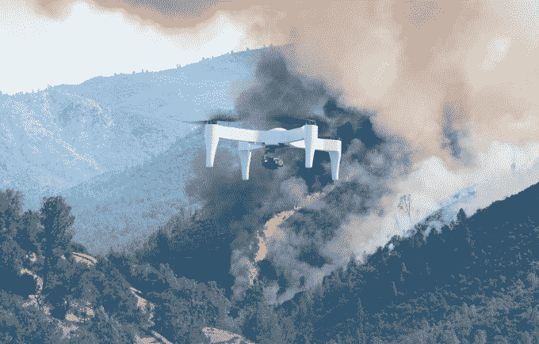

# Impossible Aerospace 筹集 940 万美元出售填充电池的无人机 

> 原文：<https://web.archive.org/web/https://techcrunch.com/2018/09/10/impossible-aerospace-raises-9-4m-to-sell-drones-stuffed-with-battery-cells/>

# Impossible Aerospace 筹集 940 万美元出售填充电池的无人机

与智能手机制造商非常相似，无人机公司在过去几年中一直在为设备添加大量功能，但电池寿命仅略有提高。但是，虽然你的手机可能号称“全天”使用，但许多顶级无人机只记录 20-35 分钟的飞行时间。

不可能航空航天公司(Impossible Aerospace)正在寻求改变这种状况，至少在商用无人机方面，这种密集的设计基本上都是电池。该公司今天分享了其 US-1 无人机的发布细节，并宣布已完成来自 Bessemer Venture Partners、Eclipse Ventures 和 Airbus Ventures 的 940 万美元 A 轮投资。

它的第一款产品是一架无人机，最引人注目的是它可以在最佳飞行条件下保持空中飞行约 120 分钟，直线距离为 75 公里(超过 46 英里)。它可以携带 2.9 磅的有效载荷，但这将总飞行时间降至 78 分钟。

对于商业客户来说，增加的飞行时间可以极大地释放用例，将操作思维从基于任务转变为更具探索性。

该公司的网站上有一张几乎滑稽的 US-1 电池结构的 X 射线图，展示了一个看起来像电池的大“X”的设计。该公司告诉我，这架 15 磅重的无人机大约 70%的重量是锂离子电池。

这是为老派无人机飞行员打造的设计；为了实现漫长的飞行时间，他们不得不放弃一些额外的组件，最有争议的选择可能是缺乏任何机载避障传感器。“每架飞机的设计都是一种妥协，”Impossible Aerospace 首席执行官斯潘塞·戈尔在接受 TechCrunch 采访时表示。“最难的是弄清楚你将为一些用户提供哪些功能，而这些功能会损害那些不打算使用它们的人的性能。”

戈尔表示，这家初创公司知道它希望在第一架无人机上深入研究某些功能，该公司有一个“令人兴奋的产品路线图”设计，做出了一些不同的选择。

US-1 起价 7，500 美元，将于今年第四季度上市。