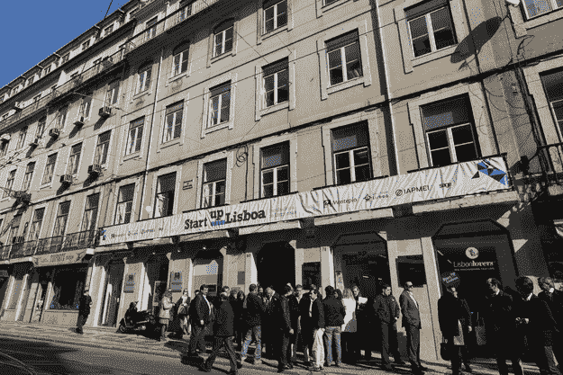
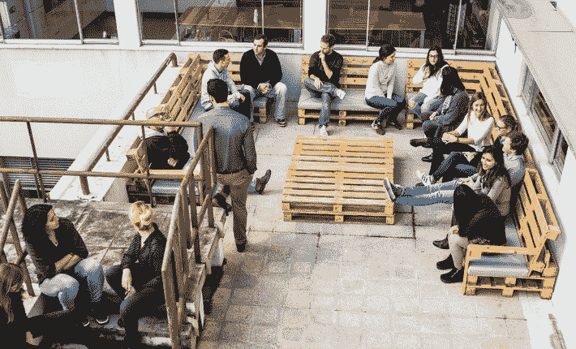

# 2016 年里斯本启动了它的启动引擎——2017 年将听到它们的轰鸣 

> 原文：<https://web.archive.org/web/https://techcrunch.com/2017/02/14/in-2016-lisbon-fired-up-its-startup-engines-2017-will-hear-them-roar/>

在关注城市生态系统的新系列的第一集中，TechCrunch 自由编辑 Mike Butcher 深入了解了欧洲最热门的创业城市之一。

在上一次金融危机期间，葡萄牙是欧洲遭受打击最严重的国家之一。在经历了 20 世纪 70 年代之前的长期战后独裁统治，以及 80 年代和 90 年代缓慢的经济崛起之后，2008 年的全球经济衰退对该国以及意大利、希腊和西班牙都是沉重的打击。但是不寻常的事情发生了。就像一个次中量级拳击手，它开始利用自己的体型优势，在主要由年轻人领导的反击中打出超过体重的拳。他们意识到，如果要生存下去，他们就必须利用企业家精神来创造自己的未来。在贴满古葡萄牙瓷砖的咖啡馆和法多酒吧里，他们把目光投向了网络。制定了他们的计划。

置身于经济衰退的烈火之中，造就了一种更具活力的文化，这是许多观察家通常从南欧国家期待的。

当该国在 2011 年不得不向欧盟寻求救助时，葡萄牙被迫实施严厉的紧缩措施。约 485，000 名葡萄牙人，尤其是年轻的大学毕业生，在危机期间离开该国，试图在国外寻找机会。他们去了德国、巴西，甚至去了前非洲殖民地安哥拉。大约 60%的人回来了。

如今，失业率已从 2012 年的 17%降至 12%。与此同时，政府大幅提高税收，放开劳动力市场，解雇公务员，降低公务员工资以及养老金和社会服务。

但这场危机也从葡萄牙人的内心释放出了新的创造能量。例如，一个新的艺术家中心在俯瞰城市的城堡脚下开放。欧盟地区委员会授予该市 2015 年“年度欧洲创业地区”荣誉。

成功的背后是有原因的。人们在里斯本受到良好的教育，工资也低于其他欧洲大都市地区，生活成本也是如此。一家豪华旅馆，它的名字充分体现了这种新精神:Independente。它俯瞰着卡斯蒂洛山上一群色彩缤纷的建筑。初创公司坐落在葡京市中心鹅卵石街道上有着漂亮瓷砖墙的老建筑里。

葡萄牙漫长的航海探索和发现历史也没什么坏处。开拓新领域是葡萄牙人的天性。他们还有其他重要的成分。一些他们的南欧兄弟所没有的东西:一个内置的英语语言设施。它不仅在学校教授，而且与邻国西班牙不同，西班牙人口众多，因此能够承担翻译英语电影和电视节目的经济成本，而小葡萄牙却不能。

这种对英语的熟悉是一种巨大的优势，原因有二。首先，这使得葡萄牙能够更容易地进行国际贸易。其次:普通的出租车或优步司机以及普通的政府工作人员都会说英语，这是你在巴塞罗纳或马德里找不到的。突然间，作为一名前爱国者企业家，在葡萄牙阳光明媚的地方创建企业变得容易多了。

这种结合让里斯本陷入了与柏林在 21 世纪中期所处的环境完全相同的境地，当时外籍人士和艺术家开始让创意产业，尤其是初创企业涌入这座城市。[广告插播:[买二送一门票](https://web.archive.org/web/20221007020926/http://www.beta.techcrunch.com/event-info/disrupt-berlin-2017#newsletter)买二送一活动将于 4 月 5 日中午在 CEST Techcrunch Disrupt Berlin 举行]

里斯本拥有一座看起来像金门大桥的标志性吊桥、古铜色的冲浪者、有轨电车、山丘和充满活力的科技产业。让你想起了什么地方？

2017 年的今天，里斯本在获得人才、经济适用房和充足的公共交通(更不用说天气)方面得分很高。我们不要忘记 Bairro Alto 是一个历史悠久、风景如画的街区，可以追溯到 16 世纪，街道两旁是小餐馆、Fado-playing 酒吧、酒吧和咖啡馆，白天很安静，但晚上变成了这座城市充满活力的夜生活区。

美丽的旧场馆与引人注目的现代建筑并排而立。但这座城市正在让这些场馆重新焕发生机，比如 16 世纪的 Palá cio de Pombal，现在每年都会举办里斯本投资峰会。

难怪欧洲数字城市指数将里斯本的主要特征列为低生活成本和高生活质量。

另一个因素对这座城市有利:由于该国人口少，葡萄牙初创企业从第一天起就着眼于国际扩张，延续了这个小小的航海国家的传统。在这方面，它的思维模式更接近英国。

正是这些因素的结合导致了葡萄牙，尤其是里斯本创业公司的激增。你可以说这里正在成为“南方的柏林”。

根据全球投资研究公司 Preqin 的数据，2016 年风投只在 9 笔交易中投资了 1850 万美元。尽管与国际相比，这些数字很小，但这代表着自 2015 年以来的 6 倍跃升。

德国保险公司 Allianz Kulturstiftung 在 2016 年支持的一项研究将里斯本列为欧洲表现第五好的创业社区，领先于斯德哥尔摩和都柏林等老牌城市。

里斯本在由有影响力的学者理查德·佛罗里达创造的“全球创新阶层”方面也得分很高。创意产业是当今经济增长的巨大推动力，并引领了伦敦东区的复兴。但是伦敦近年来的物价飞涨(更不用说英国退出欧盟了)给它留下了一个越来越大的问题。

最新统计数据显示，由于住房成本的原因，搬出伦敦的年轻人比有记录以来的任何时候都多，房租的上涨速度远远超过了工资。近年来，伦敦大约 40%的音乐场所已经关闭。在美国，纽约的创意人士和旧金山的科技企业家正成群结队地迁往洛杉矶，在这里，过上好生活的成本更低，而且这座城市拥有伟大的艺术和音乐舞台。

虽然柏林继续从欧洲更昂贵的地方吸引这些创意阶层，但许多人现在正把里斯本作为替代选择。

例如，今年，欧洲最大的技术会议[网络峰会](https://web.archive.org/web/20221007020926/https://websummit.com/)将第二次来到这座城市，2016 年吸引了超过 53，000 人参加，并证明了这座城市可以保持这些数字并生存下去。

一些交通拥堵、紧张的地铁和会场的一些后勤问题不足以阻止网络峰会在里斯本持续到 2020 年。该交易可能会再延长两年。来自 166 个国家的超过 53，000 人，其中包括 15，000 家公司，7，000 名首席执行官和 700 名投资者，聚集在里斯本参加这一活动，据说这为里斯本带来了超过€1.75 亿英镑的收入，使€35，000，000 人的网络峰会相形见绌。

成功举办了这样一场大型活动，真正展示了这座城市，可以说 2017 年还会有更多活动。

**新的发展**
[第二个家](https://web.archive.org/web/20221007020926/https://secondhome.io/lisboa)，也许是创意类空间的终极宣言，去年宣布用于这座城市，但今年真正开始，在这座城市最时髦的地区开放。它将被安置在 Mercado da Ribeira 内，加入该市的许多合作和艺术空间，包括 [Coworklisboa](https://web.archive.org/web/20221007020926/http://www.coworklisboa.pt/) 和 [Village Underground Lisboa](https://web.archive.org/web/20221007020926/http://vulisboa.com/) 。后者——与肖尔迪奇标志性的地下村庄相连——将由集装箱和废弃的公交车制成。

此外，在柏林创造了许多标志性创业空间的[工厂](https://web.archive.org/web/20221007020926/http://www.factory.co/)，也在这座城市放下了烂摊子。与此同时，国际创业加速器 Startupbootcamp 和 ImpactHUB 据传也将到来。

事实上，里斯本初创企业的一个优势(而非劣势)是，它不仅仅关乎葡萄牙或里斯本。事实上，一家总部位于伦敦的第二家园可能希望在那里扩张，这绝非偶然。

**主枢纽**
这座六层的[新创葡京](https://web.archive.org/web/20221007020926/http://www.startuplisboa.com/)大楼最初是这座城市的主创业枢纽，从 2011 年起，它就成为这座城市的创始创业孵化器。大约有 60 家公司坐落在这栋六层楼的大楼里，这里也经常举办活动和研讨会。Startup Lisboa 是一个非政府组织，得到了公共部门(里斯本市)和私营部门的支持。自成立以来，该组织已经支持了 180 多家初创公司。

成立四年的加速器 Fábrica de Startups 由安东尼奥·卢切纳·德·法利亚领导，专注于来自巴西、澳门等葡语国家的初创企业。今年 3 月，它将举办“旅游创意周”，为今年夏天为期五周的发现加速器项目创建创业公司。

这将是葡萄牙影响力中心的第一个前哨站，影响力中心的全球合作空间网络遍布 70 多个城市。它抵达了 Beato Marvila 区的一个废弃的展馆，这里为多达 300 名企业家提供办公桌租赁，每月只需 80 欧元的€。

举办[里斯本挑战](https://web.archive.org/web/20221007020926/http://www.lisbon-challenge.com/)的[Beta-I](https://web.archive.org/web/20221007020926/http://beta-i.pt/)已经接管了市中心一座巨大的前邮局大楼。这有几层楼高，很可能成为该地区创业公司的超级中心。它还刚刚宣布与西班牙加速器 Tetuan Valley 合并，创建了一个伊比利亚加速器，并在里斯本使用欧洲创新学院(伯克利+斯坦福)的方法。

新的国际联系里斯本、伦敦和其他欧洲城市之间的联系正由一些城市的权势人物积极培育。

例如，你会经常看到 Faber Ventures 的联合创始人亚历山大·巴博萨(Alexandre Barbosa)在伦敦与风投伙伴一起喝咖啡。或者 Beta-i 的佩德罗·罗查·维埃拉或里卡多·马文带着最新一批初创公司到伦敦的谷歌园区进行路演，正是因为里斯本正在与伦敦的初创公司 megacity 建立密切联系。或者 Chic By Choice 的首席执行官菲利帕·内托(Filipa Neto)出席伦敦时装周。

与此同时，你很可能会在柏林偶遇 Felix Petersen，他也是 Faber 的员工，他在柏林做着一笔生意，吸引人才从柏林来到葡萄牙首都。或者你可能会遇到 Caixa Capital 的斯蒂芬·莫莱斯，他在达沃斯(世界上仅有的几个这样做的国家之一)带领许多年轻的葡萄牙创业公司。你也可以和技术公关和创业顾问克拉拉·阿曼德-德利尔一起喝咖啡，在俯瞰里斯本水边礁的咖啡店里，或者在巴黎的咖啡馆里。这些事情不是偶然发生的，这些与欧洲生态系统的联系正变得越来越紧密。

官方鼓励以及国家和市政府正在积极鼓励这一国际化浪潮，这在一定程度上导致了经济衰退中的葡萄牙“侨民”回归，以及移居国外者开始在里斯本的部分地区定居。政府几乎毫不留情地通过税收减免、居留项目和更宽松的官僚制度来吸引回国人员。

里斯本市政府一直在竭尽全力激励企业家在该市开办公司。这些激励措施包括降低初创企业的税率，税率最低可达 7.5%，而投资额在 500 万€以下的企业可享受 20%的税收减免。公司备案的繁文缛节也已经简化为一个简单的在线过程。

几年前，当里斯本市长被当地一家加速器要求放宽对办公空间的限制时，他只是简单地交出了废弃市政建筑的 30 年租约。

一位关键的初创企业倡导者是和蔼可亲的若昂·赛洛斯，他是初创企业葡京银行(Lisboa)的前负责人，长期以来一直支持这一领域，现在担任葡萄牙政府新的工业部长这一关键职位。

葡萄牙创业社区也没有坐以待毙，他们在科技创业领域之外制作定期博客和媒体，甚至创建了自己的[创业宣言](https://web.archive.org/web/20221007020926/http://www.startupmanifesto.pt/)。

政府以“创业葡萄牙”作为回应，这是一项国家公共战略，旨在培养创业精神并在国际上促进本地创业。

**立法**
在网络峰会上，葡萄牙总理安东尼奥·科斯塔(António Costa)启动了一个 2 亿€(2.2 亿美元)的基金，与风投一起共同投资当地初创公司和迁移到葡萄牙的外国公司，有 150 名当地创始人支持他。信息非常简单:来里斯本，在那里找到你的公司。只要初创企业位于葡萄牙，世界各地的任何风险基金都有资格为单笔投资申请匹配资金。

这些基金将被称为“2 亿欧元”(2 亿欧元)，是未来两年向该国科技领域投入 4.4 亿美元的更大努力的一部分。从都柏林带来网络峰会是这一努力的一部分。

里斯本是 2015 年第一个欧洲创业之都，这导致了一系列倡议，如“Empresa na hora”，允许任何人在一小时内在线创建一个新企业。

**英国退出欧盟的好处**
随着英国退出欧盟的逼近，在英国政府正式投票触发第 50 条退出欧盟后，问题是，公司是否会更容易在葡萄牙等欧盟国家成立？里斯本会加入都柏林、阿姆斯特丹和其他欧盟城市的行列，成为创业中心吗？简单的答案是肯定的，因为英国将失去部分——如果不是全部——作为欧洲扩张跳板的吸引力。根据风险投资公司 Balderton 的数据，超过 40%的英国初创公司创始人在国外获得了大学学位，这使得他们更有可能四处流动(这显然是政府所忽略的)。

**人才**
葡萄牙的工程师质量很高，人才竞争仍然有限(25 岁以下年轻人的失业率高达 31%，为初创公司工作听起来是个不错的选择)。一个名为 Inov Contacto 的政府项目每年向世界各地派遣数百名葡萄牙毕业生到海外公司工作，从而拓展他们的国际抱负和运营经验。葡萄牙对海外知识分子也有吸引力，他们以前在国外接受教育，现在渴望回到故国。他们在斯坦福或高盛工作后，有一种文化纽带引导人们想要回到里斯本。

事实上，葡萄牙的开发成本要低得多，这一点并没有被忽视。葡萄牙企业家卡洛斯·席尔瓦(Carlos Silva)和美国出生的合伙人杰夫·林恩(Jeff Lynn)在伦敦推出了他们的众筹股权平台 Seedrs，但决定将他们的工程人才放在葡萄牙。这意味着该国正在加入巴塞罗那、慕尼黑、维也纳等工程中心的行列。但是，尽管这些人有很多天赋，他们却没有日常生活中常用的英语。这使得做生意变得更容易，也吸引了从国外移居到这座城市的人。

榜样
葡萄牙现在有了一批崭露头角的家乡英雄。从 Farfetch 的 Jose Neves，到 Google/Yahoo fame 的 Henrique de Castro，再到 Seedrs 的 Carlos Silva。

早期阶段的资金通常来自 Beta-i、Faber to Portugal Ventures，它们是最明显、最活跃的本地基金，Caixa 在后期阶段的直接投资中扮演着积极的角色。更重要的是，非葡萄牙基金正在对葡萄牙公司进行重大投资。总部位于里斯本/伦敦的 Seedrs 最近从伦敦的 Augmentum Capital 和 Woodford Patient Capital 筹集了 750 万英镑。Unbabel 从里斯本来到 Y Combinator，带着谷歌风投的支票离开，Codacy 赢得了 2014 年网络峰会竞赛。Rocket Internet 已经悄悄地在波尔图建立了自己的运营中心，拥有数百名员工。

**投资人**
里斯本的投资人包括:[Beta-I](https://web.archive.org/web/20221007020926/http://beta-i.pt/)；[费伯风险投资](https://web.archive.org/web/20221007020926/http://www.faber-ventures.com/)；[首都间](https://web.archive.org/web/20221007020926/https://www.crunchbase.com/organization/intercapital)；[忙碌的天使](https://web.archive.org/web/20221007020926/http://busyangels.co/)；[葡萄牙风投](https://web.archive.org/web/20221007020926/http://www.portugalventures.pt/)；以及 [Caixa 资本](https://web.archive.org/web/20221007020926/http://caixacapital.pt/en/)。

费伯风险投资公司由亚历山大·巴博萨创建。据他说，它部分是创业工作室，部分是投资平台。他们将€1100 万英镑作为第一只首轮融资前基金进行管理，通常首笔投资为 20 万至 30 万欧元(如果是种子期前投资，则为 10 万欧元)，并一直作为联合投资者参与首轮融资。他们的投资组合中有 19 家公司，现在正在筹集第二个工具，同时仍在进行投资。

由 Beta-i 运营的里斯本挑战被公认为欧洲五大最活跃的投资者计划之一。许多初创公司从中脱颖而出，加入了 TechStars、Y Combinator 和 Seedcamp 等公司的行列。里斯本挑战赛的参赛者中有 40%获得了风险投资，越来越多的投资来自美国。里斯本挑战大会在塔古斯河畔的一个旧仓库里举行。

与此同时，外国投资者经常访问首都，看看发生了什么，网络峰会现在是一个完美的年度机会来检查城市。

来自葡萄牙的 Seedcamp 公司不少于 7 家:Simpletax、Codacy、Hole19、Crowdprocess、Cashtag、Zercatto 和 Popcorn Metrics。

政府投资机构葡萄牙风险投资公司(Portugal Ventures)有一只 4.5 亿€的基金，专注于投资创新科技公司和更传统行业的初创公司。迄今为止，它已经在 96 家公司进行了 105 项投资。

然后是 BGI(麻省理工学院-ISCTE 合作项目)，这是一个面向科技企业家、初创公司和衍生公司的国际加速器。

**创业公司**
最后，还有创业公司。

葡萄牙不是从零开始的。例如，早在里斯本成为潮流科技中心之前，波尔图和科英布拉就已经有很多科技公司了。但里斯本带来了来自伦敦和柏林等科技中心的灵感。但现在，这座城市几乎从零开始产生了稳固的创业公司。

在拒绝了谷歌的一份工作后，Jaime Jorge 与 Joao Caxaria 共同创建了 Codacy，为全球数十家企业开发可以自动纠正软件代码错误的算法。他们现在与 ash PayPal 和 Adobe 等全球巨头合作。

葡萄牙最优秀和最聪明的人过去在伦敦等主要首都的咨询公司工作，但现在他们在本地筹集资金，并在全球范围内开展业务。

**扩大规模**
这并不是说里斯本不能产生大公司。Teleperformance 是处理销售、支持和所有其他客户关系职能的外包呼叫中心的全球领导者，现在拥有 150，000 名员工，收入为€24 亿英镑。

与此同时，波尔图正成为葡萄牙生态系统中的一个参照。Veniam、AddVolt、Hype Labs(Hype Labs 将去美国的 AngelPad)和 knok health care——医生的优步——获得资金。

其他创业公司也看到了城市的好处。Hole19 是一个高尔夫球手的国际社交网络。Uniplaces 允许学生预订欧洲各地的住房。Feedzai 使用机器学习为全球客户自动识别欺诈。CrowdProcess 有一个人工智能平台，使对冲基金和银行能够预测固定收益资产何时违约。

(了解这座城市的初创企业的一个好方法是查看由葡京制成的

**重点创业**

[Uniplaces](https://web.archive.org/web/20221007020926/http://uniplaces.com/) Uniplaces 正在打造一个值得信赖的全球学生住宿品牌。有了 Uniplaces，学生可以轻松安全地预订——uni places 团队会在网站上核实每个学生的住所。

Codacy
分两轮从 6 位投资者那里筹集了 160 万美元。Codacy 是一个自动化的代码评审工具，可以帮助开发人员节省代码评审的时间和管理技术债务。

该公司在 4 轮融资中从 3 位投资者那里筹集了 211 万美元。Tradiio 是一款面向网络和移动的音乐应用，它将流媒体与直接向艺术家粉丝支付的经常性费用相结合。

Aptoide 已经在两轮中从 4 个投资者那里筹集了 491 万美元。这是一个独立的 Android 应用商店，允许开发人员、OEM、电信公司和集成商创建和管理他们自己的 Android 商店。

这已经从 3 个投资者那里筹集了 3 轮 189 万美元的资金。Muzzley 是您连接设备的智能单一入口点。系统会预测您通过连接的设备采取的行动。

由 Faber 和 Portugal Ventures 投资超过 80 万美元支持的 GetSocial
通过将在线商店转变为社交购物网络来支持在线商店。

[Gleam](https://web.archive.org/web/20221007020926/http://gleam.com/)
iOS / Android 应用程序，适用于追求时尚的女士们(大多是),她们希望发现穿什么和不穿什么的最新和最大趋势。

Chic by Choice 让你以零售价的一小部分租出高级设计师的服装。首席执行官 Filipa Neto 可以在欧洲的任何地方工作，但她的时间分散在伦敦和里斯本之间。她已经筹集了 50 万欧元的风险投资，将高级时装传遍整个欧洲。

Farfetch 由 Jose Neves 于 2007 年创建，是一个连接时尚客户和全球高端精品店网络的电子商务平台，在 6 轮融资中从 15 位投资者那里筹集了超过 3.045 亿美元。其中包括 Advent、e.ventures、Index 以及最近的 Conde Nast 和 Vitruvian Partners。牵强是葡萄牙迄今为止最大的(最近的)创业成功。

[Nmusic](https://web.archive.org/web/20221007020926/http://nmusic.com/)
在葡萄牙市场被称为“MEO music ”,因为它与占主导地位的葡萄牙电信达成了一项白色标签协议。它有一个电视应用程序，使客户能够在电视上观看音乐视频和创建视频播放列表。他们正与三星在非洲合作。

由 Seedcamp、基马风投和 Frontline Ventures 支持的 Crowdprocess 将大量参与用户的网络浏览器连接起来，将它们变成虚拟的超级计算机。

un label 通过人工智能和 50，000 名移动语言学家的混合，与 Salesforce、Zendesk、Mailchimp 和 Facebook Messenger 等平台集成，实现了跨 28 种语言的多语言通信。Unbabel 的联合创始人兼首席执行官瓦斯科·佩德罗(Vasco Pedro)开始了公司的冲浪之旅，整个公司仍然每月冲浪一次。

Coolfarm 希望帮助农民以更智能的方式种植水培植物，结合使用硬件设备、基于云的数据和人工智能。

[Talkdesk](https://web.archive.org/web/20221007020926/http://talkdesk.com/)
Talk desk 已经在 4 轮融资中从 5 位投资者那里筹集了 2445 万美元。投资者包括暴风创投和 DFJ。联合创始人蒂亚戈·帕瓦和克里斯蒂娜·丰塞卡通过参加开发者竞赛筹集了第一轮资金。该公司现在有几千个客户，包括 DoorDash、Weather.com、Edmunds.com 和 Anki。

这家葡萄牙欺诈保护初创公司在 5 轮融资中从 8 位投资者那里获得了 2613 万美元。它得到了 Oak HC/FT、Sapphire Ventures 和 Espirito Santo Ventures 的支持。他们的软件可以更早地识别风险和阻止欺诈。

[Veniam](https://web.archive.org/web/20221007020926/http://veniam.com/)
通过将车辆变成热点来增强 Wifi。它在两轮融资中从 8 位投资者那里筹集了 2690 万美元。它由若昂·巴罗斯、苏珊娜·萨金托、罗伊·拉塞尔和 Zipcar 的联合创始人兼前首席执行官罗宾·蔡斯创建。

[放大镜](https://web.archive.org/web/20221007020926/http://magnifinance.com/)
这为中小企业提供了一个财务管理平台，简化了日常管理，提高了财务规划的准确性。2014 年，放大镜是国际加速计划里斯本挑战的决赛选手之一，并获得了 Caixa 创业奖，从 Caixa 资本获得了 10 万€的投资。

[爆米花指标](https://web.archive.org/web/20221007020926/http://popcornmetrics.com/)
他们花了一年时间开发了一个平台，该平台集成了网络分析工具，无需编写一行代码。联合创始人保罗·博伊斯(Paul Boyce)是一名爱尔兰人，他在度假时爱上了葡萄牙，并选择在里斯本开设新公司。他在里斯本的一次创业活动中遇见了他的联合创始人路易斯·科雷亚。

[sentian](https://web.archive.org/web/20221007020926/https://madeoflisboa.com/p/company/sention)
这在直播中使用机器学习，以数字方式用有针对性的广告取代广告牌。

其他值得关注的葡萄牙初创公司包括 Zaask、TOPDOX、WIME、EyeSee、Zercatto、Prodsmart、nothing . us、fluid and tradi io、LineHealth。

**交通局**
里斯本有很好的交通联系——从市中心坐出租车到机场只有 15 分钟——快速的无线网络速度增加了它的吸引力。

**生活成本**
里斯本的生活成本确实很低。它比伦敦便宜 75%左右。这可能会使它比柏林便宜 50%左右。一杯咖啡或啤酒比€1 英镑贵得多是不寻常的，而杂货店的价格比其他欧洲城市低近 25%。

**UniversitY**
里斯本的大学，如 Instituto Superior Técnico，现在正在培养企业家，而不是企业无人机。里斯本受益于两所主要大学和一所专业理工学院，每年可培养出 10 万名精通设计、开发和编程的毕业生。事实上，出于这个原因，一些初创公司在大学旁边设有办事处。

**事件**
除了网络峰会，里斯本的大型初创企业活动还包括里斯本投资峰会，这既是一次会议，也是里斯本挑战加速器的最后一站。[也生产了](https://web.archive.org/web/20221007020926/http://www.productized.co/)一个产品管理事件。开发人员也可以查看[里斯本 Scala 会议](https://web.archive.org/web/20221007020926/http://www.lxscala.com/)。

**初创公司聚集地**
【liber Dade 229——有趣而友好的合作场所，每天都挤满了不同背景的有趣人群。
“企业家聚会”——这是一个非正式的网络活动，由企业家为您提供创业工具和见解。
Product Tank——这是一个非正式的聚会，聚集了每个城市的本地产品社区。
“地下村庄”——里斯本市中心创意活动的共同工作和活动空间。

文化/生活方式在首都，一杯又短又浓的浓缩咖啡的价格是 60 美分兑 1 欧元。一条连接里斯本和卡斯卡伊斯的铁路线在 15 分钟内带你到几个广阔的海滩进行日光浴或冲浪。世界级的冲浪运动就在 Ericeira 附近，该镇定期举办一轮国际冲浪比赛 ASP 世界冲浪之旅。卡斯卡伊斯有一种乡村的感觉，在山里开一小段路就能看到迪斯尼风格的辛特拉宫塔楼(还有很多游客)。

**MEDIA**
《Beta-i 时事通讯》，作者 Maria Almeida 是“Beta-I 的全能内容公爵夫人”。
Tek SAPO-Tek Sapo 是葡萄牙主要的技术门户网站之一
Hugo Seneca，Impresa-Hugo 就职于引领葡萄牙市场的 IT 杂志。Ana Pimentel，Observador——Ana 是 Observador 的一名记者，专门研究创业和风险投资。t Magazine–Ana Rita 是葡萄牙顶级杂志之一的技术专家。
·joo Ramos，Expresso–joo 专注于 IT、电信、创业和创新主题。

**酒吧&夜生活**
比萨店 Casanova——烧柴比萨
penso Amor——喝一杯的好去处。luxfráGil——这是里斯本最大的夜总会之一，有三个主要区域，俱乐部、酒吧和屋顶。音乐盒——位于市中心一座桥下的大型俱乐部

**里斯本国际学校**
卡卢奇里斯本美国国际学校
国际预科学校
圣多米尼克国际学校
圣朱利安国际英国学校
法国查尔斯·莱皮埃尔中学
德国利萨邦中学
基石学院

[*通过 Crunchbase 获得的投资数据]