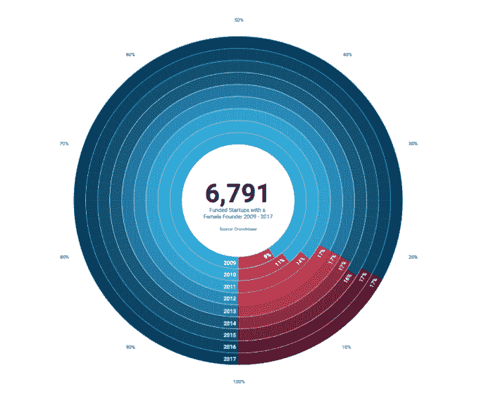
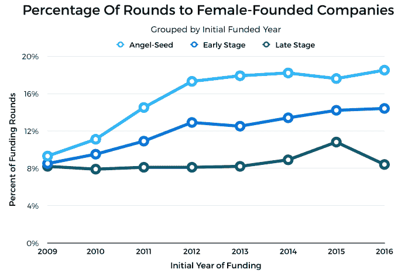
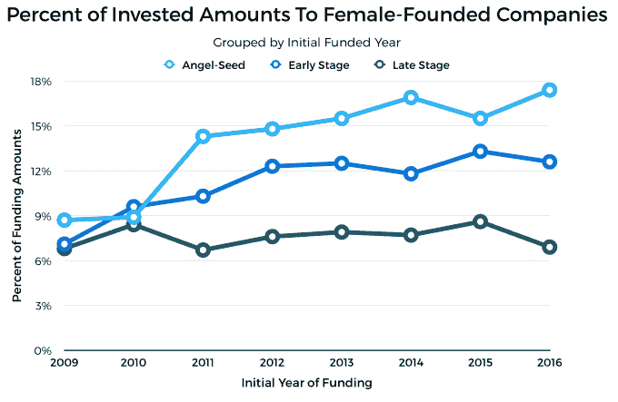

# 2017 年，只有 17%的创业公司有女性创始人

> 原文：<https://web.archive.org/web/https://techcrunch.com/2017/04/19/in-2017-only-17-of-startups-have-a-female-founder/>

More posts by this contributor

2017 年第一季度，至少有一名女性创始人的创业公司比例持平。

Crunchbase 关于美国公司女性创始人代表性的首次研究于 2015 年 5 月发表。随着关于工程团队中缺乏女性的讨论越来越多，我们得出结论，Crunchbase 是解决女性在科技领域创始人中的代表性问题的独特平台。作为创业社区的开放数据集，我们在 2015 年 3 月将性别添加到 Crunchbase，以进一步研究领导力、创始人和性别。

两年过去了，随着这项研究扩展到全球生态系统，我们重新审视同样的问题:至少有一名女性创始人的公司比例是多少？自 2009 年以来，这些数字发生了变化吗？女性创始人团队在筹集种子资金、早期和晚期风险资金时表现如何？

## 五年，没有百分比增长

对于 Crunchbase 对女性创始人的持续研究，43，008 家有创始人的全球公司在 2009 年至 2017 年间有初始资金。在这些全球公司中，6791 家(15.8%)至少有一名女性创始人。对于此次更新，随着 2016 年数据继续添加到 Crunchbase，我们主要是审查逐年趋势。

从 2009 年到 2012 年，拥有女性创始人的风险投资公司的比例增加了近 8 %;然而，自 2012 年以来，女性创办的风险投资公司的比例一直稳定在 17%左右。当我们查看 Q1 2017 年的数据时，这一比例似乎没有变化。对于那些一直在跟踪的人来说，这是近五年来女性创办的风险投资创业公司没有任何增长的一年:

拥有女性创始人的公司的绝对数量(以及创业公司的总数)增长了五倍多，从 2009 年的 176 家增加到 2016 年的 932 家。随着更多拥有初始资金的女性创业公司在下一年加入 Crunchbase，2016 年的结果将会增长。

在这 932 家公司中，有三分之一的创始人团队是女性。还有三分之一是由两个人组成的女性-男性创始团队。最后三分之一是由三个或更多成员组成的创始人团队。总之，三分之二的女性创办的公司仅由女性领导，或者与一名男性创始人共同创办。

对于 2016 年首次融资的公司，女性创办的公司倾向于教育(32%)、电子商务(31%)、医疗保健(21%)以及媒体和娱乐(21%)创业公司。

## 女性创办的公司只筹集了 8%的后期融资，7%的后期融资

说到筹款，女性创办的团队表现如何？在每个渐进式融资阶段，女性创办的公司筹集的资金占总资金的比例较低。

2016 年，至少有一名女性创始人的公司筹集了 19%的种子资金，14%的早期风险投资和 8%的晚期风险投资。

同年，女性创办的公司筹集了 17%的种子资金、13%的早期资金和 7%的后期资金。

## 挑战现状的投资公司

许多组织已经成立，以应对女性创始人和代表性不足的少数群体面临的挑战。像 Astia 天使、Pipeline 天使、百老汇天使和 Golden Seeds 这样的天使网络专注于女性领导的公司，同时培训女性投资。BBG 风险投资、MergeLane、女性创始人基金、铆钉风险投资、卤素风险投资、规模投资者、激烈资本和珀金斯基金都是专注于女性创办的公司的早期基金。SheWorx、Vinetta 项目、Watermark 等为女性创始人和领导提供了一个论坛。这里选择的是在 Crunchbase 上市的越来越多的[投资公司，旨在投资女性创始人。](https://web.archive.org/web/20230323163246/https://www.crunchbase.com/app/lists/investor-firms-investing-in-female-and/cc0e72c4-edce-461b-979c-33b1af1c39bb/identifier?new=false)

BBG 风险投资公司的联合创始人苏珊·莱恩(Susan Lyne)证实，“最大的问题不是创办公司的女性数量，而是当你在食物链上移动时获得资本的机会。”正如上面的图表所示，女性创办的公司在经历种子期、早期和晚期创业阶段时，总体融资比例较低。在 2016 年的所有融资阶段，至少有一名女性创始人的公司获得了 100 亿美元，而只有 940 亿美元投资于男性创始人团队。

*gene Teare 是 Crunchbase 的内容总监。*

###### [特色图片](https://web.archive.org/web/20230323163246/https://www.flickr.com/photos/wocintechchat/25392519213/) via Flickr 用户在 CC BY 2.0 下 WOCinTech 聊天。图像已被裁剪。