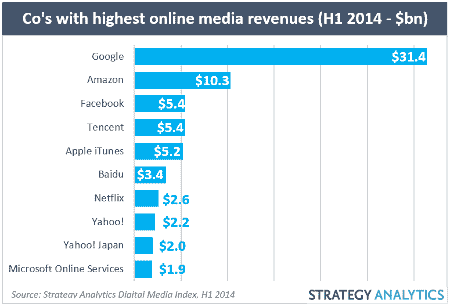

# 谷歌广告引领 H1 860 亿美元的在线媒体销售额 

> 原文：<https://web.archive.org/web/https://techcrunch.com/2014/12/08/in-86b-of-online-media-sales-in-h1-google-leads-chinese-sites-grow-and-ads-take-lions-share/>

[Strategy Analytics](https://web.archive.org/web/20221007032412/http://www.strategyanalytics.com/) 今天发布了一份关于[2014 年上半年在线媒体收入表现的概要](https://web.archive.org/web/20221007032412/http://www.strategyanalytics.com/default.aspx?mod=pressreleaseviewer&a0=5623)——特别关注 44 家最大的上市公司今年上半年的表现。2014 年上半年，该集团共获得 859 亿美元的数字媒体收入，同比增长 17%。或许并不令人意外的是，搜索引擎巨头谷歌仍然是最大的在线玩家，凭借其广告业务的优势，在此期间获得了 3140 万美元的销售额。

让你了解一下谷歌的数字意味着什么，它超过了所有 44 家企业产生的在线收入总额的三分之一，几乎相当于前十名中其他企业的总和。电子商务巨头亚马逊以 103 亿美元排名第二。

其他主要结论:中国的在线业务规模仍然很小，但增长迅速，在增长最快的 10 家公司中占据了 4 个席位。雅虎的总收入仍排在前十名，销售额为 22 亿美元，但它也是该集团中唯一一个下降(下降 3%)的公司。

尽管游戏和其他数字内容正在增长，广告仍然是最大的收入来源。

Strategy Analytics 称，谷歌目前的增长率比去年高 12%，领先于亚马逊 9%的增长率，但远远落后于其他在实际数字上落后于它的公司。脸书为 H1 带来的 54 亿美元在线收入比一年前增长了 66%。

这使得 FB 目前的增长速度超过了一些较大的中国网站:腾讯收入 54 亿美元(增长 43%)，而中国的谷歌百度收入 34 亿美元，增长 56%。新浪上涨了 36%。

正如你所料，随着越来越多的新兴服务的出现，一些小公司发展得更快。

据称，中国互联网安全软件公司奇虎是最大的增长故事，其 5.82 亿美元的在线收入增长了 123%。Twitter 的 5.62 亿美元增长了 122%。

Strategy Analytics 数字媒体总监迈克尔古德曼(Michael Goodman)写道:“火热的中国互联网市场正在挑战美国公司的历史主导地位。“中国网民比美国人多 2.5 倍，这是一个重要因素，因此他们能够仅在国内市场就达到如此高的水平。最大的问题，也是对美国全球主导地位的关键威胁，是他们能否将这种成功带到中国以外。”

SA 没有给出苹果 iTunes 的增长率，但指出其上半年销售额为 52 亿美元。当然，就市值而言，苹果是当今世界上最大的科技公司，其大部分收入来自硬件销售，而不是在线内容。此外，值得注意的是，阿里巴巴不在其中，大概是因为没有可供比较的公开数据。

就什么在网上卖得好而言，尽管我们已经看到了数字内容服务的爆炸式增长，但广告仍然是赚大钱的来源。在线广告占所有数字媒体收入的 77%，其次是在线游戏(15%)和视频(5%)。

“音乐和内容交付网络(后者如 Akamai 和 Limelight，它们代表出版商提供内容)瓜分了剩下的 3%，”它指出。游戏是增长最快的，增长了 26%，但广告和视频以 24%的比例紧随其后。内容交付网络的收入增长了 21%，而音乐表现不佳，仅增长了 9%(对于 Spotify 和 Soundcloud 的世界来说，这不是一个好兆头)。

值得关注的是广告公司——实际上是所有的网络公司——在未来如何实现多元化。

SA 指出，百度和微软的在线服务收入 100%来自广告，而脸书则有 91%来自广告。谷歌 90%的在线收入来自广告，而雅虎占 80%(雅虎日本占 60%，该公司也有宽带服务)。

“音乐流媒体工具 Pandora 也严重依赖广告，占其收入的四分之三(77%)以上，”它指出——这可能是尽管音乐表现平平，但 Pandora 仍跻身前十的原因之一。

SA 指出，中国企业比西方企业更加多样化。

古德曼写道:“中国公司尤其擅长通过各种服务创造收入。”。“例如，在向搜索和移动领域扩张的推动下，行动最快的奇虎公司在广告和互联网增值服务领域都表现出色。”然而，情况并非总是如此——看看百度 100%基于广告的收入模式。

多样化还可能突显出，为什么亚马逊等公司如此积极地进入一系列服务领域，从内容到广告，从交付到托管到自有品牌商品，以补充其电子商务业务。