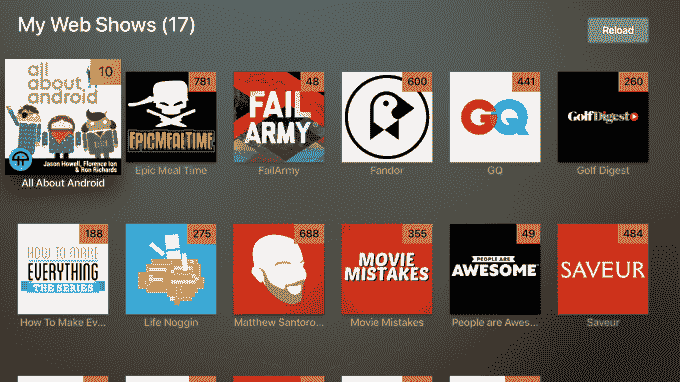
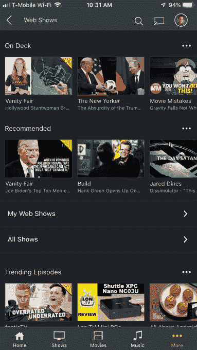

# 为了集中您的所有媒体，Plex 现在包括 web 系列 

> 原文：<https://web.archive.org/web/https://techcrunch.com/2018/10/03/in-a-quest-to-centralize-all-your-media-plex-now-includes-web-series/>

在 CES 上，媒体软件制造商 Plex [表示，今年将在其平台上增加对播客、网络系列和其他数字媒体的支持](https://web.archive.org/web/20221207233918/https://techcrunch.com/2018/01/08/podcasts-are-coming-to-plex-followed-by-web-series-and-other-digital-media/)。今年五月，[推出了播客](https://web.archive.org/web/20221207233918/https://techcrunch.com/2018/05/30/plex-adds-support-for-podcasts-debuts-personalized-mobile-apps/)，现在它推出了自己策划的网络系列。该公司今天推出了测试版的 [Plex 网络节目](https://web.archive.org/web/20221207233918/https://www.plex.tv/online-content/web-shows/)，将提供来自 GQ、Saveur、Epicurious、Pitchfork、Condé Nast、The New Yorker、Fandor、Vanity Fair 等品牌的无限制点播在线节目。

Plex 表示，这些节目将涵盖一系列兴趣，包括食品、家居和园艺、科学、技术、娱乐和流行文化。除了大牌品牌合作伙伴的节目，还包括 Bonnier、TWiT、Ovation 等，还将有少数独立创作者的节目，如 *Epic Meal Time、ASAPscience、Household Hacker、*和 *The Pet Collective。*

Plex 告诉我们，在发布会上，将有超过 19，000 集的 67 个节目，还有更多正在进行中。

该公司还表示，根据 Plex 管理的广告销售，一些合作伙伴和 Plex 达成了收入分成协议。细节未披露。

Plex 最初是一款组织用户家庭媒体收藏视频、音乐和照片的软件，但在最近几个月，它已经将重点转移到解决脐带切割者的需求上。它推出了通过天线观看直播电视，以及将节目和电影录制到 DVR 上的工具。

它最近还表示将关闭其他功能，如支持来自丛云的[流媒体内容以及](https://web.archive.org/web/20221207233918/https://techcrunch.com/2018/09/11/plex-cloud-will-shut-down-november-30-due-to-technical-challenges/)[丛的插件目录](https://web.archive.org/web/20221207233918/https://techcrunch.com/2018/09/26/plex-kills-off-support-for-cloud-sync-plugins-and-bookmarking-features/)，以便更好地专注于其新的雄心。

与此同时，Plex 还推出了其他为媒体消费设计的功能，不仅包括播客，还在其应用程序中添加了新闻中心，这要归功于其对流媒体新闻初创公司 Watchup 的[收购](https://web.archive.org/web/20221207233918/https://beta.techcrunch.com/2017/01/31/plex-acquires-watchup-to-bring-streaming-news-to-its-media-app/)。

随着[网络节目](https://web.archive.org/web/20221207233918/https://www.plex.tv/online-content/web-shows/)的推出，Plex 再次找到了一种方法，让用户有东西可看，而不必像今天其他直播电视流媒体服务那样进行艰难的内容交易——例如 Sling TV、PlayStation Vue 或 YouTube TV。

“我们真的很关心每个用户的个人媒体体验，并希望成为对他们来说最重要的媒体平台，”Plex 首席执行官 Keith Valory 告诉 TechCrunch。“这始于帮助人们使用他们自己的个人媒体库，然后我们增加了无线电视、新闻、播客，现在还有网络节目。优质数字内容的来源继续呈爆炸式增长，但用户发现和访问这些内容的体验从未如此糟糕。这是一片混乱，”他继续说道。

“这是我们正在解决的问题。Valory 补充道:“我们正努力在一个漂亮的应用程序中提供大量精彩的内容，并为我们的用户提供工具来定制他们自己的体验，只包含对他们来说重要的内容。

[https://web.archive.org/web/20221207233918if_/https://www.youtube.com/embed/0W-WvSaCQ14?feature=oembed](https://web.archive.org/web/20221207233918if_/https://www.youtube.com/embed/0W-WvSaCQ14?feature=oembed)

视频

通过 Plex 应用程序可以跨设备访问网络节目，现在有了一个新的“网络节目”图标。在这里，您将看到熟悉的“在甲板上”部分(您正在关注的部分)，以及个性化推荐、热门剧集、查看所有可用网络节目的链接和您订阅的内容列表。

你也可以按类别浏览节目，如“艺术与娱乐”、“计算机与电子”、“科学”等。或者查找“最近播放的”或“新”到 Plex 的内容。

每集都将显示诸如节目长度、概要、发布日期和标题等信息，并允许您播放、暂停、标记为已观看/未观看，以及添加到您的队列中。

网络节目的推出是 Plex 向其新目标迈出的又一步，即成为所有媒体的平台——不仅仅是你的家庭收藏，还包括所有流媒体——如播客、网络连续剧和电视。(它现在缺少的只是一个类似 Roku 的界面，可以让你跳转到你最喜欢的点播流媒体应用。这是[的长期路线图，然而](https://web.archive.org/web/20221207233918/https://techcrunch.com/2018/01/08/podcasts-are-coming-to-plex-followed-by-web-series-and-other-digital-media/)。)

网络节目将对 Plex 现在的 1900 万注册用户免费，而不仅仅是 Plex Pass 的订户。该功能在 iOS、Android、Android TV 和 Apple TV 上直播。