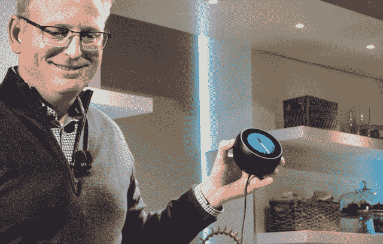
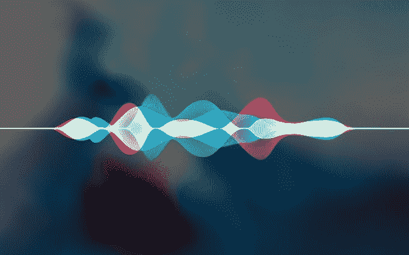

# 为 HomePod 辩护 

> 原文：<https://web.archive.org/web/https://techcrunch.com/2018/04/15/in-defense-of-the-homepod/>

在我的公寓里，我的 HomePod、谷歌主页和亚马逊 Echo 相距不超过 15 英尺。

这既证明了我对智能家居废话的痴迷，也证明了我无法购买一家科技巨头的硬件生态系统。我曾在不同时期全力以赴帮助每个助手，但现在我的整个互联生活都是通过一系列命令来运行的，这些命令由特定的语调、准确的措辞和说话量组成，只有我一个人完全掌握了这些内容。我独自掌握着我的互联生活的秘诀。(这让我的室友日子不好过，有时他不得不要求我开灯，但说实话，当他看到我搬进来时打开我的 VR 设备时，他应该知道会有什么烦人的技术问题摆在面前。)

这些健谈的智能助手让我对这些产品的每一个缺点都了如指掌，但它也帮助我对这些平台本身的个体优势有了深刻的认识。

本周，[彭博](https://web.archive.org/web/20221206142902/https://www.bloomberg.com/news/articles/2018-04-12/apple-s-stumbling-homepod-isn-t-the-hot-seller-company-wanted)报道了 HomePod 的艰难时期。苹果正在减产，它的一些零售店每天的销量都没有突破两位数，而且它在智能扬声器市场上只占很小的份额。这份报告引来了许多批评者，他们预示着苹果产品战略的无知，并喋喋不休地谈论智能扬声器的普遍沉默和黯淡的功能集。

现在，我没有为近万亿美元的公司辩护的习惯，但我认为这种批评是错误的。HomePod 可能是其中功能最好的智能扬声器，我还认为该公司的整体战略远远没有“落后”其竞争对手。苹果的人工智能战略需要一些 TLC 来加强 Siri，但通过 AirPods 和 HomePod，苹果正在音频硬件上建立一个统一战线，将经受住一个似乎从一开始就人为成熟的市场的噱头。

### 被误解的市场

首先，我一直认为“智能音箱市场”是一个以一种奇怪的方式切片的馅饼。尽管语音助手与智能手机有着密切的联系，但如果说亚马逊仍然是排除了数十亿具有深度语音助手功能的移动设备的类别中的明显赢家，这似乎是*准确的*，但同时也是大错特错的。

这也是为什么我认为苹果不需要担心推出像 Home Mini 或 Echo Dot 这样 50 美元的产品，因为虽然亚马逊迫切需要与消费者建立低摩擦的联系，但苹果不会通过将一个微小的扬声器放入一个罐头中来获得更多，它甚至比你 iPhone 上的“嘿 Siri”更少。

349 美元对另一个方向来说很远(太远)，但高端硬件是苹果的卖点，消费者将默认使用另一个智能助手而不是他们的手机使用的概念只是 Siri 和谷歌助手早期存在的问题。亚马逊的技术可以变得越来越好，但如果谷歌助手是唯一一个对你的谷歌账户活动了如指掌的人，而 Siri 是唯一一个你可以用来发送 iMessages 的人，那就没什么可聊的了。

### **听好了**

聪明的演讲者给出的最愚蠢的答案总是你一直在等待却从未到来的答案。正如 Airpods 由于不太性感的连接进步而成功地实现了他们的方法一样，HomePod 通过麦克风阵列赢得了其聆听能力的智能，即使在大声播放音乐时，它也可以听到我耳语的音量。在硬件比较中，这是一个被忽略的特性，但实际上这是最重要的特性之一。

我在电视播放的时候喊了很多次“嘿，谷歌”，但都没有被记录下来。与此同时，我明白了，与 HomePod 人交谈时，我其实不必提高嗓门。这一点，加上它的位置感知功能，使它感觉更像是我公寓里的一个幽灵，而不是束缚在我点头大喊的物理位置上。虽然亚马逊在这方面的技术也一直令人印象深刻，但我发现当音乐响起时，HomePod 处理更有效，而谷歌的智能扬声器(包括 Max)则几乎被浪费了，根据我的经验，在嘈杂的环境中，谷歌的智能扬声器似乎总是很难听到。

### 不熟练的智力

现在，Siri 在作为电话助手方面绝对不如谷歌助手，但这些缺点在 HomePod 看来并不那么不和谐。苹果在 iOS 上与 Siri 的第三方集成方面做出了错误的决定，但 Alexa 技能和谷歌助手行动的现状表明，苹果在智能音箱第三方平台方面还没有错过太多。

像在 Echo 或 Google Home 上用达美乐订购比萨饼这样的事情需要大量的努力，只有你提前在手机上做了大部分工作，这才是容易的。我不会说苹果缺少这个功能已经在其核心智能中撕开了一个口子，同样，这些“技能”中的大部分通常不会给我做出决定所需的背景。

我不明白为什么有这么多的爱扔在这些智能扬声器开发平台。事实是，它们在很大程度上是品牌营销预算的渠道，而不是消费者效用的堡垒。当然，其中一些应用程序很有趣，最终可能会使 Echo 成为比 HomePod 更适合家庭使用的设备，但随着噱头的消退，这个臃肿的软件最终会成为一种事后想法。亚马逊现在需要的是这个，而不是消费者。

### 限制

打电话、区分多个用户和访问日历都是非常基本的功能，人们希望 HomePod 能尽快更新。尽管如此，HomePod 并不像有些人说的那样是一个未完成的产品，当然也没有“落后”其竞争对手几年。感觉肯定比亚马逊发散智能音箱聚宝盆里的一些硬件产品更有成品感。

他们在音乐流媒体支持方面做出了一些令人恼火的决定；Apple Music 是享受这款产品的绝对必需品。我过去一直是 Spotify 的听众，但我从来没有成为播放列表的超级用户，这让我很容易切换播放列表，如果它让 HomePod 和我的 AirPods 的生活变得更容易的话，事实确实如此。

苹果音乐只是生态系统中又一个独有的元素，推而广之，还有 Siri。尽管 Spotify 的市值极高，但我实在找不到不看好苹果音乐的好理由。这项服务正在快速增长，如果趋势不变，将在今年夏天的某个时候超过 Spotify 的付费用户数量。苹果将苹果音乐支持引入 Echo 或 Google Home 似乎不太现实，但如果 HomePod 的 Spotify 能同时获得一些基本支持就好了，尽管我也有点怀疑这一点。

### 结束游戏

都是关于生态系统的；按照我们现在的定义，“智能音箱市场”并不重要，也永远不会重要。谷歌通过谷歌 Home Mini 的廉价入口点获得的是一种让人们获得他们不知道自己手机拥有的功能的方式。苹果正在利用 HomePod 设定一个基准，同时他们希望建立 Siri 尚不具备的这些功能。亚马逊的 Alexa 可能在联网家庭的背景下有机会，但很难想象一个世界，你不希望你的移动设备和家庭助理中枢在操作系统层面上密切联系。

AirPods 和 HomePod 是集成操作系统的硬件的很好的例子，虽然 Siri 需要翻新，也许需要一些大脑手术，但苹果对 HomePod 的想法是它需要在哪里。这是一个暂时应该真正有点试验性的平台。亚马逊人对市场主导地位的追求让这些东西如此迅速地进入了人们的家庭，但智能扬声器的大部分效用仍然与他们的沮丧情绪密切相关。

像 AirPods 一样，HomePod 已经找到了需要首先解决的挑战。“赢得智能扬声器市场”不会发生在这款产品上，但我觉得苹果对 HomePod 的思考与它的竞争对手所缺乏的健康的自我意识紧密相连。