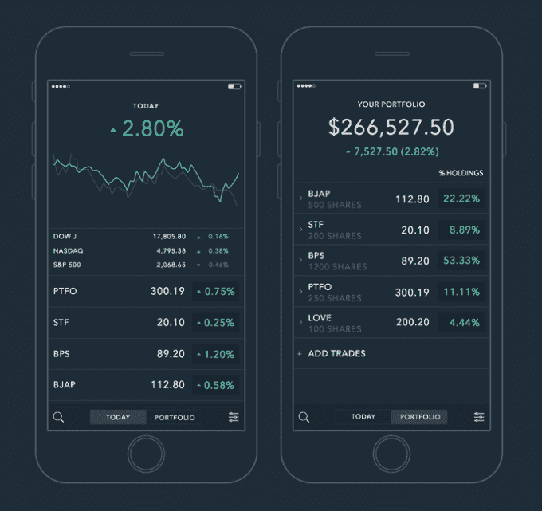

# 想要挑战雅虎财经的应用程序 Portfolio 的深度

> 原文：<https://web.archive.org/web/https://techcrunch.com/2015/04/09/in-depth-with-portfolio-the-app-that-wants-to-take-on-yahoo-finance/>

# 深度投资组合，应用程序，希望采取雅虎金融

移动应用不仅仅是游戏，由 TechCrunch 校友 [Ben Schaechter](https://web.archive.org/web/20230316055710/https://twitter.com/Bensign) 共同创立的 [Portfolio](https://web.archive.org/web/20230316055710/http://get-portfolio.com/) 想要颠覆金融应用领域。该公司三周前推出了其 iOS 应用程序，并在一定程度上受到了苹果应用商店 love 的推动，很快获得了早期采用。

投资组合是跟踪美国金融市场和个人交易的简单方法。该应用程序在交易结束时向您发送每日更新，以标出较大的金融波动以及个别公司的动向。现在我可以毫不费力地看到我在 AOL 的惊人股份是如何运作的。

本在美国在线之前的日子里在 TechCrunch 工作，后来创立了 GoPollGo，[，并于 2013 年卖给了雅虎](https://web.archive.org/web/20230316055710/https://techcrunch.com/2013/05/09/yahoo-acquires-gopollgo-a-maker-of-analytics-and-social-feedback-site-shuts-down/)。他离开雅虎一段时间后，创建了 Portfolio——大概是为了追踪他的累积财富。

几个月后，我会回来看看 Portfolio，看看这款应用的发展势头如何。这一点、它的 Android 计划以及它打算以多快的速度进入国际市场都是显而易见的问题。谁知道呢，在这个紫色巨人获得投资组合以帮助增强其自己的金融应用程序后，本最终可能会回到雅虎。

毕竟，世界上还有讽刺。