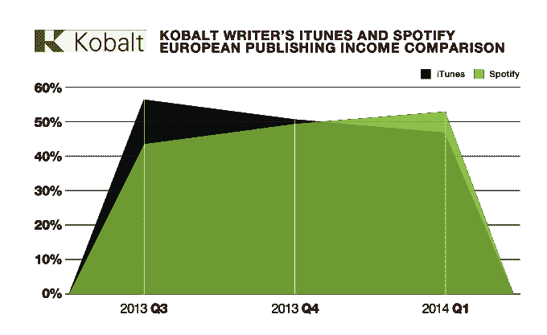
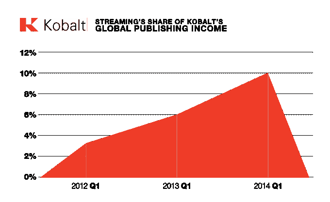

# 在欧洲，Spotify 版税收入超过 iTunes

> 原文：<https://web.archive.org/web/https://techcrunch.com/2014/11/04/in-europe-spotify-royalties-overtake-itunes-earnings-by-13/>

Spotify 可能会因为泰勒·斯威夫特(Taylor Swift)的音乐目录被从其平台上移除而受到 T2 的伤害，泰勒·斯威夫特可能不在乎，因为她的新专辑《1989》销售火爆，但事实证明，从更大的角度来看，Spotify 的流媒体服务继续获得下载优势，特别是通过 iTunes。

[Kobalt](https://web.archive.org/web/20221006114423/http://www.kobaltmusic.com/) ，一家帮助代表数千名艺术家收取音乐版税的公司——包括“本周公告牌前 10 名中的一半”以及魔力红、蓝尼·克罗维兹、大卫·格鲁、马克斯·马丁、鲍勃·迪伦和麦克摩尔·瑞恩·刘易斯等音乐家——表示，在欧洲上个季度，Spotify 流媒体的收入平均比苹果 iTunes 为其客户带来的收入高出 13%。

这些数字支持了《华尔街日报》上个月报道的发现，指出 iTunes 音乐销售额今年下降了 13%。iTunes 仍然是一个庞大的业务——上个季度的销售额增加了 3 亿美元到 46 亿美元——但这并不意味着音乐在其中的表现有多好。

(我们今年早些时候在 Kobalt 的简介中指出，当它[筹集了 1.4 亿美元的资金](https://web.archive.org/web/20221006114423/https://beta.techcrunch.com/2014/06/04/kobalt-music-ka-ching/)时，该公司仅从欧洲的 Spotify 流媒体中收集收入，但显然这已经发展到涵盖全球收入，但 Spotify 的流媒体流量目前仅在 Euorpe 超过 iTunes，因此专注于该地区的收入。)

Kobalt 还指出，截至 2014 年 Q2 奥运会，流媒体服务占其欧洲客户全部出版收入的 10%。

Kobalt 指出，流媒体服务的平衡是一个相对较新的现象。

2013 年第三季度，iTunes 的收益比欧洲的 Spotify 高出 32%。过去两年，流媒体收入增长了两倍。Kobalt 表示，它将出版收入计算为订阅服务、YouTube、网络电台上的音乐播放的回报，以及现场创作表演、电台表演以及 CD 和音乐会 DVD 的版税。

iTunes 销量的下降表明了从下载到流媒体的更大转变，这也再次说明了为什么苹果可能有兴趣收购 Beats Music，并且[正在努力将流媒体服务的一部分整合到更广泛的 iTunes 体验中](https://web.archive.org/web/20221006114423/https://beta.techcrunch.com/2014/10/24/apple-will-modify-beats-music-brand-to-death/)。它希望提供一个有吸引力的流媒体服务，以保持用户与它的设备和更广泛的移动生态系统的联系。

尽管流媒体收入似乎在增长，但也有一些钱留在桌面上。

“Spotify 在欧洲超过 iTunes 是流媒体领域一个重要的新里程碑，”Kobalt 首席执行官 Willart Ahdritz 说。“音乐行业的基础设施令他们失望，无法有效处理来自数字交易的海量数据。”当然，正如今天 [SoundCloud 和华纳音乐](https://web.archive.org/web/20221006114423/https://beta.techcrunch.com/2014/11/04/soundcloud-confirms-licensing-deal-with-warner-music-group/)之间的交易所示，这一点正在缓慢但肯定地被抢购一空。