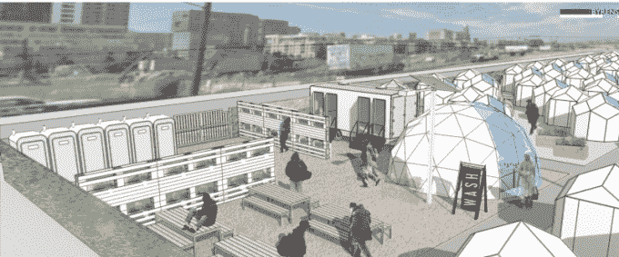

# 在其 VR/AR 推广中，Twitter trolls 自己

> 原文：<https://web.archive.org/web/https://techcrunch.com/2016/10/18/in-its-vrar-push-twitter-trolls-itself/>

公关复苏 101:当你搞砸了这个现实，就去下一个现实。

随着其他现实世界的希望和梦想在 Twitter 周围起伏，Twitter 似乎正在慢慢增加其 AR/VR 员工。新闻[今天爆出](https://web.archive.org/web/20230328070657/http://variety.com/2016/digital/news/twitter-greg-gopman-virtual-reality-1201892529/)该公司已经聘请前 AngelHack 创始人格雷格·戈普曼开始在该公司从事虚拟现实工作。

[ **太平洋时间 2019 年 10 月 11 日上午 11 点**更新:格雷格·戈普曼现在声称，在[新闻爆出](https://web.archive.org/web/20230328070657/https://techcrunch.com/2016/10/18/in-its-vrar-push-twitter-trolls-itself/)公司已经聘请他为承包商后不到一天，他就被推特解雇了。戈普曼在 2013 年卷入了一桩丑闻，原因是他对无家可归者发表了攻击性言论，以及随后的影响。今天在脸书，[戈普曼写道](https://web.archive.org/web/20230328070657/https://www.facebook.com/GregoryGopman/posts/10109468186724721)“我被解雇了。感谢 TechCrunch”。当朋友们问发生了什么事时，他补充说，“他们昨晚写了一篇关于我的轰动性文章，但通讯部不想处理它。”当被要求发表声明时，Twitter 提供了“无可奉告”。

更新 10/19 下午两点 PT : Gopman 告诉 TechCrunch“在 Twitter 工作真的很棒。比我预期的好多了。我在一个不可思议的团队中工作，我们正在做非常令人惊奇的事情。昨天我们在飞行。现在一切都结束了。我仍然爱他们，并祝愿他们一切顺利。”。

戈普曼的说法引发了一个问题，即 Twitter 在雇用他作为承包商时，是否知道戈普曼过去关于无家可归者的言论。如果不是，它就没有对潜在雇员进行适当的尽职调查。如果它知道并雇佣了他，仅仅因为三年前的新闻报道就终止他的合同合适吗？-乔希·康斯坦丁

Twitter 尚未真正宣布 VR/AR 方面的任何重大举措——当然，他们可能已经测试了一两个 360 视频——但他们的注意力似乎主要集中在其他项目上，如平台上猖獗的虐待和骚扰。

对于一个有着这样一个来自巨魔的滥用问题的公司来说，他们雇佣了 Gopman，一个“虚拟现实专家”，他也表达了他对处理“退化者”的热情，这可能最初看起来是一个双赢的局面。也就是说，直到你意识到他称为“负担和责任”的“堕落者”是科幻小说中无家可归的人。

这是正确的，这是同一个 Gopman，他失去了它后，在一个长期以来被删除的脸书对科幻小说的无家可归者问题的咆哮痛骂。(重点是我的)

> 刚回 SF。我周游过世界，我不得不说，没有什么比走在旧金山的市场街上更怪异的了。为什么我们城市的中心要被疯子、无家可归者、毒贩、辍学者和垃圾所占据？我不知道。每次我经过它的时候，我对科幻小说的爱就消失了一点。
> 
> 不同的是在其他国际大都市，**社会的下层不与人交往。他们卖小饰品，害羞地乞讨，保持安静，一般不碍事。他们意识到这是一种特权，在城市的文明部分，并把自己视为客人。这没关系。**
> 
> 在旧金山市中心，**堕落者像鬣狗一样聚集在一起，吐痰，小便，奚落你，卖毒品，变得粗暴，他们表现得好像他们拥有这个城市的中心**。好像这是他们休闲的地方……实际上这是美国最富有的城市之一的商业区。这是一种耻辱。如果没有计划好自己的行走路线，我甚至觉得走在人行道上不安全。
> 
> 你可以宣扬同情、平等，并成为世界上最大的爱人，但有一片城镇是给堕落者的，也有一片城镇是给工人阶级的。让他们离我们这么近没有任何好处。让他们离我们这么近是一种负担和责任。相信我，如果他们增加了一丁点的价值，我会考虑改变想法，但那个疯狂的无牙女士踢了每个太靠近她的纸箱的人，并没有让任何人的生活变得更好。

Twitter 没有立即回应我关于他们是否知道戈普曼过去的评论的询问。

戈普曼的新角色被披露之际，有消息称，Twitter 的骚扰问题似乎已经阻止了 Salesforce 和迪士尼竞购该公司。鉴于 Twitter 的 troll 问题，你不会认为他们会为他们的 VR 项目雇用一个过去的观点看起来像该公司用户群中最糟糕的人(尽管远远超过 140 个字符所允许的罗嗦)。

不过话说回来，Twitter 在虚拟现实领域的举措到目前为止还没有太多意义。

虽然社交媒体竞争对手脸书凭借其开创性的 360 视频/音频技术一直处于虚拟现实创新的前沿，但 Twitter 仍然停滞不前。Snapchat 因其增强现实智能滤镜获得了大量关注，但 Twitter 仍远远落后。令人费解的是，该公司甚至没有为那些想要炫耀这种越来越受欢迎的内容类型的人提供原生 360 视频浏览器。

有这么多应该发生的 AR/VR 移动，很奇怪的是，Twitter 竟然雇佣了 Gopman。

我们大多数人都曾在网上说过一些事后会后悔的话，你不一定想在某人的余生中因为一个愚蠢的帖子而指责他。但是，即使是戈普曼为自己的评论做出的努力也没有取得成功。

戈普曼经历了一场艰难的战斗，从他所谓的“我一生中最愚蠢的错误”中恢复过来。今年早些时候的一篇 6000 字的背景文章详细描述了自从他在 FB 发表文章以来，他在“教育自己”旧金山无家可归者的困境方面所做的工作。现在，人们可以改变，也确实改变了，但尽管戈普曼似乎不知疲倦地关注着这个城市最贫困人群的困境，但总有一个人更需要救赎和关注，那就是他自己。

他让我们和他一起参与他的学习经历，把他的经历分享到[的个人博客](https://web.archive.org/web/20230328070657/https://medium.com/homes-for-the-homeless/solving-homelessness-in-san-francisco-65d13ce12a9#.n0k91tax1)，并在推特上给记者贴标签，这样他们就可以看到他是如何学会关心他人的。这一切都符合硅谷的一句格言:好事不登媒体。

https://twitter.com/StartupGreg/status/571095951856656384

“去年，我在脸书上写了一篇慷慨激昂的文章，表达了我对旧金山无家可归者群体的不满。它像病毒一样传播开来。人们认为我是个怪物……”戈普曼[写道](https://web.archive.org/web/20230328070657/https://medium.com/homes-for-the-homeless/solving-homelessness-in-san-francisco-65d13ce12a9#.6tuh1i3en)。“但最糟糕的是，它分散了旧金山对改革我们破碎的无家可归者政策的必要对话的注意力。”

在更多的自我参考博客帖子和大量数据点之后，戈普曼组建了一个集体，以他所知道的最好的方式来解决这个问题，努力创建一个类似于*燃烧人* 的无家可归者社区[。戈普曼没有得到他所期待的积极关注。在他的计划的一部分——包括为无家可归的模特建造网格状的圆顶避难所——被媒体曝光和撕毁后。](https://web.archive.org/web/20230328070657/https://backchannel.com/the-weird-redemption-of-sf-s-most-reviled-tech-bro-ce8dd1bfb705#.rwiaa72jc)

戈普曼后来发布(并删除)了一封电子邮件(这次是在 Twitter 上！)来自旧金山市长住房机会、合作与参与办公室的公共政策主任。在电子邮件中，这位官员称戈普曼是一个“*冒牌货*”，他正努力“帮助清除他在谷歌搜索档案中说过的所有可怕的话。”另一名官员告诉[卫报](https://web.archive.org/web/20230328070657/https://www.theguardian.com/us-news/2015/sep/08/tech-entrepreneurs-san-francisco-homeless-plan-flounders-amid-acrimony)，戈普曼的努力已经停止，因为“和他一起工作的人厌倦了他的自负”

为无家可归者提供住所的网格球顶设计的实体模型

在一年时间内改变旧金山长达几十年的无家可归问题是多么困难，戈普曼心烦意乱，开始了他所谓的“亚洲美食、祈祷和爱情之旅”从这九个月的休假中回来后，他开始找工作，并在虚拟现实娱乐/媒体/工作空间初创公司 [UploadVR](https://web.archive.org/web/20230328070657/http://uploadvr.com/) 找到了一个业务发展职位，在那里他负责招聘新员工，并帮助创建一个名为“双月虚拟现实生活方式夜总会体验”的项目

他在 Upload 呆了大约九个月，然后在本月加入 Twitter 的团队，担任虚拟现实项目经理，他现在负责“合作伙伴关系、产品发布和招聘”，Twitter 显然需要对这些领域给予更多积极的关注，而他的招聘可能不会做到这一点。

尽管戈普曼的批评者在社交媒体上的声音如此之大，但他刚刚被聘用的公司正在悄悄地开展其虚拟现实工作。

Twitter 的 AR/VR 工作目前包含在 Twitter Cortex 工程组中。它由 Alessandro Sabatelli 领导，他的 VR/AR 公司 IXOMOXI 于 6 月被 Twitter 收购。他的初创公司为 Gear VR 开发了一款名为“Lucy”的应用，面向音乐节观众，该应用将万花筒般的迷幻剂灵感过滤器放在手机上的直通摄像头的镜头上。

自从 Sabatelli 被聘用以来，该公司还一直在研究如何将 Periscope 与 360°视频相结合，以建立不同事件的现场直播，Twitter 的用户可以相互体验。“我们现在的主推是直播，以及我们如何一起体验直播事件，”Sabatelli 在 Twitter Cortex 与 UploadVR 在 Siggraph 2016 大会上举办的一次活动中告诉人群。

网站上的招聘启事敦促潜在的 Cortex 申请人“想象一下，参加有史以来规模最大的音乐会，来自世界各地的数百万人以新的激动人心的方式进行现场互动。”潜望镜的[最新更新](https://web.archive.org/web/20230328070657/https://techcrunch.com/2016/10/13/periscope-producer/)带来了从外部摄像机流式传输实时视频的能力，360 视频流式传输和实时拼接似乎也在生产者功能的道路上，所以这个功能可能比其他功能来得更快。

Snapchat 风格的过滤器显然也是 Cortex 希望进入的一个领域，该公司目前正在寻找具有“人脸检测、识别、身体跟踪和/或姿势检测”知识的计算机视觉专家[。这是一个必要的举措，但不清楚的是为什么要花这么长时间才能让任何东西复活。萨巴特利从 6 月份才上任，所以他不一定会犯错，但为什么推特在提高其平台的计算机视觉能力方面拖拖拉拉，对我来说是个谜。](https://web.archive.org/web/20230328070657/https://careers.twitter.com/en/work-for-twitter/software-engineer-computer-vision-deep-learning0.html)

关于收购要约的持续谣言有可能让该平台的主要功能运动靠边站，但推特在扩展其功能集时总是缓慢而谨慎。

虚拟现实/增强现实技术仍处于生命周期的早期，但推特甚至懒得公开尝试寻找用户现在在智能手机上喜欢的相关功能。Snapchat 有其有趣和疯狂的智能过滤器，而脸书有一个最大的虚拟现实视频和照片库(哦，是的，Oculus，一个完整的虚拟现实耳机公司)。推特不仅没有找到自己的定位，甚至没有尝试复制其他社交媒体公司的成功。

对于大公司来说，如今被视为增强现实/虚拟现实领域的进步力量并不需要太多时间，但推特在这一领域奇怪的不作为——以及今天令人质疑的招聘决定——似乎并不是特别明智的举措，尤其是在该公司展望如此不确定的现实之际。

*Josh constitne 的补充报道*