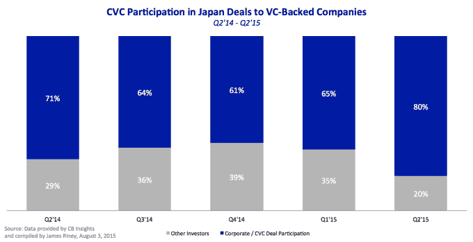
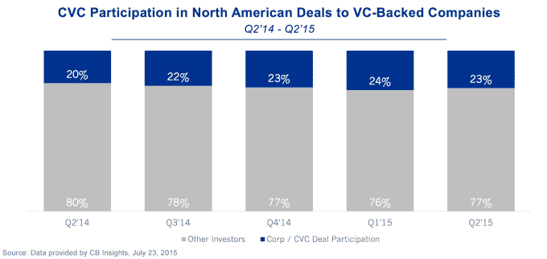
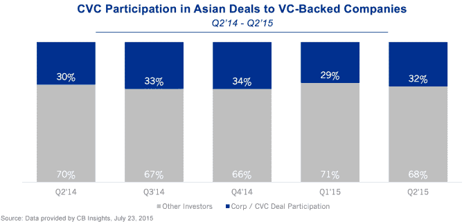

# 日本企业风险投资为王 

> 原文：<https://web.archive.org/web/http://techcrunch.com/2015/08/13/in-japan-corporate-venture-capital-is-king/>

詹姆斯·雷尼是 500 Startups Japan 的管理合伙人和负责人。

More posts by this contributor

在美国，当谈到融资时，corporateventurecapital似乎是“c 计划”的同义词。如果你无法从顶级公司筹集资金，你就会转向 B 计划，即二线公司。如果失败，C 计划就是公司。

当然也有例外，但是公司往往是最后的选择:当你的公司被收购，或者你的估值太高，以至于那些疯狂到给你开支票的投资者有大把的“傻钱”可以花的时候，你会去那里。

“他们烂透了！”联合广场投资公司的弗雷德·威尔逊如是说。“他们对公司的成功或企业家的成功不感兴趣。公司的存在是为了最大化他们的利益。他们永远不会有男子气概或宽宏大量。这不是他们的基因，所以他们作为投资者很差劲。”

在美国，尤其是在硅谷，从企业融资可能并不理想。但是在日本，科技企业家们没有在公司、风险投资和资本面前畏缩不前的奢侈。

从很多方面来说，创业 资本 *从根本上来说就是*法人 资本，不仅仅是 CVC 的形式，还有独立资金的有限合伙人形式。虽然美国的大部分资金来自机构投资者，如养老基金、捐赠基金或基金的基金，但在日本，也有很大一部分来自企业。

这种差异来自于日本投资者倾向于更加厌恶风险，而风险资本被广泛认为是一种风险太大的资产类别，不适合投资。不幸的是，回报还没有达到硅谷的高度来克服这种厌恶。

因此，创业者可获得的风险资金明显减少。2014 年，大约有 9 . 6 亿美元投资于的风险资本[，而美国的](https://web.archive.org/web/20230130020950/http://nvca.org/pressreleases/annual-venture-capital-investment-tops-48-billion-2014-reaching-highest-level-decade-according-moneytree-report/)为 480 亿美元——相差 50 倍。对于天使投资来说，大约是 10 亿美元到 241 亿美元。换句话说，日本企业家只有大约 19.6 亿美元。这几乎是安德森·霍洛维茨基金第五支基金的规模。

那么，日本企业为什么要投资初创企业呢？原因与其他国家的 T2 公司投资者没什么不同。公司投资者的唯一目的不是财务回报。从管理的角度来看，公司 企业部门被视为研发或公司开发费用。

R&D 的需求得到了满足，因为它能够关注最新趋势，并在采取行动为时已晚之前发现可能影响其核心业务的因素。在公司发展方面，这是一种发现要收购的公司的机制，也是与有前途的公司建立关系，希望与它们长期合作的机制。本质上，他们是否认为风险投资有风险并不重要:财务回报不是首要目标。

有趣的是，因为创业公司的很多资金来自公司，所以没有人认为公司的钱不如独立的钱。

事实上，从许多方面来看，从拥有强大品牌的老牌公司那里融资，对市场来说是一个更好的信号。在一个天生厌恶风险的国家，品牌公司的支持传达了稳定，而这种稳定非常有帮助。

当你是一家斗志昂扬、默默无闻的初创公司时，如果客户确信一年后你还会存在，那么说服他们采用你的解决方案会容易得多。当你试图说服顶尖人才跳槽时，情况也是如此。企业的支持给人一种错觉，你的创业之舟不会在未来的创业风暴中沉没。

感知完全取决于你站在哪里。在这片旭日东升的土地上，一些企业投资者是风险投资界的红杉和安德森·霍洛维茨。这听起来可能有点违反直觉，但这可能不是你第一次听说日本的独特之处。